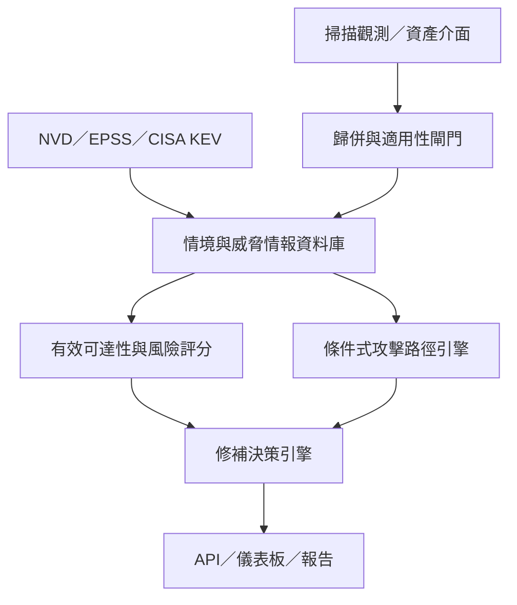

# CVE2Action：2026 IT 鐵人賽 30 天總體施工藍圖

> 參賽題目：從 CVE 堆到修補優先序：教弱掃工具算出真實風險的 30 天

| 文件欄位 | 內容 |
|---|---|
| 文件版本 | 0.1.1 |
| 基線日期 | 2026-09-15 |
| 文件狀態 | Baseline |
| 專案代號 | CVE2Action |
| 預定最終版本 | 1.0.0 |

## 1. 文件目的

本文件是 30 天系列的總體施工藍圖，同時管理兩條相依路線：

1. **文章路線**：每天要回答的問題、讀者理解順序及公開內容。
2. **系統路線**：每天累積的資料、程式、測試、畫面及最終展示。

它不是每日逐步操作手冊。正式進入開發前，仍須依本藍圖產生每日施工卡，列出前置輸入、實作步驟、測試案例、圖片素材、預估工時及 Definition of Done。

## 2. 問題陳述

弱點掃描工具很會找問題，卻不一定能告訴我們該先解決哪個問題。面對成千上萬筆 CVE，資安與維運團隊往往只能依照 CVSS 分數排序，卻忽略資產重要性、對外暴露程度、漏洞利用條件、攻擊複雜度、入侵路徑，以及既有防護措施等真實情境。

最終目標不是再產出一份更厚的弱掃報告，而是讓工具能回答：

- 這個漏洞真的容易被攻擊嗎？
- 成功入侵後可以走到哪裡、造成多大影響？
- 在有限人力與停機窗口下，現在應該先修哪一個？

## 3. 產品主張

CVE2Action 接收現有弱掃結果，再結合威脅情報、資產情境、網路拓樸、權限關係與既有控制，輸出：

- 0–100 的情境式修補優先分數。
- 每項因子的加分、減分理由與資料來源。
- 從可能入口點到關鍵資產的攻擊路徑。
- Patch、隔離、關閉服務或補償性控制等候選措施。
- 措施執行前後的分數、路徑與風險降低幅度。

正式名稱為 **Contextual Remediation Priority Score（CRPS，情境式修補優先分數）**。它是用於排序的決策分數，不宣稱是精確的事故機率或財務損失。

## 4. 專案範圍

### 4.1 MVP 包含

- CSV/JSON 弱掃結果匯入。
- 多 IP、Hostname、MAC 與 Virtual IP 的資產歸併。
- 漏洞適用性狀態與版本證據管理。
- Service、Port、Zone、ACL 與帳號狀態的有效可達性判斷。
- NVD CVE/CVSS、FIRST EPSS、CISA KEV 資料補充。
- CVSS v3.1 與 v4.0 的共同正規化格式。
- 資產重要性、資料敏感度、暴露面與控制資料。
- 可解釋的風險計分與 P0–P3 優先序。
- 網路及權限關係的圖形模型。
- 從入口到 Crown Jewel 的路徑分析。
- 修補與補償性控制 What-if 模擬。
- Dashboard、CSV/JSON 匯出與完整展示案例。

### 4.2 MVP 不包含

- 主動弱點掃描、Port Scan 或 Exploit。
- 企業級 CMDB、Ticket、IAM、SIEM 的正式整合。
- 自動執行 Patch 或變更網路政策。
- 完整資產探索與帳號攻擊模擬。
- 精確量化年度損失金額。
- 讓 LLM 決定風險分數。

## 5. 成功標準

30 天結束時，專案必須能以一份模擬弱掃檔完成下列流程：

1. 匯入 40 筆以上的弱點發現。
2. 將同一設備的多個掃描介面歸併為穩定資產。
3. 將適用性不足的項目標為 `REVIEW_REQUIRED` 或 `NOT_APPLICABLE`。
4. 為每筆資料補上 CVSS、EPSS 與 KEV 狀態。
5. 同時呈現 CVSS 排名與 CRPS 排名。
6. 對每個分數說明來源、加減分及資料缺口。
7. 找出至少一條從 Internet 到 Crown Jewel 的有效路徑。
8. 比較 Patch、隔離與關閉連線等措施。
9. 重算措施後的分數及剩餘攻擊路徑。
10. 輸出修補優先清單，且重複觀測只形成一項修補工作。
11. 提供可重現的安裝方式與自動測試。

## 6. 最終系統架構



### 6.1 處理流程

1. **Collect**：保存原始弱掃觀測、資產介面與拓樸資料，取得公開威脅情報。
2. **Resolve**：將多個 IP、Hostname、MAC 與 Virtual IP 歸併至穩定 `asset_id`。
3. **Validate**：依版本、Build、Package、Backport、模組與設定證據判斷漏洞適用性。
4. **Reachability**：結合 Zone、Service、Port、ACL、帳號與控制判斷有效可達性。
5. **Enrich**：補上 EPSS、KEV、資產重要性、暴露面與控制措施。
6. **Score**：計算 Likelihood、Impact、Attack Path、Control 及 CRPS。
7. **Graph**：建立網路、服務、帳號與權限關係，檢查路徑前置條件。
8. **Recommend**：歸併修補工作並計算候選措施的成本與預期風險降低。
9. **Explain**：顯示排序理由、假設、缺失資料、信心程度與人工覆核狀態。

## 7. 技術選型

| 元件 | MVP 選擇 | 選擇理由 | 暫不採用 |
|---|---|---|---|
| 語言 | Python 3.12 | 資料、API及圖演算法生態完整 | 多語言微服務 |
| 套件管理 | uv | 快速且可鎖定版本 | 手動 requirements 管理 |
| API | FastAPI＋Pydantic | 型別清楚、自動 API 文件 | 完整企業 API Gateway |
| 資料處理 | pandas | 讀者熟悉、文章容易說明 | Spark |
| 儲存 | DuckDB＋Parquet | 無需 DB Server、易重現 | PostgreSQL Cluster |
| 圖形分析 | NetworkX | 足以處理模擬資料與路徑 | Neo4j |
| 儀表板 | Streamlit＋Plotly | 30 天內最快完成互動展示 | React 前後端分離 |
| 測試 | pytest | 容易建立公式與路徑回歸測試 | 大型測試平台 |
| 品質 | Ruff | 快速且設定簡單 | 多套重疊 Linter |
| 包裝 | Docker | 讓讀者一鍵重現 | Kubernetes |
| CI | GitHub Actions | 自動測試與版本檢查 | 自建 CI Server |

LLM 只可用於把既有計算結果轉成自然語言說明；核心分數、優先序及覆寫規則必須由確定性程式產生。

## 8. 公開模擬資料集

### 8.1 虛構環境

虛構企業名稱為 **Northstar Digital Services**。所有主機、帳號、IP、拓樸、營運角色與弱點配置均為虛構，不從任何真實公司資料轉製。

### 8.2 規模

- 20 項資產。
- 40 筆弱點發現。
- 25 條網路連線。
- 10 條帳號或權限關係。
- 8 項控制措施。
- 4 項 Crown Jewel。
- 15 種候選修補措施。

### 8.3 檔案與資料契約

| 檔案 | 核心欄位 | 用途 |
|---|---|---|
| `assets.csv` | asset_id、type、zone、owner、criticality | 資產與營運情境 |
| `asset_interfaces.csv` | asset_id、ip、hostname、mac、interface_type | 多介面資產歸併 |
| `finding_observations.csv` | observation_id、target、cve_id、port、detected_at | 保存原始掃描觀測 |
| `findings.csv` | finding_id、asset_id、cve_id、applicability、confidence | 歸併與適用性判斷結果 |
| `services.csv` | asset_id、port、service、version、state | 有效攻擊面 |
| `version_evidence.csv` | finding_id、observed_version、actual_version、evidence | 子版本與修補證據 |
| `cve_snapshot.json` | cve_id、cvss、vector、cwe、description | 固定版公開 CVE 資料 |
| `threat_intel.csv` | cve_id、epss、percentile、kev、poc | 威脅與利用狀態 |
| `network_edges.csv` | source、target、port、protocol、allowed | 網路可達關係 |
| `network_policies.csv` | source_scope、destination、port、action、verified_at | ACL 與正向列表 |
| `identity_edges.csv` | account、source、target、privilege | 權限及橫向移動條件 |
| `controls.csv` | asset_id、control_type、effectiveness | WAF、EDR、ACL 等控制 |
| `business_context.csv` | asset_id、data_class、impact、rto | 業務衝擊 |
| `remediations.csv` | finding_id、action、effort、downtime | 候選措施與成本 |
| `expected_rankings.csv` | scenario、finding_id、expected_tier、reason | 人工驗證基線 |

所有外部資料快照必須記錄來源網址、取得日期、原始欄位與轉換方式。未知值維持 Unknown，不能自動當成零或低風險。

### 8.4 四個必測情境

1. **高 CVSS、低環境風險**：CVSS 9.8，但位於隔離測試區且沒有可達路徑。
2. **中高 CVSS、極高優先度**：CVSS 8.x、列入 KEV、Internet 可達且能通往核心資料庫。
3. **控制降低剩餘風險**：尚未 Patch，但 WAF、ACL 與 EDR 已降低利用成功率或衝擊。
4. **一次措施切斷多條路徑**：修補跳板或關閉一條連線，同時移除多條 Crown Jewel 路徑。

## 9. 風險模型 v0.1

所有輸入值正規化為 0–1。

### 9.0 評分前置閘門

原始 Finding 不得直接進入 CRPS。系統先依序執行：

1. 資產歸併：重複 IP 觀測合併到同一資產與修補工作。
2. 漏洞適用性：標示 `CONFIRMED`、`LIKELY`、`UNKNOWN` 或 `NOT_APPLICABLE`。
3. 有效可達性：確認 Zone、Service、Port、ACL、帳號與控制的實際狀態。
4. 路徑前置條件：確認網路、權限及後續節點能否串成有效路徑。

`UNKNOWN` 或缺少關鍵情境資料者標為 `REVIEW_REQUIRED`，不得以零值取代未知；`NOT_APPLICABLE` 不進入修補排序，但保留證據與判定理由。

### 9.1 遭利用可能性

\[
L=0.35E_{EPSS}+0.25E_{KEV}+0.20E_{CVSS}+0.20E_{Exposure}
\]

- \(E_{EPSS}\)：EPSS 轉換值。
- \(E_{KEV}\)：列入 KEV 為 1，否則為 0。
- \(E_{CVSS}\)：CVSS Exploitability 指標正規化。
- \(E_{Exposure}\)：Internet 1.0、DMZ 0.8、內網 0.4、隔離區 0.1。

EPSS 初版轉換公式：

\[
E_{EPSS}=\frac{\ln(1+99p)}{\ln(100)}
\]

其中 \(p\) 為 EPSS 原始機率。轉換目的是避免低值全部擠在接近零的位置；此設計必須於 Day 18 以人工排序案例重新校準。

### 9.2 企業衝擊

\[
I=0.40B_{Criticality}+0.25B_{Data}+0.20B_{CIA}+0.15B_{Blast}
\]

- 資產重要性。
- 資料敏感度。
- 機密性、完整性與可用性衝擊。
- 可影響的下游系統範圍。

### 9.3 攻擊路徑

\[
A=0.40A_{Reachability}+0.25A_{Privilege}+0.25A_{CrownJewel}+0.10A_{Hops}
\]

- 是否能從外部或已受控節點抵達。
- 成功利用後可取得的權限。
- 是否存在通往 Crown Jewel 的路徑。
- 路徑長度；路徑愈短分數愈高。

### 9.4 控制有效性

\(C\) 由網路隔離、WAF、EDR、MFA、應用白名單與監控覆蓋等資料計算，範圍為 0–1。初版將控制折減上限設為 60%，避免單一自評控制把高風險直接降為零。

### 9.5 最終分數

\[
CRPS=100\times L^{0.45}\times I^{0.35}\times \max(A,0.05)^{0.20}\times(1-0.6C)
\]

結果限制為 0–100。

| 優先級 | 分數 | 初版處置原則 |
|---|---:|---|
| P0 | 80–100 | 緊急評估與處理 |
| P1 | 60–79 | 納入下一個修補窗口 |
| P2 | 35–59 | 排程處理或補強控制 |
| P3 | 0–34 | 監控、接受或定期複核 |

### 9.6 規則覆寫

- KEV＋Internet 可達＋存在有效攻擊路徑：至少 P0。
- 可無需既有權限通往 Crown Jewel：至少 P1。
- 關鍵輸入缺失：標記 `REVIEW_REQUIRED`，不得僅依數字自動降級。

分數不取代人工決策。任何 P0/P1 降級都必須留下原因、核准人與有效期限。

### 9.6 Day 5 baseline：先用最小 Decision Rule 跑通

Day 5 決定先以 0–10 的 Contextual Priority Score 建立 Decision Engine v0.1：

```text
S = CVSS / 10
E = Reachability × Control Effectiveness
B = Business Impact

Priority Score = 10 × (0.50×S + 0.25×E + 0.25×B)
```

此公式是 **v0.1 baseline，不是最終 CRPS 標準答案**。目的在先完成可解釋的 Vertical Slice；EPSS、KEV、攻擊路徑與更完整的控制/衝擊模型於後續施工日逐步加入並重新校準。權重與門檻必須外部化、可版本化，且變更需留下 ADR。

## 10. 30 天雙軌施工表

| Day | 文章題目 | 系統或資料產出 | 當日驗收重點 |
|---:|---|---|---|
| 1 | 一份沒人看的弱掃報告 | 問題陳述與五個真實缺口 | Finding 不等於修補工作 |
| 2 | CVSS 9.8，真的就該第一個修嗎？ | 兩個反例 | 可說明嚴重度不等於優先度 |
| 3 | 嚴重度、威脅與風險，其實是三件事 | 名詞模型 | 名詞定義一致 |
| 4 | 一個漏洞要加入哪些企業情境？ | 因子清單 | 每個因子有資料來源 |
| 5 | 少即是多：留下能改變判斷的企業脈絡 | Minimum Context、Decision Rules、MVP I/O | Day 6 可不再討論 Scope，直接開工 |
| 6 | 讓第一條決策鏈跑起來 | Decision Engine v0.1 Vertical Slice | `scanner.csv + asset_context.csv + risk_rules.yaml → ranked_result.csv` |
| 7 | 打開 NVD：取得 CVE 與 CVSS 資料 | NVD Collector | 可快取、可重跑 |
| 8 | CVSS v3.1、v4.0 怎麼共存？ | 統一 CVSS Model | 保留 score 與 vector |
| 9 | EPSS：漏洞未來遭利用的可能性 | EPSS Collector | 處理查無資料與逾時 |
| 10 | CISA KEV：哪些漏洞已被實際利用？ | KEV Collector | 正確辨識 KEV |
| 11 | 建立一間不存在的數位公司 | 模擬企業資料 v1 | 無真實企業資訊；可支撐 Minimum Context |
| 12 | Internet、內網、隔離區：有效曝險怎麼量化？ | Effective Exposure | Reachability 與 Control Effectiveness 可重現 |
| 13 | 核心系統和測試機不能一視同仁 | Business Impact | 業務重要性尺度可重現 |
| 14 | 外部威脅情報怎麼進 Decision Engine？ | EPSS / KEV enrichment rule | 顯示每項情報如何改變排序 |
| 15 | 防護措施到底能降多少？ | Control calibration | UNKNOWN 不得降低風險 |
| 16 | Priority 不能是黑箱 | Explain API | 可回傳公式、因子與理由 |
| 17 | 五個漏洞的人工判斷與模型比較 | Calibration Test | 差異都有書面解釋 |
| 18 | v0.1 評分門檻：什麼算可用？ | Scoring acceptance baseline | 固定 baseline、版本與回歸案例 |
| 19 | 把基礎架構變成一張攻擊圖 | Graph Model | 節點與邊定義完成 |
| 20 | 哪些網路連線真的能構成攻擊路徑？ | Reachability Engine | Port 與方向納入判斷 |
| 21 | 帳號與權限如何讓攻擊者橫向移動？ | Identity Edges | 權限前置條件明確 |
| 22 | 從 Internet 找到最短入侵路徑 | Path Finder | 找到並呈現一條路徑 |
| 23 | 不是路徑愈短就一定愈危險 | Attack Path Score | 路徑條件進入分數 |
| 24 | 找出通往 Crown Jewel 的共同瓶頸 | Choke Point | 找出共用高影響節點 |
| 25 | 修漏洞不是唯一選項 | Remediation Model | 支援 Patch 與補償控制 |
| 26 | Patch、隔離、關閉服務，哪一個先做？ | Candidate Engine | 每項措施有成本與限制 |
| 27 | 用最少變更切斷最多攻擊路徑 | Remediation ROI | 比較投入與降低幅度 |
| 28 | 做一個主管與工程師都看得懂的儀表板 | Dashboard | 排序、說明、路徑可操作 |
| 29 | 四個情境驗證：模型真的比 CVSS 排序好嗎？ | 測試報告及 Demo GIF | 四個必測情境通過 |
| 30 | 從 CVE 堆到修補優先序 | Release v1.0.0 | 一鍵重現完整流程 |

## 11. 每篇文章固定模板

1. 今天遇到的實務問題。
2. 既有方法缺少什麼。
3. 今天加入的資料或邏輯。
4. 實作、程式或資料結果。
5. 結果是否符合預期，有什麼限制。
6. 明天將解決的下一個問題。

每天至少產出一個可見成果：程式、CSV、測試、圖表、API 回應、Dashboard 畫面或決策紀錄。

## 12. GitHub 儲存庫結構

```text
cve2action/
├── README.md
├── CHANGELOG.md
├── LICENSE
├── pyproject.toml
├── Dockerfile
├── data/
│   ├── synthetic/
│   ├── snapshots/
│   └── schemas/
├── src/cve2action/
│   ├── collectors/
│   ├── normalization/
│   ├── scoring/
│   ├── attack_graph/
│   ├── remediation/
│   └── api/
├── app/
│   └── dashboard.py
├── tests/
├── docs/
│   ├── architecture/
│   ├── decisions/
│   ├── methodology/
│   └── articles/
└── .github/workflows/
    └── ci.yml
```

## 13. Git 版本管理規則

### 13.1 分支

- `main`：隨時可展示、可回顧的版本。
- `feature/day-NN-topic`：當日文章及功能。
- 若一項工作無法在一天完成，仍以功能命名，禁止直接在 main 上做大量試驗。

### 13.2 Commit 格式

採 Conventional Commits：

- `docs(day-03): explain severity threat and risk`
- `feat(collectors): add EPSS enrichment`
- `feat(scoring): add control effectiveness`
- `test(graph): cover unreachable crown jewel`
- `fix(scoring): preserve unknown exposure state`
- `refactor(model): separate severity from priority`

一次 Commit 只表達一個可說明的改變。文章、程式與測試若共同構成同一個可交付成果，可以放在同一個 Commit。

### 13.3 版本號與 Tag

| 版本 | 里程碑 |
|---|---|
| `v0.1.0-blueprint` | 施工藍圖基線 |
| `v0.1.1-context-gates` | 評分前置閘門與 Day 1 草稿 |
| `v0.2.0-data` | Day 10，資料管線與模擬資料 |
| `v0.3.0-scoring` | Day 18，評分與解釋 |
| `v0.4.0-attack-graph` | Day 24，攻擊路徑 |
| `v0.5.0-remediation` | Day 27，修補決策 |
| `v1.0.0-ironman` | Day 30，最終成果 |

### 13.4 決策紀錄

以下變更必須新增 ADR：

- 改變專案邊界。
- 替換主要資料庫、圖形引擎或前端技術。
- 改變評分公式、權重或優先級規則。
- 改變攻擊路徑的節點、邊或前置條件定義。
- 引入 LLM 進入決策流程。

ADR 必須包含背景、決策、理由、替代方案與後果。

## 14. 最終展示腳本

1. 上傳模擬弱掃 CSV。
2. 顯示原始結果：CVSS 9.8 排名第一。
3. 加入 EPSS、KEV、暴露面與資產情境。
4. 顯示 CVSS 8.x 的 KEV 漏洞因 Internet 可達且通往核心資料庫而升至第一。
5. 點選漏洞，展開完整公式、資料來源及攻擊路徑。
6. 選擇 Patch、網路隔離或關閉服務。
7. 顯示措施前後分數、移除路徑數、投入工時及每工時降低風險。
8. 匯出修補優先清單。

展示的核心句：

> 弱掃告訴我們哪裡有洞；CVE2Action 告訴我們攻擊者可能從哪裡進來、會走到哪裡，以及現在先做哪一件事最划算。

## 15. 主要風險與縮減策略

| 風險 | 徵兆 | 縮減策略 |
|---|---|---|
| 範圍過大 | Day 10 尚未完成資料匯入 | 固定資料快照，暫停即時 API |
| 公式爭議 | 權重討論阻塞開發 | 保留設定檔，先完成可解釋與校準機制 |
| 攻擊圖過度複雜 | 節點類型超過六種 | MVP 只留資產、服務、帳號、Crown Jewel |
| Dashboard 耗時 | Day 27 尚未有可操作 API | Streamlit 只做三個核心頁面 |
| 外部 API 不穩 | 文章無法重現 | Repo 保存帶日期的固定快照 |
| 每日寫作壓縮開發 | 連續兩天超過預定工時 | 文章固定模板，程式碼以最小可見增量提交 |
| 模型看似精確 | 讀者把分數當成真實機率 | 全程使用 Priority Score 名稱並顯示假設 |
| 洩漏內部資訊 | 範例與真實架構過於相似 | 僅使用獨立設計的虛構公司與資料 |

## 16. 階段檢查點

### Day 5：範圍門檻

- Decision Engine v0.1 的輸入、輸出、非目標與 Minimum Context 已固定。
- v0.1 只保留能改變處置優先序的必要企業脈絡。
- Decision Rule 採可外部設定的 baseline；UNKNOWN 不得因缺資料而降低曝險。
- Day 6 必須能直接開始第一條 Vertical Slice，不再回頭擴充 Scope。

### Day 10：資料門檻

- 模擬資料可離線重現。
- 每項外部欄位有來源、日期及 Unknown 處理方式。

### Day 18：評分門檻

- Decision Engine v0.1 的每項因子、權重、輸入來源與輸出理由皆可解釋。
- 至少五個案例完成人工排序比較與回歸測試。
- 50/25/25 僅是 baseline；任何調整必須留下版本與 ADR。

### Day 24：路徑門檻

- 能呈現入口、弱點、權限與 Crown Jewel 的有效路徑。
- 無法到達的資產不會被誤標為可達。

### Day 30：發表門檻

- 新使用者依 README 可以啟動 Demo。
- 自動測試通過。
- 四個必測情境可重現。
- Git tag、Release、文章索引與 Demo 素材完整。

## 17. 回顧架構

完賽後以 Git tag、CHANGELOG、ADR 與下列問題回顧：

1. 哪些原始假設後來證明錯誤？
2. 哪一次架構或公式調整帶來最大改善？
3. 哪些內容讀者最有反應，哪些只有作者自己覺得重要？
4. 哪個步驟仍需要過多人工資料？
5. CRPS 與專家排序的差異在哪裡？
6. 哪項補償性控制的效果最難客觀量化？
7. 若再增加 30 天，最值得產品化的是哪一部分？

## 18. 官方參考資料

- [FIRST CVSS v4.0 Specification](https://www.first.org/cvss/v4.0/specification-document)
- [FIRST Exploit Prediction Scoring System](https://www.first.org/epss/)
- [CISA Known Exploited Vulnerabilities Catalog](https://www.cisa.gov/known-exploited-vulnerabilities-catalog)
- [NVD Vulnerability API](https://nvd.nist.gov/developers/vulnerabilities)

## 19. 下一步

以本文件作為 v0.1.0 基線，下一份執行文件為：

> 《CVE2Action：30 天每日施工卡與驗收清單》

每日施工卡必須把本藍圖的每日列項拆成可在當天完成的任務、測試、文章素材及縮減方案，不再擴張 MVP 邊界。
