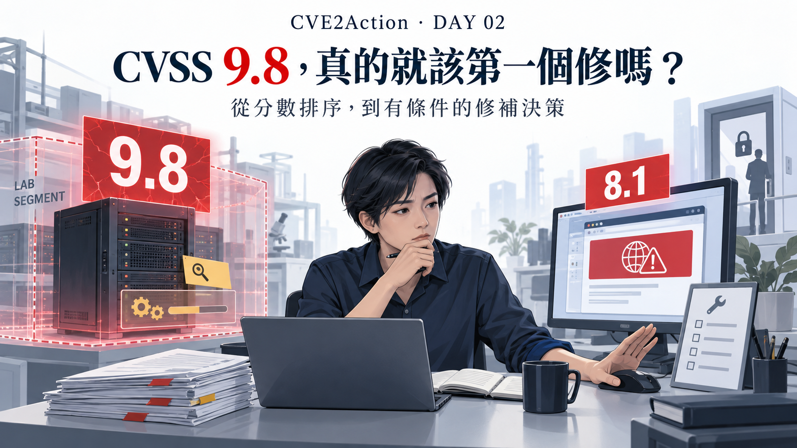
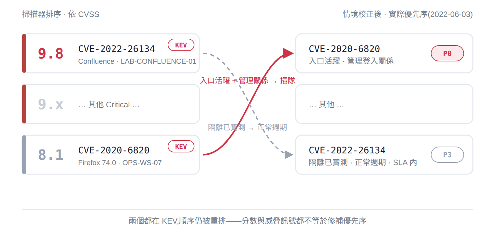

# Day 2｜CVSS 9.8，真的就該第一個修嗎？

*連線代表需要驗證的關係，不代表攻擊者已經能一路入侵。隔離區也不等於沒有任何連線。*

> 本文使用真實 CVE，搭配完全虛構的企業、資產與控制證據。決策時點設定為 **2022 年 6 月 3 日晚間（PDT，UTC−07:00）**，回顧當年的修補困境，不是建議今天部署文中的舊版本。分數採公開資料整理，並非完整重建當年的情資快照。

星期五晚上，維運團隊正在處理兩筆弱掃通知。

第一筆是 CVSS 9.8 的 Critical，第二筆是 8.1 的 High。照分數排，當然是先修 9.8。

但資產負責人補了幾句話：

> 9.8 在隔離測試區，兩週的整合測試還沒跑完，現在重啟就得重來。8.1 在維運人員每天使用的工作站，可是瀏覽器為了相容舊管理介面，被政策鎖在舊版。

這下問題就不是「哪個分數比較高」了。

要不要中斷測試？能不能先限制外部瀏覽？誰能批准暫緩？控制失效時，又由誰把案件拉回來？

**工具若只回傳一個排序，離能執行的決策，還差好幾步。**

## 先看報告，再看環境

| 比較項目 | 案例 A：隔離測試主機 | 案例 B：維運工作站 |
|---|---|---|
| CVE | CVE-2022-26134 | CVE-2020-6820 |
| CVSS v3.1 Base Score | 9.8 Critical | 8.1 High |
| 軟體與盤點版本 | Confluence Server 7.13.6 | Firefox 74.0 |
| 適用性 | 已確認受影響 | 已確認受影響 |
| 公開威脅訊號 | 已遭利用、列入 CISA KEV | 已遭利用、列入 KEV；Mozilla 曾報告針對性攻擊 |
| 資產／負責團隊 | `LAB-CONFLUENCE-01`／platform-lab-team | `OPS-WS-07`／ops-team |
| 使用情境 | 隔離測試區，無正式資料、採獨立測試帳號 | 日常作業端點，近 30 天有外部瀏覽紀錄；不是專用管理工作站 |
| 可達性 | TCP/8090 僅允許弱掃主機與管理跳板連入；禁止新建往正式區與管理區的連線 | 主動瀏覽外部網站，也可發起管理跳板登入；不是對外提供服務的主機 |
| 既有控制 | ACL 負向測試日期為 6/1；仍須確認測試範圍 | 有 EDR，但對此類利用的阻擋效果未知；跳板登入需要 MFA |
| 修補障礙 | 兩週整合測試進行中，中斷須重跑 | 舊管理介面相容性尚未驗證，不能假定升級零衝擊 |
| 後續路徑 | 模型中尚未找到有效的核心系統入侵路徑，不代表證明不存在 | 具有條件式管理關係，不代表入侵工作站就能通過 MFA |

內部資料都是案例假設。真實 CVE 與版本依據來自 [Atlassian 公告](https://confluence.atlassian.com/doc/confluence-security-advisory-2022-06-02-1130377146.html)、[Mozilla 公告](https://www.mozilla.org/en-US/security/advisories/mfsa2020-11/)及 [NVD 的 A 案資料](https://nvd.nist.gov/vuln/detail/CVE-2022-26134)、[B 案資料](https://nvd.nist.gov/vuln/detail/CVE-2020-6820)。

## CVSS 沒有算錯，是我們還少了決策資料

[FIRST 的 CVSS v3.1 指南](https://www.first.org/cvss/v3.1/user-guide)提醒：CVSS 衡量嚴重度，不是完整的風險。Base Score 描述漏洞的技術特性；Temporal 與 Environmental 指標可以補充時間與環境因素，但企業仍需納入自己的業務條件。

本文比較的是 **Base Score**，不是說 CVSS 完全沒有環境評分機制。

A 的向量是：

`CVSS:3.1/AV:N/AC:L/PR:N/UI:N/S:U/C:H/I:H/A:H`

B 的向量是：

`CVSS:3.1/AV:N/AC:H/PR:N/UI:N/S:U/C:H/I:H/A:H`

兩者的一個關鍵差異是攻擊複雜度。但複雜度高，不代表不會遭到利用；分數高，也不會自動告訴我們誰能連到服務、控制是否有效，以及修補會中斷什麼。

工具還需要回答：這筆發現屬於哪部資產？版本確認了嗎？來源、服務與身分條件是什麼？證據多久以前取得？修不了的時候，還有哪些動作可以先做？

## 案例 A：可以提議暫緩，但不是看到隔離就放行

CVE-2022-26134 是 Confluence 的未授權遠端程式碼執行漏洞，而且已有利用證據。[CISA 在 2022 年 6 月 2 日將它加入 KEV](https://www.cisa.gov/news-events/alerts/2022/06/02/cisa-adds-one-known-exploited-vulnerability-cve-2022-26134-catalog)。Atlassian 在 6 月 3 日公布修正版，其中 7.13 分支的修正版是 7.13.7。

因此，7.13.6 不是誤報，也不能靠一句「這是測試機」就結案。

案例中，負責團隊希望把修補安排在內部 SLA 的 **6 月 16 日以前**，理由是避免中斷整合測試。這能解釋變更成本，卻不能單獨證明暫緩安全。

要支持短期暫緩，至少還要確認：

- ACL 測試涵蓋哪些來源、目的地、埠與方向，且證據仍有效。
- 主機沒有正式資料或可供橫向使用的正式憑證。
- 允許連入的跳板與弱掃主機沒有遭入侵的跡象。
- 有權責人核准風險接受，並明列到期日、修補責任與撤銷條件。

資料雖然有 `RA-2022-0603-01`，卻沒有附核准證據。所以目前狀態應是 **`REVIEW_REQUIRED`**，不是「已批准暫緩」。不能先把它標成不需緊急處理，再補簽核。

另外，6/1 的控制證據在 6/3 尚未超過案例設定的七天期限，並不表示它足以一路支撐到 6/16。後續仍須重新驗證；七天只是這個模擬案例的政策，不是所有企業通用的安全標準。

## 案例 B：需要先動作，但不能假裝升級沒有成本

[Mozilla 的 MFSA 2020-11](https://www.mozilla.org/en-US/security/advisories/mfsa2020-11/)指出，CVE-2020-6820 涉及 ReadableStream 的競爭條件與 Use-after-free，且當時已觀察到針對性攻擊；Firefox 74.0.1 修正了這個漏洞。

案例 B 的 Firefox 74.0 被政策鎖版，是為了舊管理介面。既然相容性尚未確認，就不能同時宣稱「立即升級、低成本、沒有服務影響」。

我的處理順序會是：**先限制這部端點接觸外部網頁，必要的外部瀏覽轉到經確認乾淨、受支援的替代環境；同時檢查端點與身分紀錄，再驗證相容性、排定修補。**

相容性限制不該成為無限期拖延的理由，但也不該被模型直接刪掉。若替代環境不可用，應升級處理業務中斷與隔離的取捨，不是默認繼續暴露。

這裡要分清兩個期限：案例設定 **6/3 完成第一步緩解措施**；正式修補期限尚未定案，必須由負責團隊補上。限制外部瀏覽，不等於完成修補，也不保證端點先前沒有被入侵。

Firefox 有洞，更不代表攻擊者必然取得整部主機與正式系統。要從瀏覽器走到管理跳板，仍需驗證執行權限、沙箱或其他隔離、憑證或工作階段、MFA 與授權等條件。

## 兩個案例其實共用一個關鍵節點

A 的正向列表裡，有 `ADMIN-JUMP-01`；B 也具有登入這部跳板的關係。

如果後續發現跳板遭入侵，A 的「只讓可信來源連入」就需要立刻重評。限制新建的對外連線，也不代表會阻擋既有允許連線的回應流量。

同樣地，弱掃主機能跨區掃描，只代表它在核准的目標、埠與協定範圍內具有存取能力，不能直接畫成「通往所有主機的萬能入侵路徑」。它持有什麼憑證、權限多大，都要另外確認。

所以，**區域標籤不是風險答案；來源的可信度、連線方向與身分條件，才是要持續驗證的內容。**

## 今晚的答案，是一份能交辦的行動表

*排序示意：本圖保留原設計的 P0／P3 標籤，並非本系列引擎已計算出的分級。B 的優先處理指先緩解暴露，不代表立即完成升級；A 進入正常週期，須以控制範圍及有效性確認、暫緩核准與有效期限齊備為前提。目前資料中的 A 仍是「暫緩待審」，不可直接套用圖中 P3 作為已核准結論。*

| 決策項目 | 案例 A | 案例 B |
|---|---|---|
| 現在先做什麼 | 維持隔離，覆核控制範圍與風險接受提案 | 限制外部瀏覽，安排替代環境並查閱端點／身分紀錄 |
| 誰負責 | platform-lab-team；infra-sec 協助驗證控制，核准者尚待指定 | ops-team；infra-sec 協助端點與身分查核 |
| 修補安排 | 提案於 6/16 前完成；暫緩仍待核准，不是已獲豁免 | 相容性驗證後安排，正式期限待確認，不可把 6/3 緩解期限當成修補完成日 |
| 目前狀態 | `REVIEW_REQUIRED` | `MITIGATE_NOW_PATCH_PENDING` |
| 何時重評 | 控制過期、規則／用途改變、發現新路徑、跳板或 B 出現入侵跡象、接受提案遭拒或到期 | 外部內容暴露改變、防護效果或管理權限改變、相容性驗證完成、出現入侵跡象 |
| 何時能結案 | 修補與版本驗證完成；暫緩本身不等於結案 | 修補與版本驗證完成；若已入侵，另須完成事件處置 |

我會優先處理 B 的入口暴露，**同時**啟動 A 的控制與暫緩審查。這不是把 A 丟到下個月，也不是等整條攻擊鏈被百分之百證明才開始處理 B。

若審查發現 A 的控制不可信，原本的處理順序就可能改變；若任何一案出現入侵跡象，還必須啟動事件應變，不能只改個分數。

今天要留下的三個原則是：

1. **嚴重度不是完整的處理順序。** 修補、緩解、查核與事件應變，可能需要並行。
2. **暫緩必須有條件、有核准、有期限。** 單號、ACL 存在或測試尚未完成，都不能單獨替代決策證據。
3. **未知不能自動變成低風險。** 未找到路徑不等於不存在；沒有觀察到攻擊，也不等於沒有攻擊。

明天，我們再把經常混在一起的三個詞拆開：**嚴重度、威脅與風險，到底有什麼不同？**

## 資料與重現

- [模擬資產資料](../../data/synthetic/day-02-assets.csv)
- [模擬弱點發現資料](../../data/synthetic/day-02-findings.csv)
- [情境時間與資料規則](../../data/synthetic/day-02-scenario.json)
- [案例設計與推論邊界](../research/day-02-case-design.md)

所有內部證據均為虛構輸入。KEV 表示已有利用證據，不能單靠 KEV 推出「大規模成功入侵」；針對性攻擊也不是互斥的規模等級。本文不把這些文字直接換算成攻擊機率。
