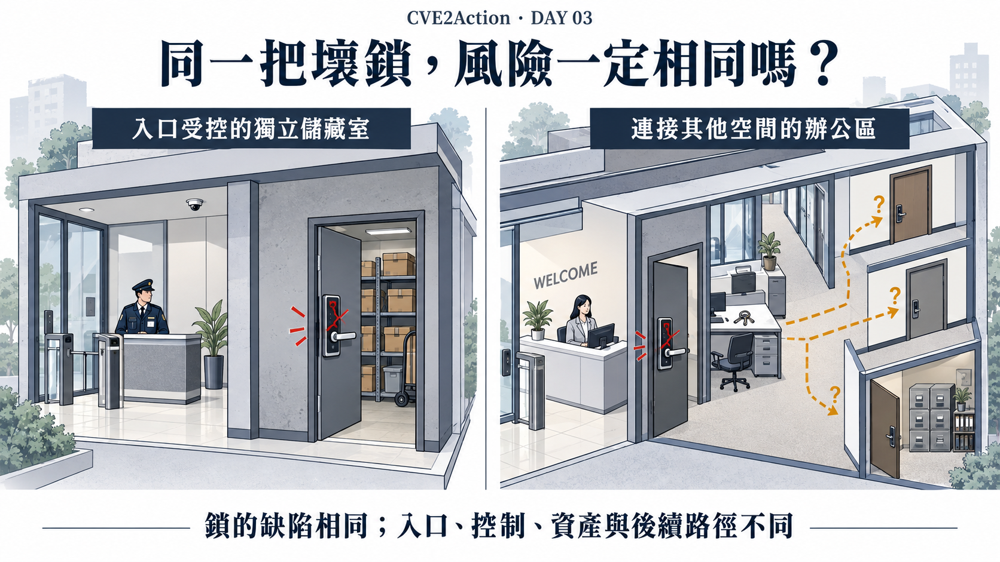
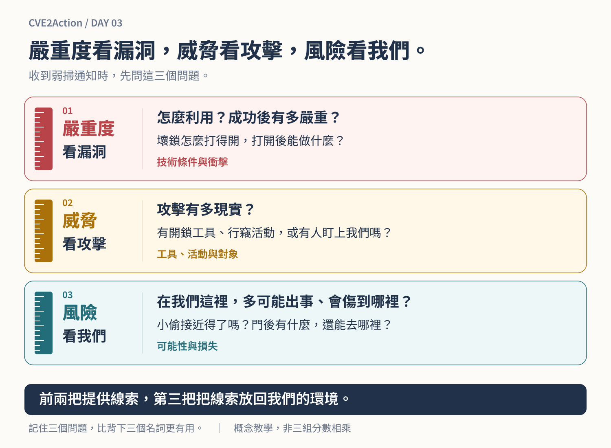
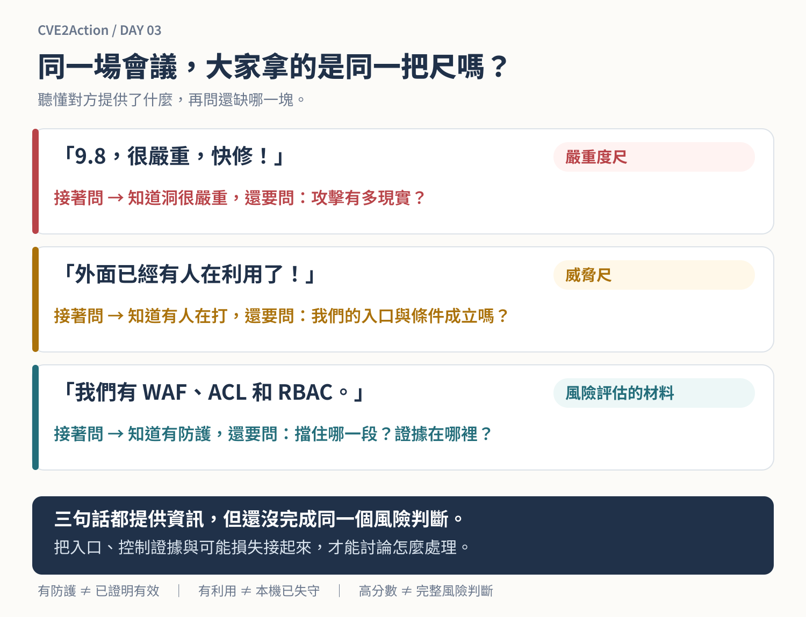
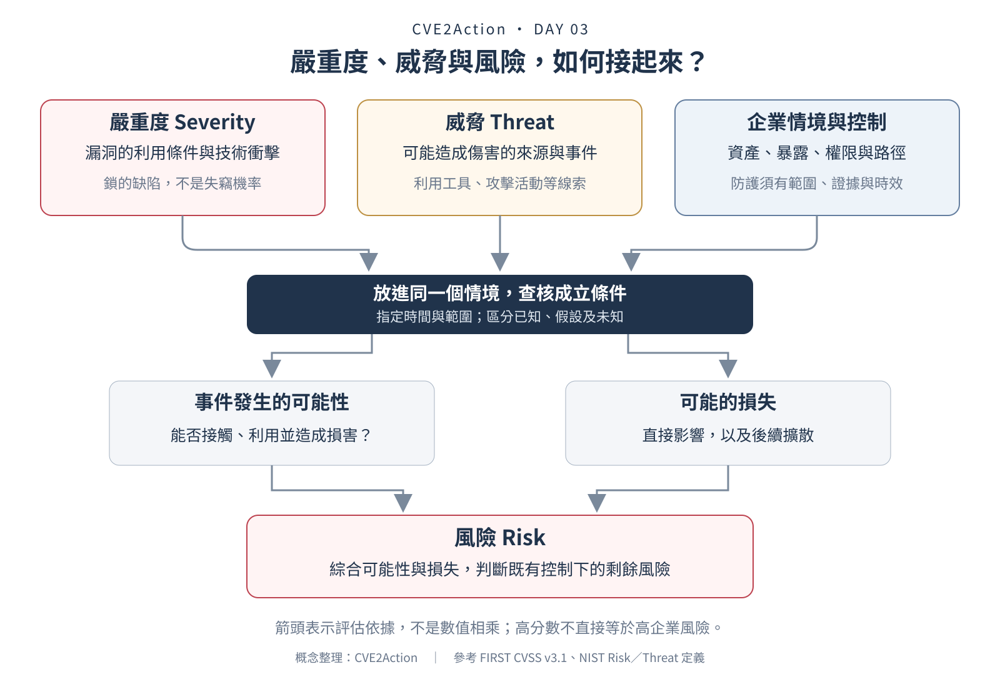

# Day 3｜高分數不等於高風險：同一把壞鎖，為什麼處理方式不同？

*同一把壞鎖，裝在不同地方，就不能只用同一個分數決定處理方式。誰接近得了、門前的防護是否有效、門後放著什麼，都會改變風險。右側虛線是待查核的路徑，不代表每一道門都已經打得開。*

昨天，我們比較了兩個漏洞：隔離測試主機上的 9.8，以及維運工作站上的 8.1。

加入環境資訊後，處理方式不再只是按照分數排序。我們需要優先限制工作站的外部暴露，同時覆核測試主機的控制與暫緩條件。

但漏洞分數明明沒有變，為什麼決策會改變？

今天先不寫公式。我們從一把壞鎖，拆開三個工程人員經常使用、卻容易混在一起的概念：**嚴重度、威脅與風險。**

## 「9.8，很危險，請盡快修補」

先回到一個熟悉的企業場景。

資安寄出弱掃通知，維運收到一串紅色 Critical。其中一項，CVSS 9.8。

「這個很嚴重，請立即修補。」

維運回覆：「服務前面有 WAF，Firewall 限制來源，帳號權限也有控管。現在升級會中斷測試，能不能安排在下一個窗口？」

「外面已經有人在利用了。」

「所以我們現在的防護擋不住嗎？還是哪個路徑沒有涵蓋？」

討論到了這裡，有時沒有繼續分析，只留下：「我們資安的立場就是很危險；不修，風險自負。」

維運心裡可能冒出一句話：**那我們這些年建的防護，到底算什麼？**

這個疑問合理。但「我們有防護」也還不是完整答案。一邊拿漏洞分數，一邊拿防護架構；雙方都握有資訊，卻還沒把資訊接成同一個風險情境。

## 先帶走三把尺

**圖說：嚴重度看漏洞，威脅看攻擊，風險看我們。** 前兩把提供技術與攻擊線索；第三把把線索放回企業環境，問清楚「多可能出事、出事會傷到哪裡」。不用先背英文，下次收到弱掃通知，先問圖中的三個問題。

如果今天只記得一句話，就記住這一句。接下來，我們拿同一把壞鎖，把三個問題問完。

## 一、嚴重度：這把鎖到底壞得多嚴重？

想像公司收到電子鎖廠商通知：某款門鎖有設計缺陷，符合特定條件，就可能繞過原本的開門機制。

需要專用工具嗎？必須碰到門鎖嗎？需不需要先取得門禁卡？成功後，只能開門，還是連門禁設定都能修改？

這些問題，在描述缺陷本身的技術條件與後果。對漏洞而言，這就是 **Severity，嚴重度**。

CVSS Base Score 不只考慮成功利用後的衝擊，也包含攻擊向量、複雜度、所需權限與使用者互動等條件。它不是某家企業被入侵的機率，**9.8 更不是 98%**。[FIRST CVSS v3.1 指南](https://www.first.org/cvss/v3.1/user-guide)

Base 描述的是漏洞的固有特性。你在門外加派警衛，鎖的缺陷不會因此消失；把主機搬進隔離區，也不會自動改掉原本的 Base Score。評分資料可能因新資訊而修訂，但那和你今天加了幾道防護，是不同的事。

**第一把尺，看的是洞怎麼被利用、能造成什麼技術後果。**

## 二、威脅：已經有人拿這種方法來開鎖了嗎？

接著，你收到另一個消息：附近有大樓遭竊，竊賊使用的正是這種開鎖方法，相關工具也開始流傳。

鎖的缺陷可能和昨天一樣，但現在多了一項重要資訊：有人可能利用它造成傷害，而且已經出現活動線索。

這就進入 **Threat，威脅**的討論。威脅是可能造成不利影響的情況或事件；本系列主要關注攻擊者利用漏洞的情境，並不是說所有威脅都來自駭客。[NIST：Threat](https://csrc.nist.gov/glossary/term/threat)

我們會追問：是否已有實際利用？有沒有可用工具？觀察到的是探測、利用嘗試，還是成功入侵？攻擊者鎖定的對象和我們有關嗎？這些資訊會隨時間更新。

公開利用訊號不以我們是否受害為前提，但它對我們有多相關，仍然要判斷。

附近有人遭竊，不代表我們的大樓已經失守。找到開鎖工具，也不代表每一扇門都能被打開。沒有觀察到攻擊，同樣不等於沒有威脅，還要看紀錄的範圍與完整性。

昨天兩個案例都有利用紀錄。Volexity 在 2022 年 6 月披露 Confluence 的實際入侵；Mozilla 則在 2020 年 4 月的公告中指出 Firefox 漏洞曾遭針對性利用。這些紀錄證明威脅不能忽略，卻不足以直接把兩者排成「威脅高」與「威脅中」；它們並非同一時間、同一觀測範圍的攻擊量統計。[Volexity 調查](https://www.volexity.com/blog/2022/06/02/zero-day-exploitation-of-atlassian-confluence/)、[Mozilla 公告](https://www.mozilla.org/en-US/security/advisories/mfsa2020-11/)

**第二把尺，看的是攻擊有多現實，還有哪些利用線索。**

## 三、風險：壞鎖裝在哪裡，門後又是什麼？

現在，兩棟大樓使用同款有缺陷的鎖。

第一把，裝在通過人員管制後才能接近的獨立儲藏室，裡面放一般備品。第二把，裝在訪客容易接近的辦公區入口，進去後有走廊通往其他房間，桌上可能還放著其他門的鑰匙。

鎖的缺陷相同，潛在後果卻未必相同。

**Risk，風險**，關注的是特定情境下，事件發生的可能性及可能造成的不利影響。[NIST：Risk](https://csrc.nist.gov/glossary/term/risk)

我們需要知道：誰能接近門？管制是否有效？門後放了什麼？進去之後還能走到哪裡？

**鎖的缺陷不會因為有警衛而消失；但評估失竊風險時，也不能假裝警衛、其他門禁與門後的東西都不存在。**

當然，還得確認警衛能否限制這種進入方式。「有警衛」不是自動通過的安全證明。

納入既有控制後，仍然存在的風險，就是我們要面對的**剩餘風險**。

**第三把尺，把漏洞、攻擊與企業情境接起來，問「放在我們這裡呢？」**

## 回到會議：大家拿的是同一把尺嗎？

**圖說：會議卡住，常常是大家拿著不同的尺，卻都把答案叫作「很危險」或「很安全」。** 9.8 描述嚴重度，有人利用補上威脅線索，有 WAF 則提供待驗證的控制資訊。下一步是接起這些資訊：攻擊從哪裡來，防護擋住哪一段，失守後又會影響什麼？

所以，遇到「9.8，快修」，不必急著拿「我們有防火牆」回擊。可以先把問題接下去：「漏洞本身很嚴重，我們知道了。那目前有哪些利用活動？在我們這裡，哪些入口和利用條件成立？」

## 把昨天的兩個案例放進三把尺

兩個漏洞都嚴重，也都有利用紀錄。為什麼今天要做的第一個動作不同？

| 案例 | 嚴重度：看漏洞 | 威脅：看攻擊 | 風險：放回我們的情境 |
|---|---|---|---|
| A：隔離測試 Confluence | 9.8／Critical | 已有實際利用紀錄 | 入口受限，但控制與影響仍須查核；完成審查後，才有依據評估暫緩 |
| B：維運工作站 Firefox | 8.1／High | 曾有針對性利用紀錄 | 外部瀏覽持續，且具管理登入關係；先限制暴露，同時查核後續路徑與安排修補 |

**前兩把尺都是重要輸入，但任何一把都不能單獨決定處理順序。**

這張表也沒有直接宣布「A 低風險、B 高風險」。A 的暫緩仍待審查；B 能登入管理跳板，也不代表攻擊者已具備同樣能力。

這裡真正不同的是兩種決策需要的證據。

對 B 而言，已知的受影響版本、持續外部瀏覽及利用紀錄，足以支持先限制暴露。後續影響仍要查，修補仍要排。

對 A 而言，要爭取等待時間，就得說清楚等待依賴哪些條件：入口的負向測試涵蓋了什麼？是否有正式資料與可共用的憑證？允許連入的來源是否可信？連線限制能阻斷哪些後續動作？期限與核准在哪裡？

**先減少明確存在的暴露，與批准一段等待時間，是不同的決定。**

## CVSS 其實早就留了情境欄位

講到這裡，可能有人會問：這些資訊，CVSS 原本都不管嗎？

其實，CVSS v3.1 本來就有三組指標：

| 指標組 | 提供的資訊 |
|---|---|
| Base（基礎） | 漏洞固有的利用條件與技術衝擊 |
| Temporal（時序） | 利用程式成熟度、修補可用性與漏洞報告可信度 |
| Environmental（環境） | 依特定環境調整技術條件，並納入機密性、完整性、可用性需求 |

它們可以幫忙補充三把尺需要的資訊，但**不是「Base＝嚴重度、Temporal＝威脅、Environmental＝完整風險」的一對一對應**。填完後兩組，仍不等於完成企業風險評估。[FIRST CVSS v3.1 規格](https://www.first.org/cvss/v3.1/specification-document)

例如，環境指標能反映部分部署差異與防護；卻不能只因為「有 ACL」，就任意挑一個較低分的攻擊向量。每個調整都得符合定義，並留下依據。

CVSS v4.0 將 Temporal 改為 Threat 指標組，並調整其內容，更明確地納入威脅資訊；但這依然需要有人或系統提供正確資料。[FIRST CVSS v4.0 指南](https://www.first.org/cvss/v4.0/user-guide)

**欄位存在，不代表企業資訊已經流進去了。** 資產用途在清冊裡，連線政策在設備裡，權限在身分系統裡，驗證結果在工單裡。規格沒有要求只能人工填，實務的難題是如何串接、驗證與持續更新。

而且，還有另一個問題：進了一扇門之後呢？

## 進了一扇門，就能走遍整棟樓嗎？

假設竊賊真的打開了第一扇門，他進入的是獨立儲藏室，還是通往各樓層的走廊？桌上的鑰匙能開哪些門？機密檔案室是否還有另一套門禁？

回到資訊系統，就是三層問題：

| 評估面向 | 要查核的條件 |
|---|---|
| 初始入侵 | 入口可達嗎？版本、服務狀態與利用條件成立嗎？ |
| 直接影響 | 取得什麼權限？當下能讀取、修改或破壞哪些資料？ |
| 後續擴散 | 有可重用的憑證或工作階段嗎？後續還需要哪些授權、驗證或其他漏洞？ |

有些控制限制初始入侵，有些限制入侵後的影響與橫向移動。

CVSS 已有漏洞串接的評估指引，並非完全不談攻擊鏈。但它不會替企業盤點工作站、跳板與核心系統之間的實際關係，也不會自動驗證每段路徑是否成立。[FIRST：Vulnerability Chaining](https://www.first.org/cvss/v3.1/user-guide#3-4-vulnerability-chaining)

昨天的維運工作站具有管理跳板登入關係，值得進一步查核。但**走廊通得到，不代表每一道門都打得開**。可以連到跳板，不等於攻擊者能登入；可以登入，也不等於具有核心系統的管理權限。

反過來說，就算竊賊只能留在儲藏室，仍可能偷走或破壞裡面的東西。無法擴散，也不等於沒有直接損失。

## 防護有沒有用，要說到「它限制了什麼」

控制不能被忽略，也不能只是把產品名稱列出來，就扣掉幾分風險。

| 你提供的資訊 | 評估還需要知道 |
|---|---|
| 我們有 WAF | 相關流量是否經過它？規則是否涵蓋此類攻擊？有沒有其他入口？ |
| Firewall 已限制來源 | 哪些來源仍被允許？攻擊可能從這些來源發動嗎？ |
| 有 RBAC 與最小權限 | 漏洞是否受相關授權機制約束？利用成功後的權限範圍為何？ |
| 帳號有回收與憑證管理 | 涵蓋哪些身分？是否仍有可重用的憑證或工作階段？ |
| 主機位於隔離區 | 管理、掃描及維運通道有哪些例外？是否形成其他路徑？ |

維運需要說明為什麼認為控制有效；資安也需要說明為什麼認為控制不足。證據不夠，就標示未知，不能用立場填補空白。

## 同樣是 9.8，會議可以有不同的結局

把昨天的 Confluence 案例往下延伸，看看可能出現的兩種會議結局。

原本的對話停在：「現在中斷，整合測試要重跑。」「9.8 就是很危險，趕快修。」

現在換個問法：「先確認誰能連到服務。有正式資料嗎？有能存取其他系統的憑證嗎？被入侵後能往哪裡走？證據到什麼時候有效？」

**結果一：控制與影響範圍有證據支持。**

入口限制經過驗證，主機沒有正式資料及共用憑證，已建模的擴散範圍受到限制。剩餘風險經權責者審查後，可能支持較長的修補準備時間；但須附期限、期間控制及提前處理條件。

**結果二：發現可存取正式環境的共用憑證。**

這就像原本以為是獨立儲藏室，卻在桌上找到其他房間的鑰匙。憑證是否有效、能用在哪裡仍要查核，但支持暫緩的假設已需要重評，不能只說「這是測試機」。

兩種結果的 Base Score 都是 9.8。**改變決策的是證據，不是哪個部門比較會辯論。**

## 爭取的是修補時間，不是永遠不換鎖

如果入口及影響受到有效限制，且剩餘風險符合組織的接受條件，就可能爭取時間完成相容性測試、安排停機與準備回復方案。

我們仍然要修，只是不把每個高分漏洞都當成相同的緊急變更。

但必須交代：誰負責、最晚何時修完、期間依賴哪些控制、證據何時更新，以及哪些變化會撤銷原本安排。

**核准的是有條件的等待時間，不是宣布壞鎖已經安全。** 修補困難本身不是風險降低的證據；它影響怎麼處理，不應被換算成「比較不危險」。

## 三十秒練習：下一句，你會問什麼？

先別往回翻。下面三句話，各自還缺哪個問題？

1. 「9.8，今天一定要修。」
2. 「它已經有人在利用。」
3. 「我們有防火牆，不用擔心。」

可以這樣接：

- 聽到 **9.8**：攻擊有多現實？放在我們這裡，入口與後果是什麼？
- 聽到 **有人利用**：這些活動如何對應我們的版本、暴露與使用情境？
- 聽到 **有防火牆**：擋住哪些來源和路徑？證據是否有效？允許來源或其他入口怎麼辦？

**嚴重度看漏洞，威脅看攻擊，風險看我們。**

這也是 CVE2Action 要補的位置：讓工具接收掃描結果，把能自動取得的威脅與企業情境接進來，保留需要查核的證據與未知，再評估初始入侵、直接影響及後續路徑。

既有弱掃未必能持續使用這些分散的資訊，因此我們會用外掛或獨立工具實作。最後留下的不只是排序，而是：**為什麼處理方式與原始分數不同、判斷依賴哪些條件、何時失效。**

明天，我們把「企業情境」拆成可蒐集的資料：**一個漏洞要加入哪些企業情境？這些資訊從哪裡來？**

## 延伸閱讀：三把尺如何接成一次評估？

**圖說：三把尺有關係，但不是三個互不相干的分數。** 技術條件與攻擊線索，必須結合企業的入口、資產、權限及控制證據，才能判斷可能性與損失。既有控制納入後，仍然存在的是剩餘風險。

---

> **關於本文的幾個說明**：文中的對話、大樓比喻與延伸案例均為教學情境，不指涉特定企業；兩種會議結局為虛構分支，不代表 Day 2 已完成查核或核准。Day 2 的漏洞案例沿用其歷史情境，不代表今天部署那些舊版本仍然安全。圖解為本系列整理，不是 CVSS 或 NIST 的計算公式，箭頭表示評估所需的資訊，不是可以直接相乘的數值。

上一篇：[Day 2](https://ithelp.ithome.com.tw/articles/10412142)
