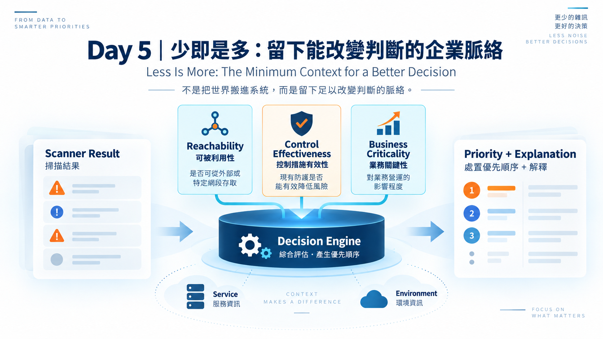
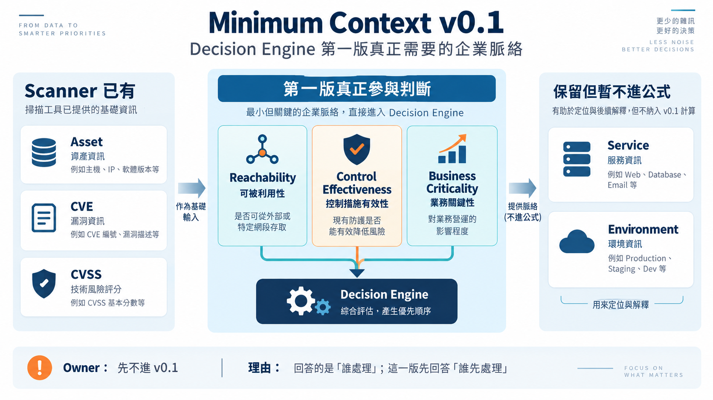
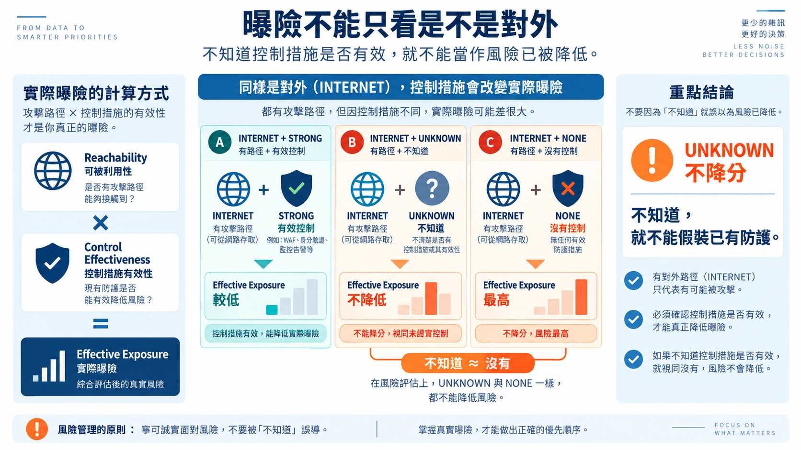
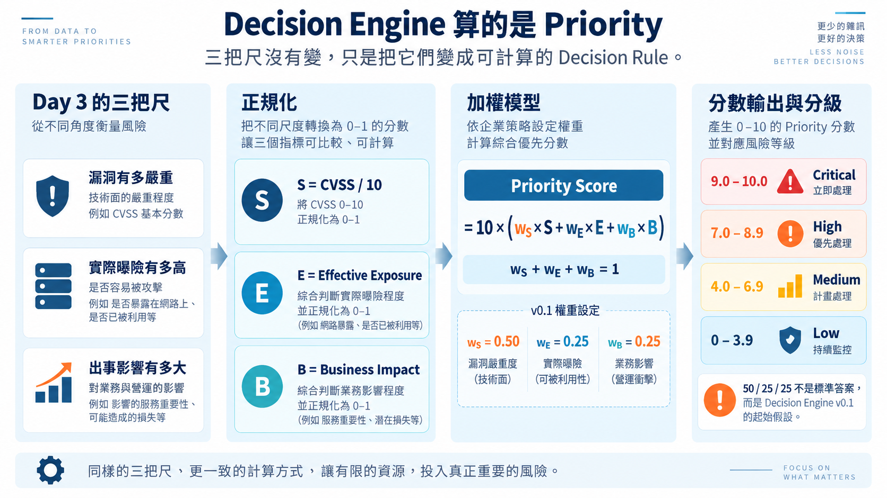
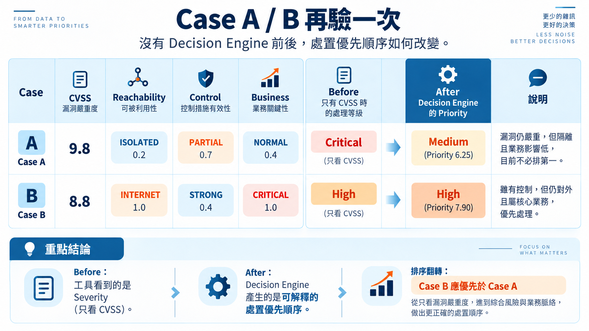

# Day 5｜少即是多：留下能改變判斷的企業脈絡

**Less Is More: The Minimum Context for a Better Decision**



昨天，我們想做的 **Decision Engine 已經呼之欲出：**

> **弱掃報告提供漏洞資訊；企業補上足以改變判斷的脈絡；Decision Engine 產生可解釋的處置優先順序。**

第一版規格：

```text
Scanner Result
      +
Minimum Context
      +
Decision Rules
      ↓
Decision Engine
      ↓
Priority + Explanation
```

先不做自動修補、Ticket Workflow、完整 CMDB 整合，也不急著做 Dashboard。

---

## 昨天畫出的「我們」，今天不能全部搬進來

Day 4 把工具看不見的企業場景畫了出來。

環境、網路位置、服務、業務重要性、Owner、相依性、防護措施……都有可能影響風險。

但：

> **全部都重要，等於沒有 MVP。**

所以今天只問：

> **少了什麼，Decision Engine 的判斷就可能失真？**

我把它叫做 **Minimum Context**。

它不是通用答案。每家公司都有自己的架構、控制措施與營運經驗。

**方法可以共用，Decision Rules 必須長在自己的企業裡。**

---

## Minimum Context v0.1



Scanner 已有：

```text
Asset / CVE / CVSS
```

第一版真正參與判斷的企業脈絡：

```text
Reachability
Control Effectiveness
Business Criticality
```

另外保留：

```text
Service
Environment
```

用來定位與解釋，但暫時不進公式。

值域先收小：

```text
Environment
PROD / NON_PROD

Reachability
INTERNET / INTERNAL / ISOLATED

Control Effectiveness
NONE / PARTIAL / STRONG / UNKNOWN

Business Criticality
CRITICAL / IMPORTANT / NORMAL
```

Owner 先不進 Decision Engine。

它回答的是「誰處理」；這一版先回答：

> **誰先處理。**

---

## 曝險不能只看是不是對外



Internet-facing 代表有攻擊路徑，但現有防護會改變實際曝險。

所以：

```text
Reachability × Control Effectiveness
             ↓
      Effective Exposure
```

v0.1 暫定：

```text
Reachability
INTERNET = 1.0
INTERNAL = 0.6
ISOLATED = 0.2

Control Effectiveness
NONE    = 1.0
PARTIAL = 0.7
STRONG  = 0.4
UNKNOWN = 1.0
```

因此：

```text
Effective Exposure
= Reachability × Control Effectiveness
```

`UNKNOWN` 不降分。

> **不知道，就不能假裝已有防護。**

---

## Decision Engine 算的是 Priority
### 產生可解釋的處置優先順序



還記得 Day 3 的三把尺嗎？

```text
漏洞有多嚴重
實際曝險有多高
出事影響有多大
```

三把尺沒有變，今天只是讓它們變成 Decision Engine 可以計算的東西。

先正規化到 `0–1`：

```text
S = CVSS / 10
E = Effective Exposure
B = Business Impact
```

再用加權模型：

```text
Priority Score
= 10 × (wS×S + wE×E + wB×B)

wS + wE + wB = 1
```

v0.1：

```text
wS = 0.50
wE = 0.25
wB = 0.25
```

Business Impact：

```text
CRITICAL  = 1.0
IMPORTANT = 0.7
NORMAL    = 0.4
```

分級：

```text
9.0–10.0  Critical
7.0–8.9   High
4.0–6.9   Medium
0–3.9     Low
```

**50 / 25 / 25 不是標準答案。**

它只是 Decision Engine v0.1 的起始假設：先讓三把尺變成一套**可計算、可驗證，也可以被實際案例推翻**的 Decision Rule。

所以權重放設定檔，不 hard-code。

---

## Case A / B，再驗一次



### Case A

```text
CVSS         = 9.8
Reachability = ISOLATED 0.2
Control      = PARTIAL 0.7
Business     = NORMAL 0.4

S = 0.98
E = 0.2 × 0.7 = 0.14
B = 0.4

Priority
= 10 × (0.50×0.98 + 0.25×0.14 + 0.25×0.4)
= 6.25
```

```text
CVSS Severity       = 9.8 / Critical
Contextual Priority = 6.25 / Medium
```

> **漏洞沒有變得不嚴重。  
> 只是放回企業場景後，它現在不必排在最前面。**

### Case B

```text
CVSS         = 8.8
Reachability = INTERNET 1.0
Control      = STRONG 0.4
Business     = CRITICAL 1.0

S = 0.88
E = 1.0 × 0.4 = 0.4
B = 1.0

Priority
= 10 × (0.50×0.88 + 0.25×0.4 + 0.25×1.0)
= 7.90
```

結果：

```text
Case A：CVSS 9.8 → Priority Medium
Case B：CVSS 8.8 → Priority High
```

排序翻轉。

如果 Case B 沒有有效控制：

```text
Priority Score = 9.40 / Critical
```

補償性控制因此真正進入 Decision Engine，而不只是報告裡的一句描述。

---

## 明天可以開工了

第一版輸入：

```text
scanner.csv
asset_context.csv
risk_rules.yaml
```

輸出：

```text
ranked_result.csv
```

至少包含：

```text
asset
cve
cvss
effective_exposure
business_criticality
priority_score
priority
reason
```

缺少必要 Context：

```text
decision = NEEDS_CONTEXT
```

不猜，也不補一個看似合理的預設值。

---

## 少即是多

這一版不完整，但已經足以回答：

> **加入最少但必要的企業脈絡後，Decision Engine 能不能做出比單看 CVSS 更有用，而且說得出理由的處置順序？**

這就是 MVP。

明天，開始做 **Decision Engine v0.1**。

#MinimumContext #LeanMVP #WalkingSkeleton #VerticalSlice
