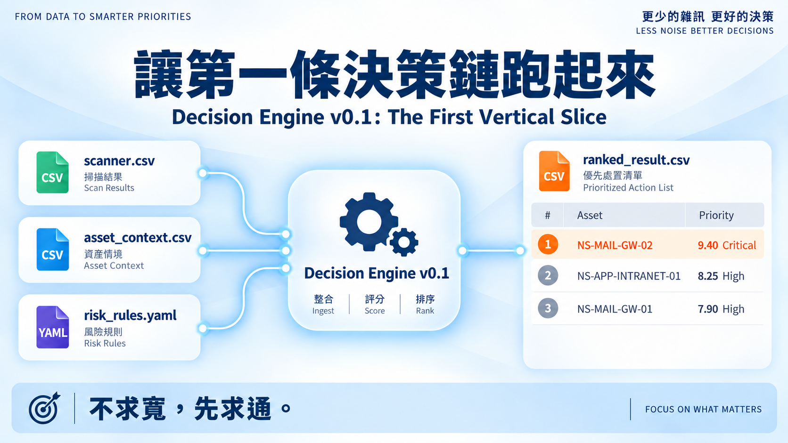
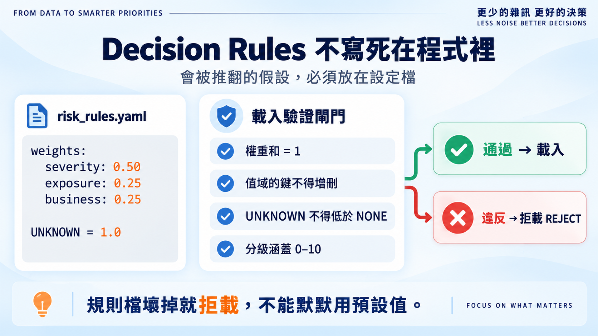
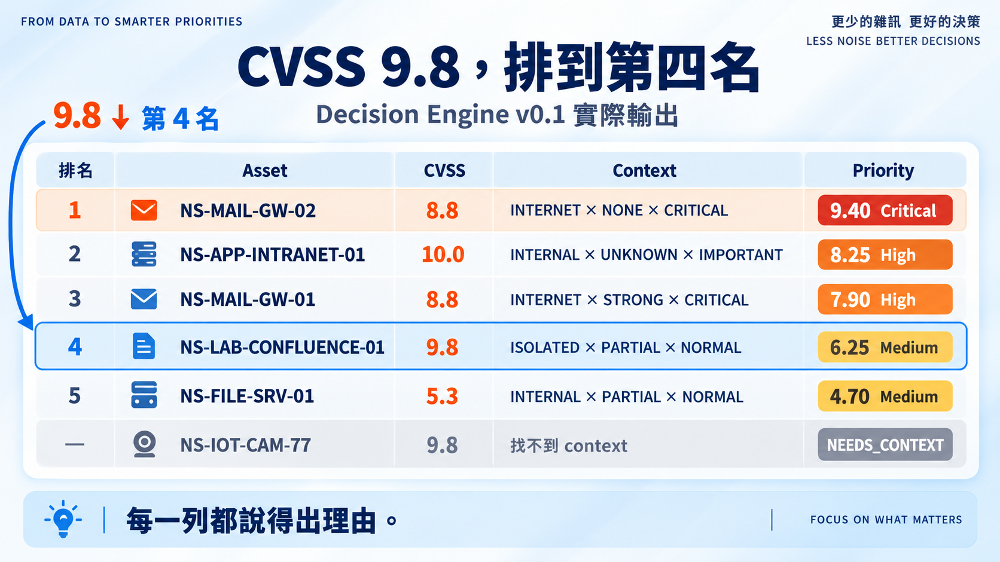
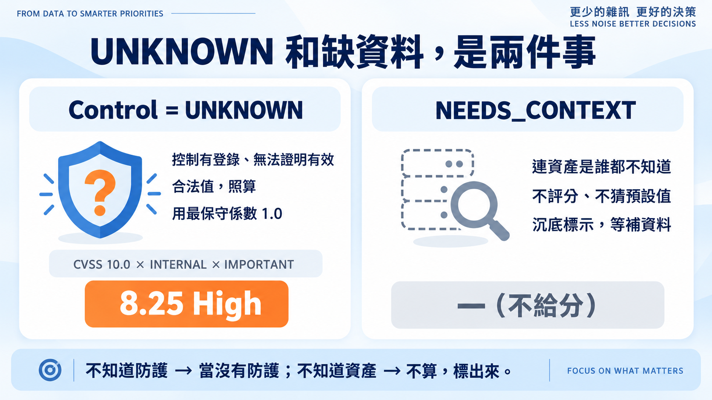

# Day 6｜讓第一條決策鏈跑起來

**Decision Engine v0.1: The First Vertical Slice**



昨天把 v0.1 的邊界凍結了，今天直接開工。目標只有一行：

```text
scanner.csv + asset_context.csv + risk_rules.yaml → ranked_result.csv
```

Day 1–5 累積了很多判斷邏輯，但專案還沒有一行程式碼。現在就去接 NVD、EPSS、KEV，很容易變成蒐集器寫了一堆、決策鏈還是斷的。所以今天只做一件事：**讓最小的決策鏈從輸入走到輸出，每一步都可驗證。** 不求寬，先求通。

## Decision Rules 不寫死在程式裡



50/25/25 只是起始假設。**會被推翻的東西，不能寫死在程式裡。** 權重、值域映射、分級門檻全放進 `risk_rules.yaml`，數值與 Day 5 相同。

載入時就驗證：權重和等於 1、值域鍵不得增刪、UNKNOWN 不得低於 NONE、分級涵蓋 0–10。**違反就拒載，不默默補預設值。**

## 跑一次：9.8 掉到第四名

6 筆虛構 finding（含 Day 5 的 Case A / B）丟進引擎，輸出如下：



三個重點：

**一、Day 5 的手算原樣重現。** 第 3、4 名就是 Case B 與 Case A——7.90 與 6.25，分毫不差。排序翻轉，從紙上推演變成可重跑的輸出。

**二、每一列都說得出理由。** `reason` 欄位長這樣：

```text
CVSS 9.8 (S=0.98); ISOLATED x PARTIAL -> E=0.14; NORMAL -> B=0.4 → 6.25 [Medium]
```

主管問「為什麼 9.8 不是第一個修」，這一行就是答案。

**三、UNKNOWN 和缺資料，是兩件事。** 第 2 名的 `UNKNOWN` 是合法值：控制有登錄、無法證明有效，照算，用最保守的 1.0，所以 10 分的 Log4Shell 還是 High。墊底的 `NEEDS_CONTEXT` 是缺資料：連資產是誰都不知道，不評分、不猜預設值，沉底等人補資料。



## 把 Day 5 的驗收數字鎖進測試

6.25、7.90、9.40、排序翻轉、UNKNOWN 不降曝險、壞規則檔拒載——全部寫成回歸測試，共 22 個，CI 每次 push 自動跑。**改壞公式的人（包括未來的我），會在 CI 被抓到。**

## 這一版還看不到什麼

- **威脅**：沒有 EPSS、KEV，已被實際利用的漏洞和沒人理的同分。
- **歸併**：多 IP 同設備的歸併還沒做，先假設 scanner.csv 已是乾淨結果。
- **路徑**：INTERNET / INTERNAL / ISOLATED 是人工標籤，不是從拓樸算出的可達性。

這些不是遺漏，是設計過的施工順序。

## 明天

決策鏈通了，但 CVSS 還是手填的。明天接第一個真實資料來源：

> **Day 7｜打開 NVD：取得 CVE 與 CVSS 資料。**

完整程式、規則檔、模擬資料與回歸測試：[github.com/oldgi/cve2action](https://github.com/oldgi/cve2action)。所有資產與環境均為虛構；CVE 編號取自公開來源，僅作示例。
