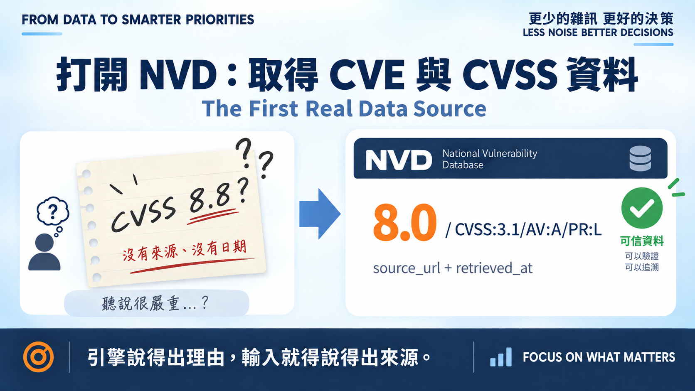
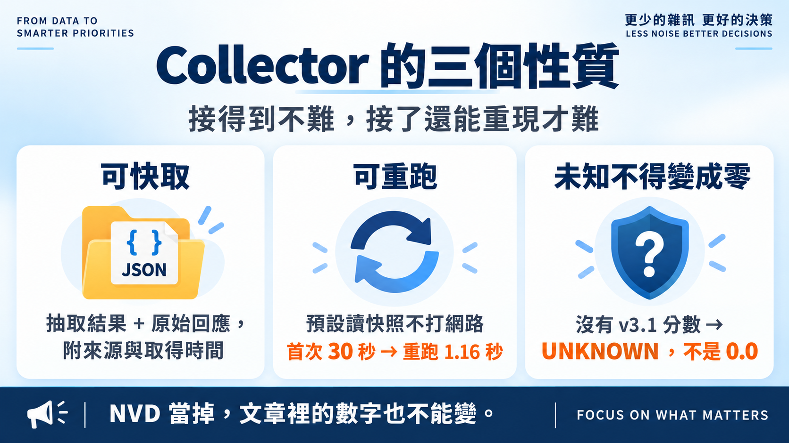
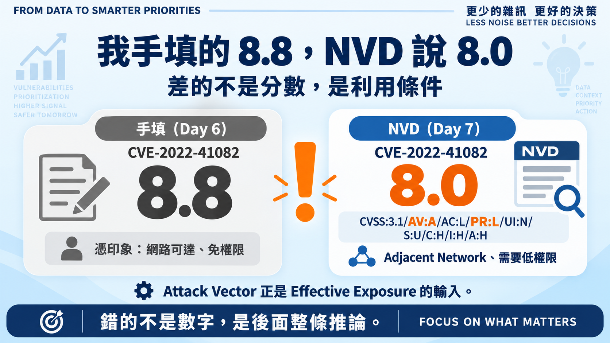

# Day 7｜打開 NVD：取得 CVE 與 CVSS 資料

**The First Real Data Source**

昨天決策鏈通了，但引擎吃的 CVSS 是我手打進 `scanner.csv` 的。

手打的數字有三個問題：沒有來源、沒有取得日期、下次重跑不保證一樣。**一個說得出理由的引擎，不能建在說不出來源的輸入上。**

## Collector 的三個性質

接 NVD API 很容易，難的是接了之後還能重現。所以這個 collector 從一開始就要求三件事：

**可快取。** 抓到的東西寫成 `data/snapshots/nvd/<CVE-ID>.json`，同時保存抽取結果與**原始回應**——今天只讀 v3.1，但明天想重新解讀同一份資料時，原始欄位還在。

**可重跑。** 預設讀快照、不打網路，`--refresh` 才重抓。NVD 當掉、限流、或我改天再跑，文章裡的數字都一樣。

**未知不得變成零。** NVD 沒有 v3.1 分數時回傳 `None` 並標 `UNKNOWN`，不是 0.0。缺資料若變成低分，整條優先序就被靜默污染了——這條規則從 Day 5 一路貫穿到這裡。

取數失敗也分兩種：`NvdNotFound` 是明確的空結果，`NvdUnavailable` 是逾時或限流，可重試，而且**都不能當成「這個 CVE 沒風險」**。

## 跑一次，抓到一個我自己的錯

拿 Day 6 的 scanner.csv 去抓，5 個 CVE 全數命中。第二次重跑全部走快取——首次含限流約 30 秒，重跑 **1.16 秒**。

但其中一筆對不上：

`CVE-2022-41082`，我手填 **8.8**，NVD 給 **8.0**。

差的不只是 0.8 分。NVD 的 vector 是 `AV:A`（Adjacent Network）、`PR:L`（需要低權限），我憑印象寫的是「網路可達、免權限」那一類。

**我寫錯的不是分數，是利用條件。** 而 Attack Vector 正是 Day 6 Effective Exposure 依賴的東西——手填一個看起來差不多的數字，動到的是後面整條推論。

這就是為什麼分數要有來源。

## 這一版的限制

- **只認 CVSS v3.1**，而且優先採 NVD 的 Primary 評分。v4.0 與多來源評分怎麼共存，是明天的題目。
- **還沒接回引擎。** 真實分數目前只躺在快照裡，`scanner.csv` 的 8.8 還沒改——改了就要重算 Day 6 的排序，那需要先有統一的 CVSS 模型。
- 快照是**某個時間點**的 NVD，不是永恆真理。CVSS 會被重新評分，所以 `retrieved_at` 跟分數一樣重要。

12 個離線測試守住這些性質：重跑不打網路、`--refresh` 才重抓、缺分數不變零、HTTP 404 與 429 對應到不同錯誤型別、限流會等待。

## 明天

分數有來源了，但 NVD 同時存在 v3.1 與 v4.0，欄位結構不一樣。

> **Day 8｜CVSS v3.1、v4.0 怎麼共存？**

程式、快照與測試：[github.com/oldgi/cve2action](https://github.com/oldgi/cve2action)。CVE 與 CVSS 為 NVD 公開資料；資產與企業環境均為虛構。
