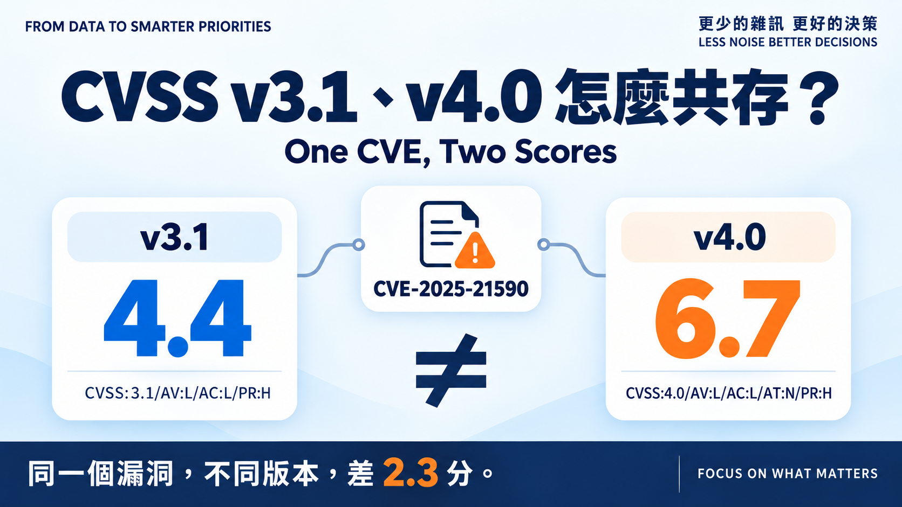
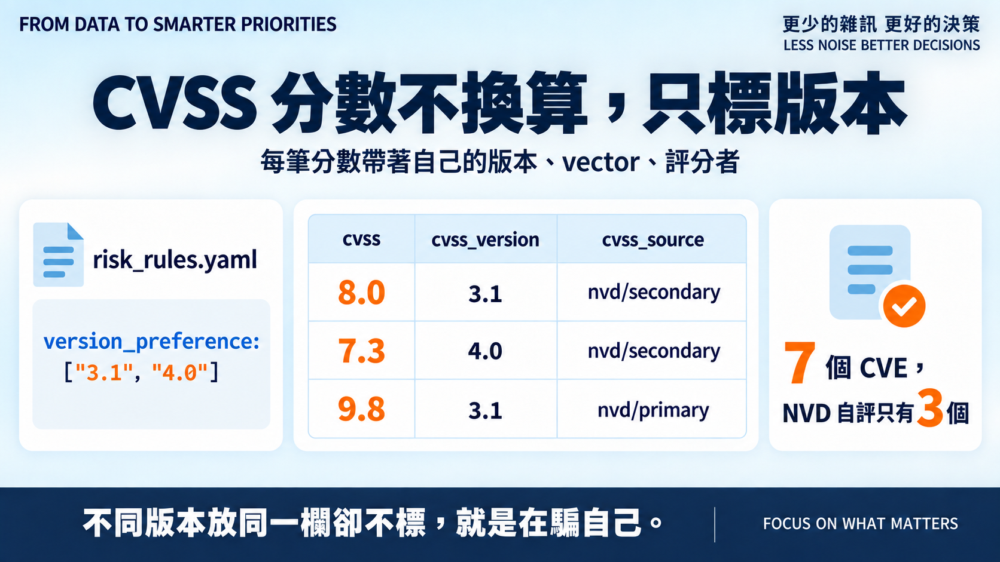
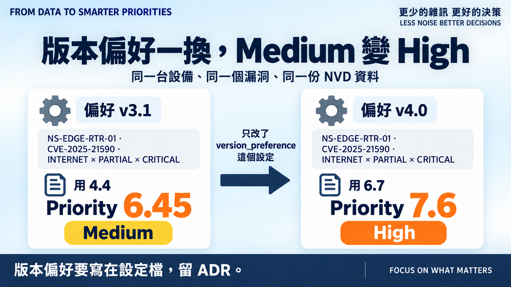

# Day 8｜CVSS v3.1、v4.0 怎麼共存？

**One CVE, Two Scores**

> **施工進度｜** 定邊界（Day 1–5）→ **接資料（Day 6–10）** → 做評分（11–18）→ 畫攻擊路徑（19–24）→ 給修補建議（25–30）

昨天留了兩件事：手填的 8.8 要換成有來源的 8.0 重算，還有 NVD 上 v3.1 和 v4.0 並存的問題。今天一起處理。

## 先找一個有 v4.0 的 CVE

我以為很好找，結果探了九個才找到兩個——Cisco、Palo Alto 在 NVD 上都只有 v3.1：Juniper 的 `CVE-2025-21590`，同一個 CNA 給了 v3.1 = **4.4**、v4.0 = **6.7**；Rockwell 的 `CVE-2024-6242`，**只有 v4.0**，7.3。

順便看到一件更麻煩的事：七個 CVE 裡，NVD 自己評分的只有三個。其他四個是 CNA 或 CISA 的 ADP 評的，NVD 只是把它們放在那裡。

所以昨天說「NVD 給 8.0」其實不精確。那是微軟給的 8.0。

> **豆知識補正：** NVD 是資料庫，不一定是評分者。它自評的標 `Primary`，CNA 與 ADP 的標 `Secondary`；同一個 CVE、同一版本，可能有好幾個人的分數。

## 不換算，標版本

兩版都是 0–10、分級門檻也一樣，很容易當成同一個數字。但公式不同，同一個漏洞差兩三分是常態，硬換算只會製造假精確。

所以每筆分數帶著自己的版本、vector、評分者。用哪一版由 `risk_rules.yaml` 一行 `version_preference: ["3.1", "4.0"]` 決定——先 3.1 是為了跟 Day 5 基準可比，只有 4.0 的才退用 4.0。同版本多人評分，NVD 自評優先。

輸出每列多兩欄：`cvss_version`、`cvss_source`。不同版本的分數放同一欄卻不標，就是在騙自己。

順帶一提，昨天留在快照裡的原始回應今天派上用場：五份舊快照一個都不用重抓。

## 跑一次

**8.8 換成 8.0。** 兩台 Exchange 從 9.4 → 9.0、7.9 → 7.5，排序沒翻，但 `reason` 多了一句 `scanner said 8.8`——差異留在紀錄裡。

**空白補上了。** Rockwell PLC 那列，掃描器給不出分數，昨天是 `NEEDS_CONTEXT`；今天 v4.0 的 7.3 補進去，6.35 Medium。

**改一行設定，跨一個分級。** Juniper 路由器放在 INTERNET × PARTIAL × CRITICAL 的位置：偏好 3.1 時用 4.4，算出 6.45 **Medium**；把偏好改成 4.0，用 6.7，算出 7.6 **High**。

同一台設備、同一個漏洞、同一份資料，改的只是先看哪一版。所以版本偏好得寫在設定檔並留 ADR。

## 還沒做到的

`Primary` 優先只是「NVD 自評 vs 別人」一律聽 NVD——Tomcat 的 `CVE-2025-24813` NVD 給 9.8、CISA ADP 給 10.0，這樣選對不對沒驗證；兩個 `Secondary` 打架則沒處理。v4.0 的 Threat／Environmental 指標和 v2 都沒碰。

三十六個新測試，含兩條端到端基準：帶快照的排序表、換偏好後路由器變 High。

## 明天

分數有來源、有版本了，但這還只是「嚴重度」那把尺。明天接第二把：

> **Day 9｜EPSS：漏洞未來遭利用的可能性**

程式、快照與 ADR：[github.com/oldgi/cve2action](https://github.com/oldgi/cve2action)。CVE 與 CVSS 為 NVD 公開資料；資產與企業環境均為虛構。
