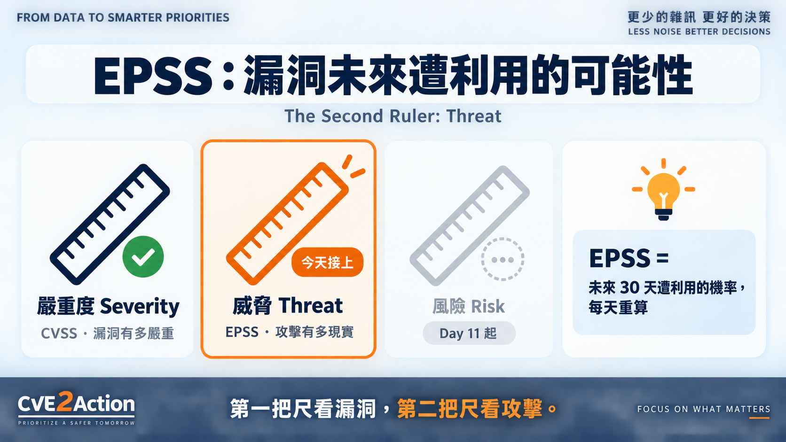
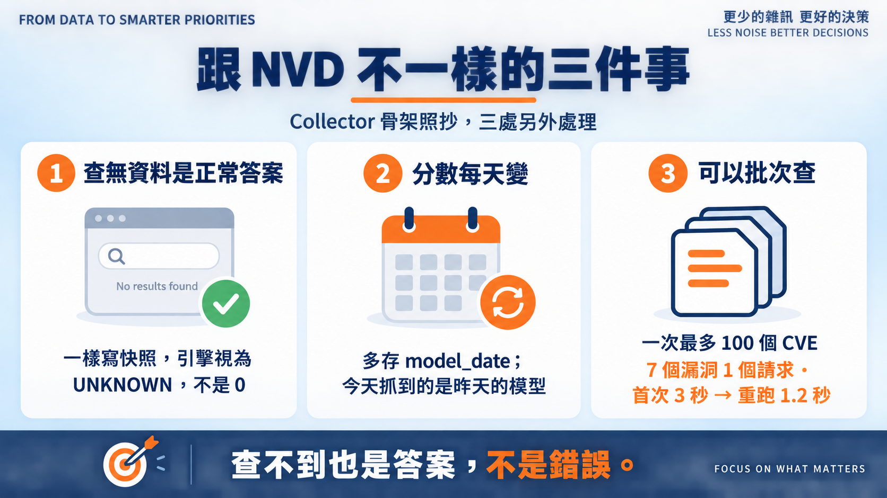
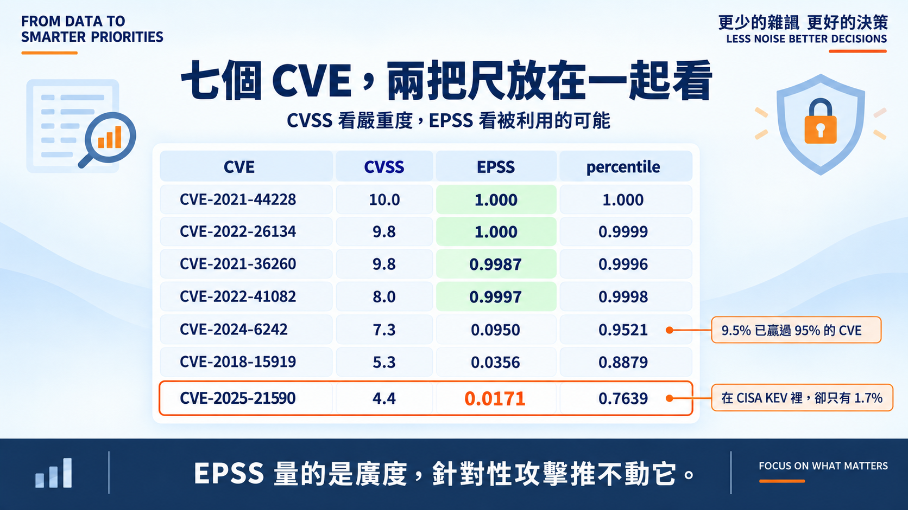

# Day 9｜EPSS：漏洞未來遭利用的可能性

**The Second Ruler: Threat**

> **施工進度｜** 定邊界（Day 1–5）→ **接資料（Day 6–10）** → 做評分（11–18）→ 畫攻擊路徑（19–24）→ 給修補建議（25–30）

前兩天把第一把尺弄乾淨了：分數有來源、有版本。但那還是「漏洞有多嚴重」。

Day 3 說過第二把尺看的是「攻擊有多現實」。今天接它的第一個資料源。

> **豆知識：EPSS 是什麼？** Exploit Prediction Scoring System，FIRST 維護。它不是資料庫，是一個機器學習模型：吃漏洞特徵和實際觀測到的利用活動，吐出「未來 30 天內遭利用的機率」，每天重算一次。另外附一個 percentile，告訴你這個機率在全部 CVE 裡排第幾。

## 跟 NVD 不一樣的三件事

Collector 骨架照抄 Day 7：快照、可重跑、未知不變零。但 EPSS 有三個地方得另外處理。

**查無資料是正常答案。** EPSS 只涵蓋已公開、沒被撤回的 CVE。太新的、保留的、REJECTED 的查不到——這不是錯誤，是答案。所以查無資料一樣寫快照，重跑不再打網路；引擎那邊視為 UNKNOWN，不是 0。

**分數每天變。** 快照多存一個 `model_date`。今天抓到的是 09-20 的模型，慢一天。兩週前的 0.97 和今天的 0.97 不是同一個數字，這欄跟 `retrieved_at` 一樣重要。

**可以批次查。** 一次最多一百個 CVE，七個漏洞一個請求就完事，3 秒。重跑走快取，1.2 秒。

## 跑一次

七個 CVE 的 EPSS 跟 CVSS 放在一起看，三件事跳出來。

**前四名 0.99 以上。** Confluence、Log4Shell、ProxyNotShell、Hikvision——都是被大規模掃射過的漏洞，EPSS 幾乎是 1。這裡兩把尺同向。

**Juniper 那筆只有 0.017。** `CVE-2025-21590` 在 CISA KEV 裡，確認被利用過。但 EPSS 說未來 30 天遭利用的機率是 1.7%。

不矛盾。EPSS 量的是**廣度**——honeypot、IDS 看到多少利用嘗試。這個漏洞需要本機存取、只在少數針對性攻擊裡出現，掃射器抓不到它。Day 3 那句「沒有觀察到攻擊，不等於沒有威脅」，今天有了數字版。

**低分不代表墊底。** Rockwell 的 9.5% 看起來很低，但 percentile 是 0.95——已經贏過 95% 的 CVE。OpenSSH 那個 3.6%，贏過 89%。EPSS 的分布極度偏斜，絕大多數 CVE 貼著零；要看相對位置，得看 percentile。

## 還沒做到的

EPSS 今天只是抓下來、放旁邊看，**沒有進公式**。怎麼跟 CVSS 合併、權重多少、KEV 又怎麼疊上去，是 Day 14 的事——先把三個資料源都接齊，再一起決定規則。

也沒抓歷史序列。EPSS 每天變，趨勢本身是資訊，但 v0.1 先只留當天快照。

十七個新測試：批次切分、查無資料進快照、逾時與 429 不寫檔、`--refresh` 才重抓。

## 明天

EPSS 說 Juniper 只有 1.7%，KEV 說它被利用過。兩個都是威脅訊號，但講的不是同一件事。

> **Day 10｜CISA KEV：哪些漏洞已被實際利用？**

程式、快照與測試：[github.com/oldgi/cve2action](https://github.com/oldgi/cve2action)。EPSS 為 FIRST 公開資料；資產與企業環境均為虛構。
