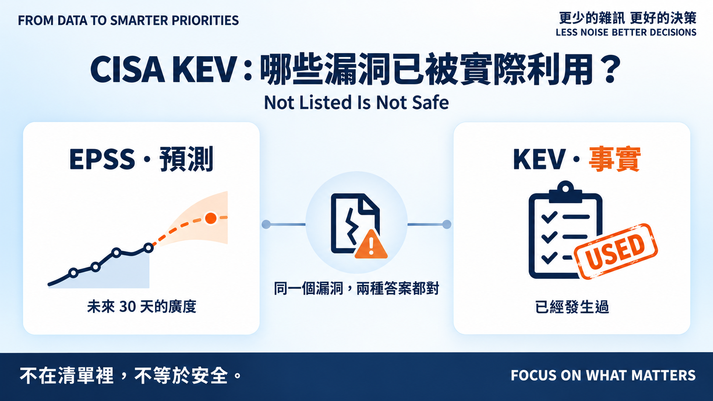
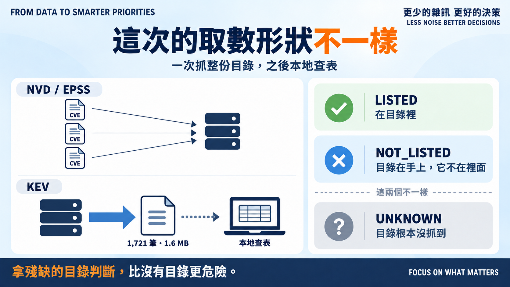
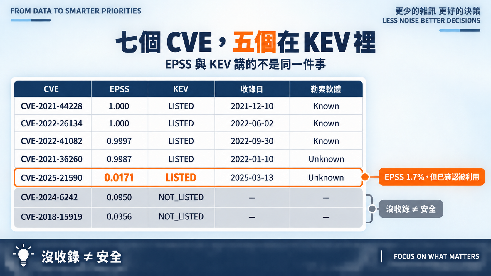

# Day 10｜CISA KEV：哪些漏洞已被實際利用？

**Not Listed Is Not Safe**

> **施工進度｜** 定邊界（Day 1–5）→ **接資料（Day 6–10，今天收尾）** → 做評分（11–18）→ 畫攻擊路徑（19–24）→ 給修補建議（25–30）

昨天留了個沒解的矛盾：Juniper 那個漏洞 EPSS 只有 1.7%，但我說它在 KEV 裡。今天把 KEV 抓下來，看清楚這兩個數字在講什麼。

> **豆知識：KEV 是什麼？** Known Exploited Vulnerabilities，CISA 維護的目錄，只收「有可靠證據、已經被實際利用」的漏洞。美國聯邦機關依法必須在期限內修完，所以每一筆都附一個 `dueDate`。它不是預測，是已發生事實的清單。

## 這次的取數形狀不一樣

NVD 和 EPSS 都是「拿 CVE 去問」。KEV 是一份完整目錄：單一 JSON、1,721 筆、1.6 MB，一次抓整份，之後在本地查表。

這改變了「查不到」的意思。NVD 查不到，我們只知道自己不知道；但**目錄在手上、裡面沒有它，那是明確事實**。所以 KEV 是三態：

- `LISTED`：在目錄裡。
- `NOT_LISTED`：目錄在手上，它不在裡面。
- `UNKNOWN`：**目錄根本沒抓到**——只有這種情況才是不知道。

所以多寫一個檢查：目錄宣告 `count: 1721`，我比對實際筆數，對不上整批拒收。拿被截斷的目錄去判「不在清單裡」，比沒有目錄更危險。

## 跑一次：七個 CVE，五個在裡面

**昨天的矛盾解開了。** `CVE-2025-21590` 確實在 KEV，2025-03-13 收錄。它同時是「EPSS 1.7%」和「已確認被利用」。

兩個都對，因為問題不同。EPSS 預測**未來 30 天的廣度**，那是掃射器看得到的；KEV 記錄**過去發生過的事實**，哪怕只在少數目標上。針對性攻擊推不高 EPSS，卻足以進 KEV。

**兩個不在清單裡。** OpenSSH 那個使用者列舉，還有 Rockwell PLC 的 `CVE-2024-6242`——後者 percentile 0.95、贏過 95% 的 CVE，CISA 仍沒收它。

`NOT_LISTED` 只代表 CISA 沒有把它列入，**不代表安全**。KEV 的門檻是「有可靠證據的實際利用」，不在門檻內的東西多得很。這也是為什麼我不讓 `NOT_LISTED` 在程式裡長得像零。

**三筆標了勒索軟體。** Log4Shell、ProxyNotShell、Confluence 都是 `Known`。另外兩筆是 `Unknown`——我把它映射成 `None` 而不是 `False`：不知道有沒有被勒索軟體用過，跟確認沒有，是兩件事。

順便看到修補期限的落差：Confluence 從收錄到到期只有 4 天，Log4Shell 給了 14 天。同樣是 Critical，CISA 給的時間不一樣。

## 接資料階段，到此結束

三個資料源接齊了：NVD 給嚴重度、EPSS 給預測、KEV 給事實。但它們**都還沒進公式**——今天的排序跟 Day 8 一模一樣。

這是刻意的。怎麼加權、KEV 要不要直接拉高優先序、EPSS 與 KEV 衝突時聽誰的，是 Day 14 的題目，規則得寫在設定檔並留 ADR。先把資料接乾淨，再談怎麼用。

二十二個新測試：三態語意、目錄殘缺拒收、`Unknown` 不等於 `False`、逾時不寫檔。

## 明天

資料齊了，但我還沒有一間公司可以套——到目前為止的資產情境都是隨手編的七行 CSV。

> **Day 11｜建立一間不存在的數位公司**

程式、目錄快照與測試：[github.com/oldgi/cve2action](https://github.com/oldgi/cve2action)。KEV 為 CISA 公開資料；資產與企業環境均為虛構。
