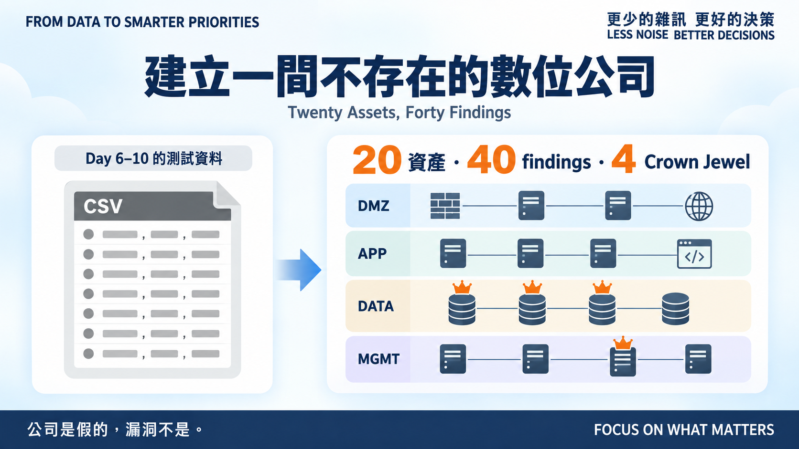
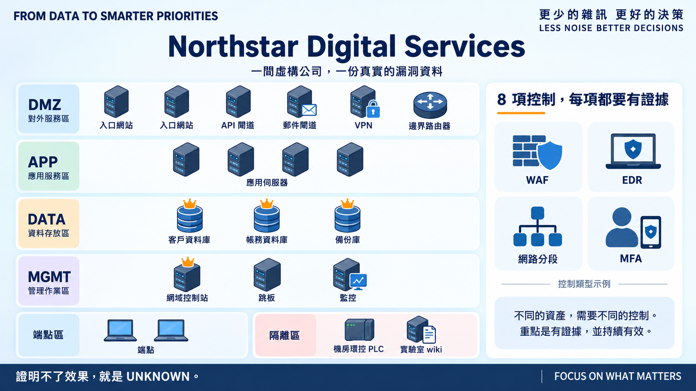
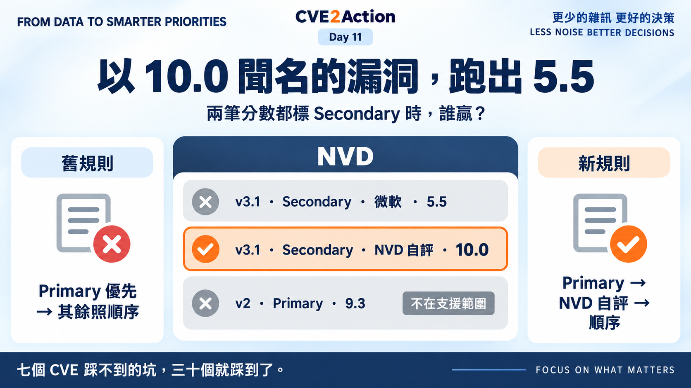
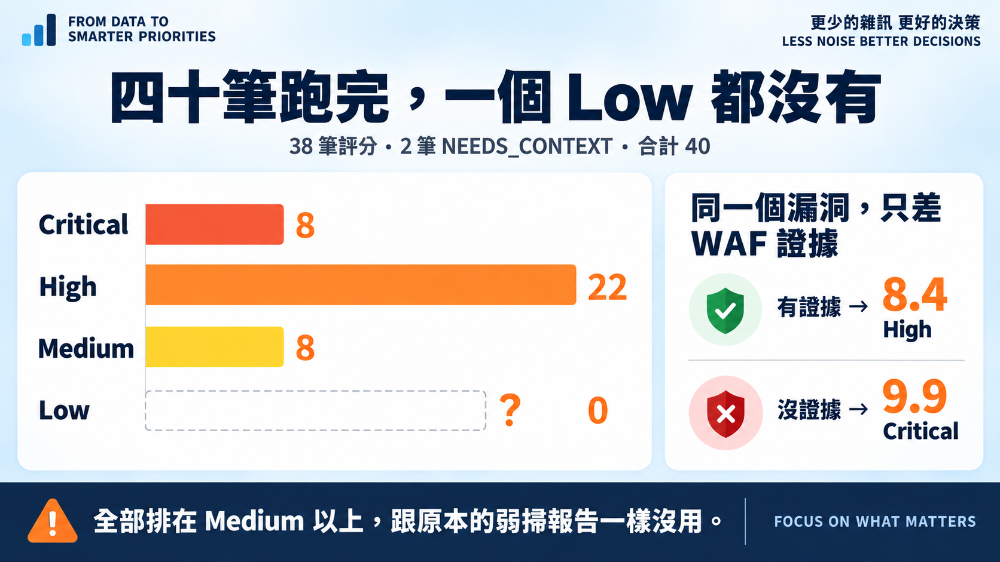

# Day 11｜建立一間不存在的數位公司

**Twenty Assets, Forty Findings, Two Bugs**

> **施工進度｜** 定邊界（Day 1–5）→ 接資料（Day 6–10）→ **做評分（Day 11–18，今天起跑）** → 畫攻擊路徑（19–24）→ 給修補建議（25–30）

前五天的引擎一直吃同一份七行 CSV——我為了驗證公式隨手編的，每一行的答案我都先知道。今天換成一間有二十台機器的公司。

## Northstar Digital Services

一家虛構的線上服務商：DMZ 六台、應用四台、資料三台、管理三台，加上端點、機房環控 PLC 與實驗室 wiki。四個 Crown Jewel：客戶與帳務資料庫、備份庫、網域控制站。八項控制措施，每項都要寫出**證據**——證明不了就是 `UNKNOWN`。

四十筆發現。**公司是假的，漏洞不是**：三十個 CVE 都有 NVD、EPSS、KEV 的真實快照，分數由腳本從快照讀進 CSV，我一個都沒手打，重跑不打網路且輸出逐位元組相同。

## 資料一放大，程式就露餡

七行 CSV 跑得好好的程式，換成三十個 CVE 就壞了兩處。

**第一個是限流。** 抓到第十五個開始整批 429。Day 7 設的 6.5 秒間隔剛好卡在 NVD「30 秒 5 次」的滾動窗邊界，前十個僥倖過關，後面全被擋。改成 7.5 秒，並在 429 時退避三十秒重試一次。

**第二個比較難看。** Zerologon（`CVE-2020-1472`）跑出來是 **5.5 Medium**。

那是個以 CVSS 10.0 聞名的網域控制站漏洞。翻開快照才發現：它的兩筆 v3.1 **都標 Secondary**——微軟 5.5、NVD 自己 10.0——唯一的 `Primary` 是我不解析的 v2。Day 8 的規則「Primary 優先，其餘照順序」於是讓排前面的 5.5 贏了。

這正是 Day 8 我在「還沒做到的」裡寫下的缺口：兩個 Secondary 打架沒處理。當時只有七個 CVE，踩不到。改法是加一層 **NVD 自評優先**，並更新 ADR。

## 跑完四十筆

三十八筆評分，兩筆 `NEEDS_CONTEXT`：一台掃到卻不在清冊裡的影子 NAS，以及一筆 NVD 沒給 v3.1、掃描器也沒給值的 TLS 老問題。另有一筆掃描器說 9.9、NVD 說 9.8，`reason` 留著 `scanner said 9.9`。

控制的對照很乾淨：同樣的 `CVE-2021-41773`、同樣對外、同樣關鍵業務，兩台入口網站只差在 WAF 有沒有證據——有的 **8.4 High**，沒有的 **9.9 Critical**。隔離實驗室的 9.8 則掉到 **6.4 Medium**。

但整體分布是個問題：**八個 Critical、二十四個 High、八個 Medium，一個 Low 都沒有。**

兩層原因。我挑 CVE 偏好有名的，三十個裡二十四個在 KEV；更根本的是公式——一半權重給了曝險與業務，而這家公司十三台 CRITICAL、六台對外，光這兩項就把底分推到五分以上。

**一個把所有東西都排在 Medium 以上的工具，跟原本那份弱掃報告一樣沒用。** 這是 Day 18 校準的第一個題目，今天先記下來。

## 明天

資料有了，但 `reachability` 還是我照 Zone 手動對應的。那張對應表憑什麼？

> **Day 12｜Internet、內網、隔離區：有效曝險怎麼量化？**

資料集與建置腳本：[github.com/oldgi/cve2action](https://github.com/oldgi/cve2action)。Northstar 為完全虛構的公司；CVE、CVSS、EPSS、KEV 均為公開資料。
