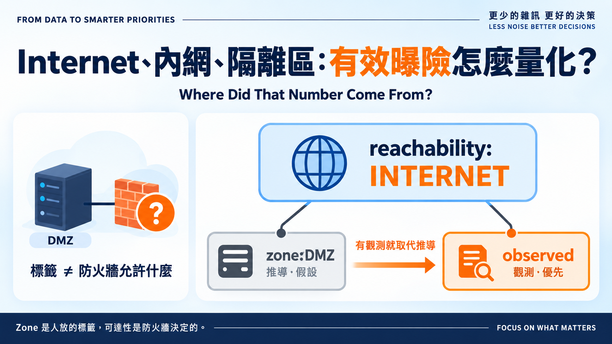
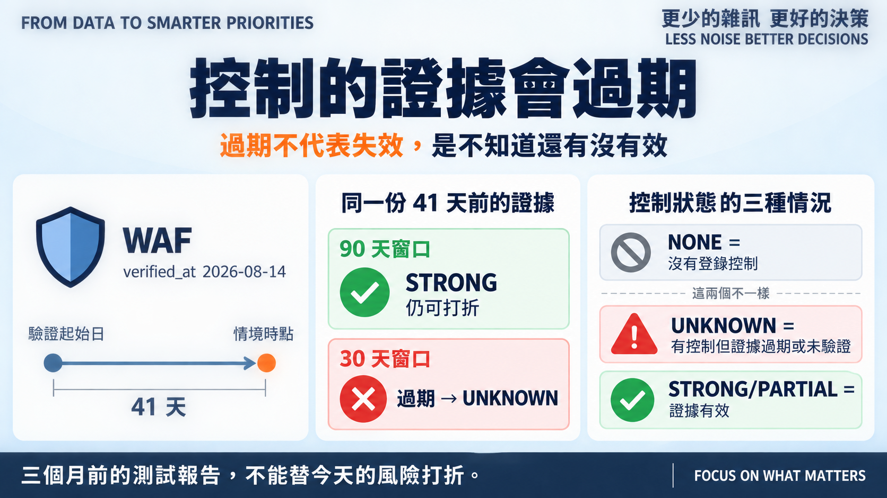
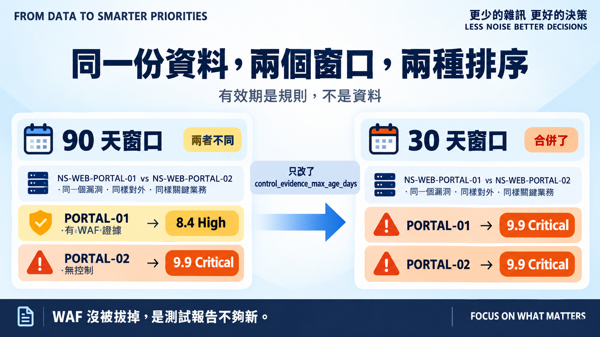

# Day 12｜Internet、內網、隔離區：有效曝險怎麼量化？

**Where Did That Number Come From?**



> **施工進度｜** 定邊界（Day 1–5）→ 接資料（Day 6–10）→ **做評分（Day 11–18）** → 畫攻擊路徑（19–24）→ 給修補建議（25–30）

昨天留了一個問題：`reachability` 是我照 Zone 手動對應的，那張對應表憑什麼？

## Zone 是行政標籤，不是可達性

DMZ 的機器一定對 Internet 開放嗎？不一定，可能只開給合作夥伴的固定 IP。CORP 的機器一定碰不到嗎？一條 NAT 規則就夠了。

Zone 是人放的標籤，可達性是防火牆決定的。把前者當後者，是**假設**。

假設不是不能用——沒有網路規則資料前，Zone 是最好的近似值。但它必須寫在設定檔而非埋在程式碼裡、必須標明是推導來的，而且能被觀測值覆寫：Day 20 的 Reachability Engine 會從實際網路規則產生真值，到時 Zone 這張表退居備案。

所以今天 `asset_context.csv` 多了兩欄：`reachability_source` 與 `control_source`。

```text
NS-WEB-PORTAL-01  INTERNET  STRONG  zone:DMZ  control:waf@2026-08-14
```

值一模一樣，但現在每個數字都說得出自己從哪來。

## 控制的證據會過期



第二個輸入更麻煩。`controls.csv` 每項控制都有 `verified_at`，那是上次驗證它有效的日期。一份三個月前的 WAF 繞過測試，能不能替今天的風險打折？

規則因此多了 `control_evidence_max_age_days`，v0.1 設 90 天。過期的證據不能再打折，但**降為 UNKNOWN 而不是 NONE**：過期不代表控制失效，是我們不知道它現在還有沒有效。完全沒登錄控制才是 NONE。

多個控制則**取最強的一個，不相乘**。WAF 和 EDR 可能被同一個繞過手法一起穿過，把 0.4 乘 0.7 當成 0.28 是假精確。

## 兩個驗證



**第一個：推導結果跟昨天手寫的一模一樣。** 二十列、四個欄位，零差異。這就是「可重現」該有的樣子——資料沒變，只是從「我說了算」變成「照規則算的，而且看得到來源」。

**第二個比較有意思。** 把有效期從 90 天收緊到 30 天，同一份資料、同一批控制，過期的從一台變三台。

昨天那組對照——兩台入口網站同一個漏洞，有 WAF 證據的 8.4 High、沒有的 9.9 Critical——在 30 天窗口下**合併了**：前者也變成 9.9 Critical。WAF 沒被拔掉，是四十一天前的測試報告不夠新。

有效期因此跟權重同級：它會改變排序，所以留了 ADR。

## 還沒做到的

`as_of` 必須固定。我用 `2026-09-24` 這個情境時點而不是 `date.today()`——否則證據年齡每天變，資料集不可重現，Day 18 的 baseline 就沒意義。真實系統當然用今天，但那時每次重跑本來就該得到不同答案。

「取最強」保守但粗糙：控制之間的相依性、同一個 WAF 對不同利用手法的覆蓋差異，都是 Day 15 的題目。

還有，Northstar 二十台資產只有八台登錄控制措施。剩下十二台是真的沒防護，還是沒人填？資料上看不出來，而這兩件事在風險上差很多。

## 明天

曝險有來源了，業務衝擊還沒有——`CRITICAL` 跟 `NORMAL` 也是我標的。

> **Day 13｜核心系統和測試機不能一視同仁**

推導模組與 ADR：[github.com/oldgi/cve2action](https://github.com/oldgi/cve2action)。Northstar 為完全虛構；CVE 相關資料為公開來源。
