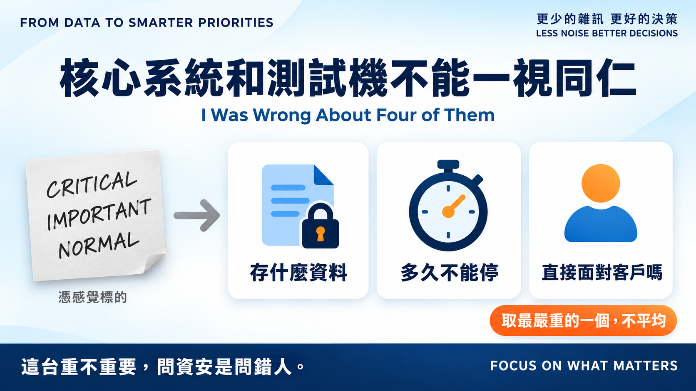
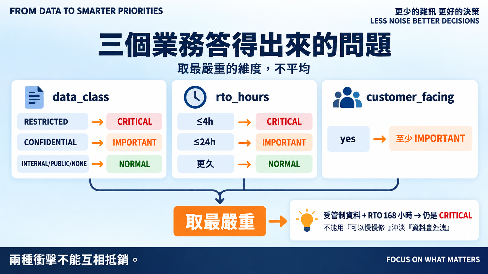
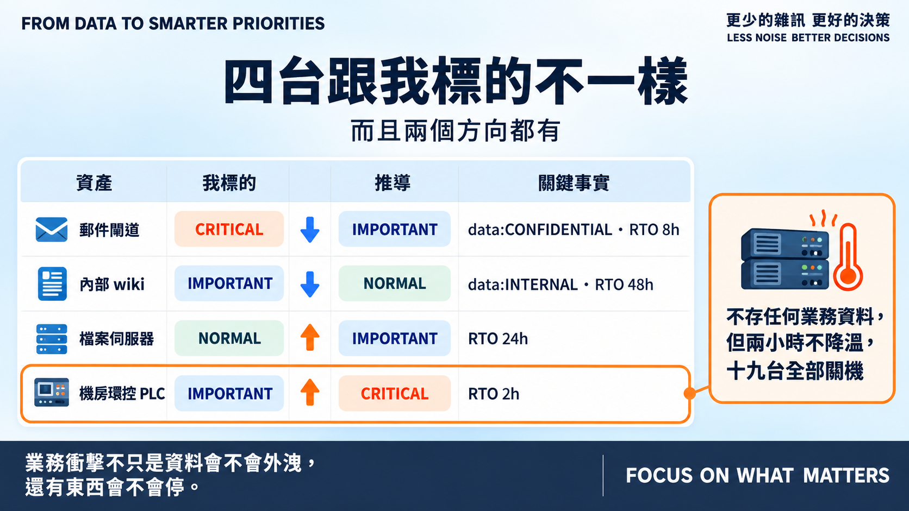

# Day 13｜核心系統和測試機不能一視同仁

**I Was Wrong About Four of Them**

> **施工進度｜** 定邊界（Day 1–5）→ 接資料（Day 6–10）→ **做評分（Day 11–18）** → 畫攻擊路徑（19–24）→ 給修補建議（25–30）

昨天把曝險變成可推導的。今天輪到最後一個手標的欄位：`criticality`。

Day 11 我在二十台資產旁邊各寫了一個 `CRITICAL`、`IMPORTANT` 或 `NORMAL`。憑感覺。

## 換成業務答得出來的三個問題

「這台重不重要」問資安是問錯人。改成三個業務答得出來的問題：

- **存什麼資料？** 受管制、機密、內部、公開、不存。
- **多久不能停？** RTO 是業務自己談出來的數字，不是我猜的。
- **直接面對客戶嗎？** 停機立刻被外部看見。

然後**取最嚴重的那一個，不平均**。

這點很重要。一台存放受管制資料、但停機容忍度很高的機器，平均起來會變成中等——等於用「可以慢慢修」沖淡「資料會外洩」。這兩種衝擊不能互相抵銷。

## 四台跟我標的不一樣

推導完，二十台裡有四台對不上，而且兩個方向都有：

| 資產 | 我標的 | 推導 | 為什麼 |
|---|---|---|---|
| 郵件閘道 | CRITICAL | **IMPORTANT** | 機密但非受管制資料，RTO 8 小時 |
| 內部 wiki | IMPORTANT | **NORMAL** | 內部資料，停兩天還撐得住 |
| 檔案伺服器 | NORMAL | **IMPORTANT** | RTO 24 小時，停一天好幾組人做不了事 |
| 機房環控 PLC | IMPORTANT | **CRITICAL** | RTO 2 小時 |

最值得看的是最後一台。它**不存任何業務資料**，在隔離區，跑的是空調控制。我當初看它「是 OT 設備、又隔離」，順手標了 IMPORTANT。

但機房兩小時不降溫，上面那十九台全部得關機。

**業務衝擊不只是資料會不會外洩，還有東西會不會停。** 我標的時候只想到前者。

反過來，郵件閘道是被我高估了：它重要，但「重要」跟「四小時內非復原不可」是兩件事。

## 排序跟著動了

三筆發現跨越分級，整體分布從 Day 11 的 8/22/8 變成 **7/23/8**。

這裡要說清楚一件事：Day 11 我說過資料集到 Day 18 都不會變。今天它變了。

但變的不是事實——資產、漏洞、控制都沒動。變的是我從事實推不出來的那個判斷。而且我補的 `business_context.csv` 也不是新編的資料，是把原本只存在我腦袋裡的理由寫下來。

**凍結資料集是為了讓校準有意義，不是為了保護已知有誤的輸入。** baseline 要到 Day 18 才訂；現在改，成本是更新三個測試數字，那時候再改，成本是重跑全部回歸案例。

## 還沒做到的

RTO 的門檻（4 小時 / 24 小時）是我挑的。這兩個數字本身也該被校準，但要等 Day 17 拿人工排序比對過才知道切在哪裡合理。

`data_class` 只有五級，而且沒有區分「外洩」跟「被竄改」的衝擊。一台唯讀的公開資料庫被改掉內容，跟客戶資料外洩，都不是現在這個尺度量得出來的。

還有 `crown_jewel` 至今沒進公式。它要等攻擊路徑（Day 22 之後）才有意義：Crown Jewel 的價值不在它自己多重要，而在有多少條路通到它。

## 明天

三把尺的輸入都有來源了。但 EPSS 與 KEV 從 Day 9、10 抓下來之後，一直放在旁邊沒用。

> **Day 14｜外部威脅情報怎麼進 Decision Engine？**

推導模組與 ADR：[github.com/oldgi/cve2action](https://github.com/oldgi/cve2action)。Northstar 為完全虛構；CVE 相關資料為公開來源。
