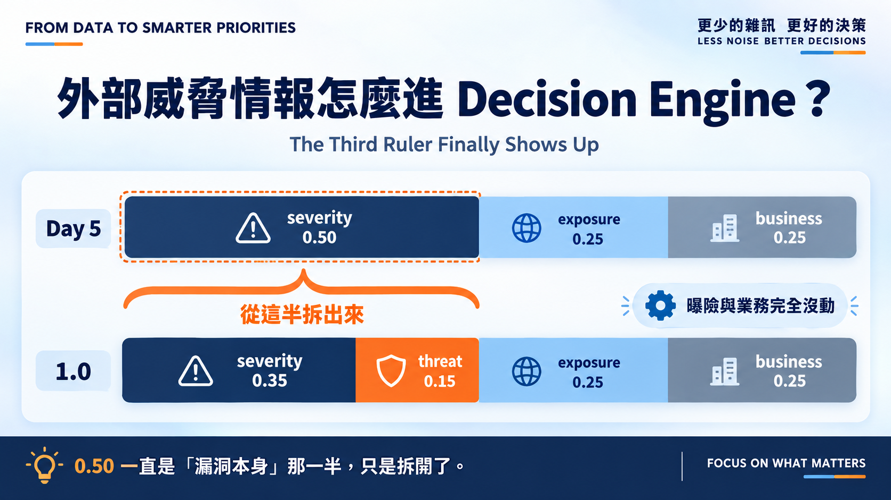
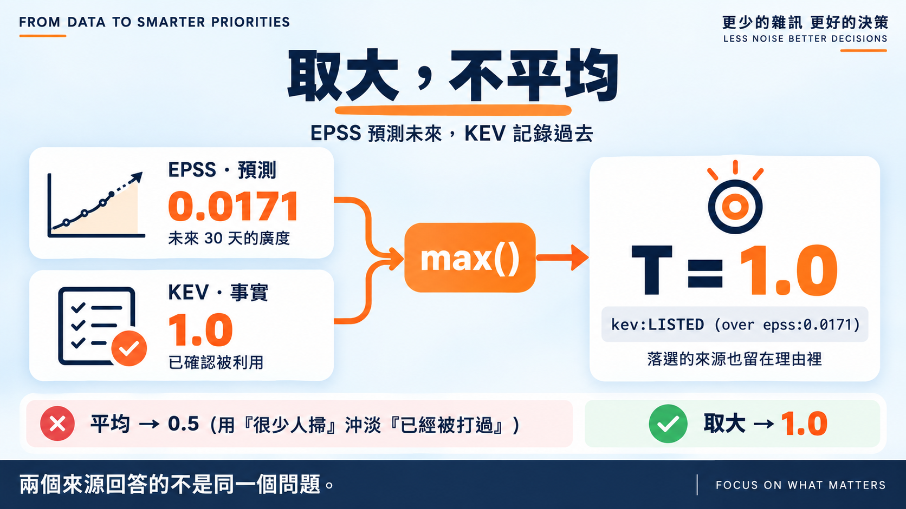
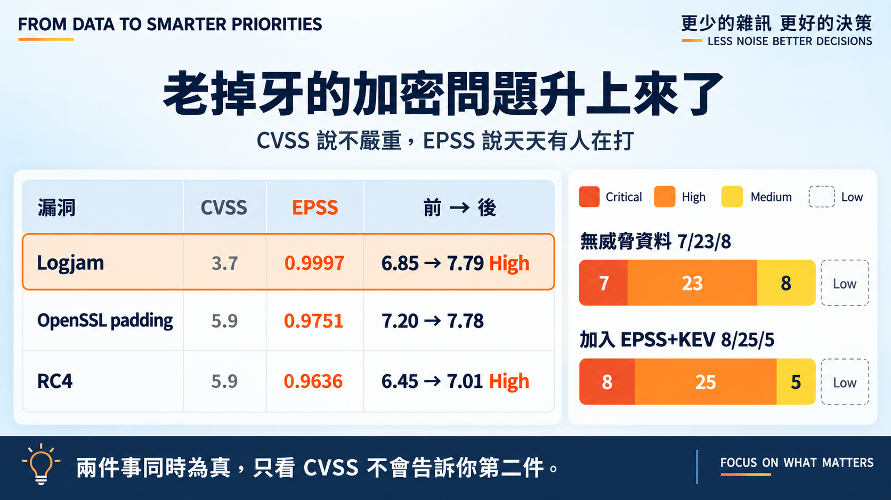

# Day 14｜外部威脅情報怎麼進 Decision Engine？

**The Third Ruler Finally Shows Up**



> **施工進度｜** 定邊界（Day 1–5）→ 接資料（Day 6–10）→ **做評分（Day 11–18）** → 畫攻擊路徑（19–24）→ 給修補建議（25–30）

EPSS 是 Day 9 抓的、KEV 是 Day 10 抓的，躺了五天沒進過公式。今天讓它們進去。

## 0.50 一直是「漏洞本身」那一半

Day 3 說過三把尺：嚴重度、威脅、風險。但公式裡只有 `S`、`E`、`B`——威脅一直由 CVSS 兼著，而它的可利用性指標講的是**技術條件**，不是**現實有沒有人在打**。

所以新權重不是把大家擠一擠，是把那 0.50 拆開：

```text
Day 5   S 0.50           E 0.25  B 0.25
Day 14  S 0.35  T 0.15   E 0.25  B 0.25
```

曝險與業務完全沒動。**拆的是同一半裡「多嚴重」跟「多可能」。**

## 取大，不平均



EPSS 原始機率極度偏斜，照藍圖做對數轉換把低端拉開。

真正要決定的是兩者怎麼合。**取最大值**——它們回答的不是同一個問題：EPSS 預測未來三十天的廣度，KEV 記錄過去已確認的事實。平均等於用「很少人掃」沖淡「已經被打過」。

Day 9 留的 Juniper 漏洞就是現成測試：EPSS 只有 0.0171，卻在 KEV 裡。取大之後 T = 1.0，理由欄留著另一邊說了什麼——`kev:LISTED (over epss:0.0171)`。

**沒有威脅資料時不補零。** 零代表「確定沒有威脅」，那是我們不知道的事。此時威脅項移除、**權重退回 severity**——CVSS 繼續兼著，公式退回 Day 5 的 50/25/25，先前基準一個都沒變。

## 跑一次：老掉牙的加密問題升上來了



分布從 7/23/8 變成 **8/25/5**，四筆跨分級。有意思的不是 KEV 那幾筆，是這三個：

| 漏洞 | CVSS | EPSS | 結果 |
|---|---:|---:|---|
| Logjam | **3.7** | 0.9997 | 6.85 → **7.79 High** |
| OpenSSL padding | 5.9 | 0.9751 | 7.20 → 7.78 |
| RC4 | 5.9 | 0.9636 | 6.45 → **7.01 High** |

Day 11 我把這幾個當成「弱掃雜訊」丟進去撐金字塔底部，以為 CVSS 3.7 的 Logjam 會一直待在最下面。結果它的 EPSS 是 **0.9997**。

這些老加密問題被每一台自動掃描器掃。**CVSS 說它技術上不嚴重，EPSS 說現實天天有人在打。** 兩件事同時為真，只看 CVSS 不會告訴你第二件。

這三筆的 EPSS 是我今天才補抓的。第一次跑時它們的 T 是 0，結論剛好相反——**缺資料不會報錯，只會給你一個看起來合理的錯答案。**

## 還沒做到的

藍圖那條覆寫規則「KEV ＋ Internet 可達 ＋ 有效攻擊路徑 → 至少 P0」今天沒做，路徑要 Day 22 之後才有。現在 KEV 只是加權項的滿分輸入，**不是硬性下限**——在 KEV 裡但隔離、沒業務衝擊的漏洞仍可能排中段。

Low 依然掛零，而且加了威脅項後 Medium 從八筆掉到五筆——**往上跑的更多了**。這問題到 Day 18 只會更難。

## 明天

控制措施只有三檔：NONE、PARTIAL、STRONG。這三個字憑什麼對應 1.0、0.7、0.4？

> **Day 15｜防護措施到底能降多少？**

威脅模組與 ADR：[github.com/oldgi/cve2action](https://github.com/oldgi/cve2action)。Northstar 為虛構；CVE、EPSS、KEV 為公開資料。
