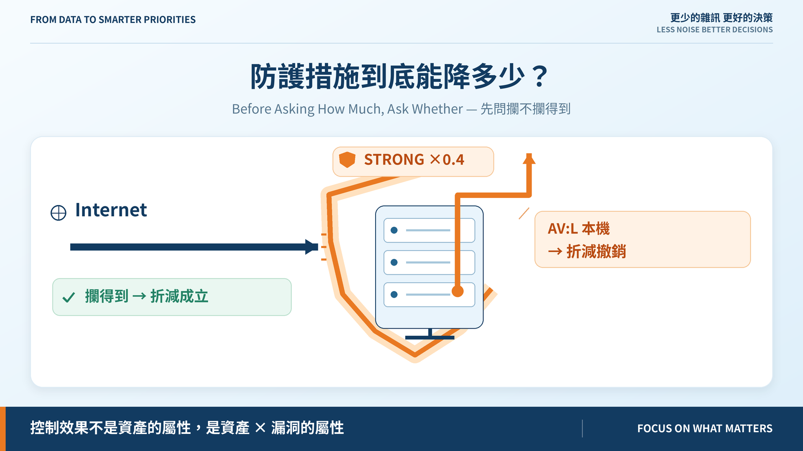
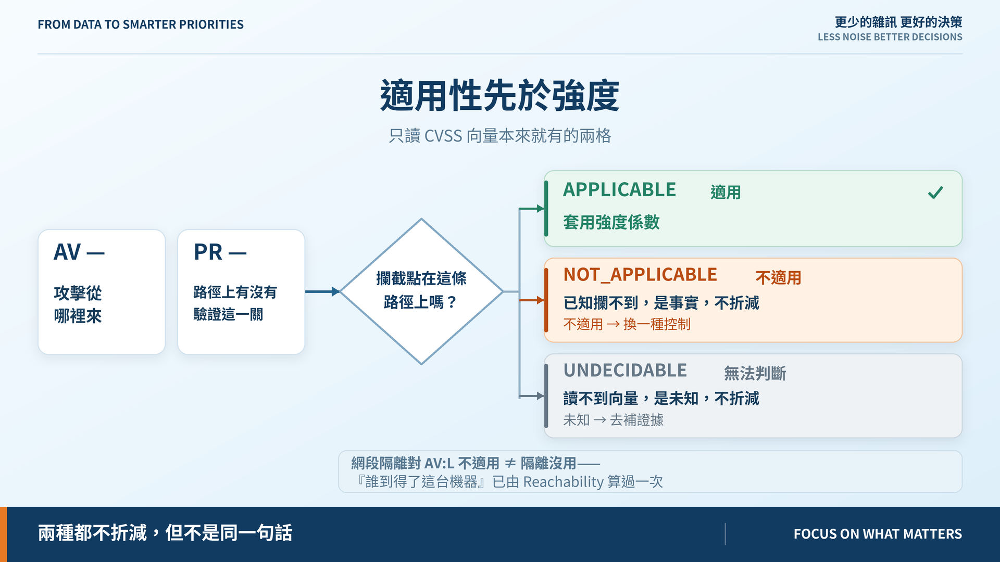
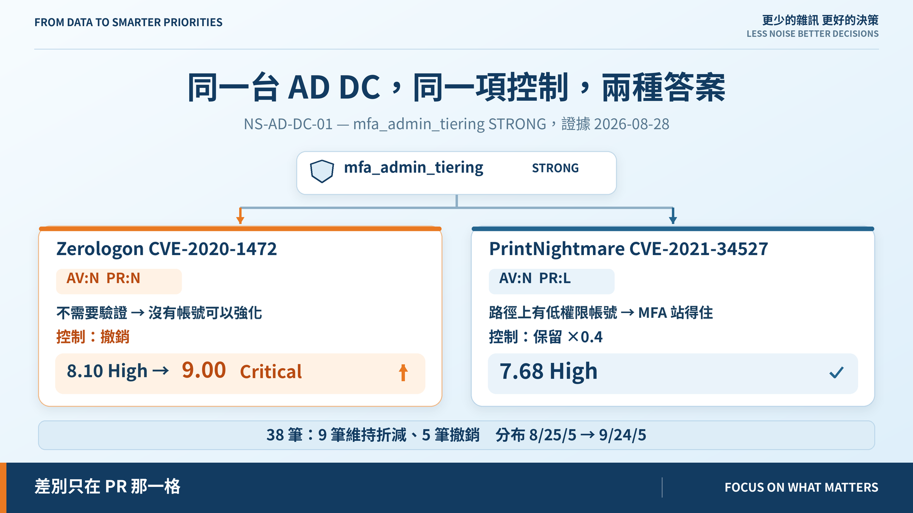

# Day 15｜防護措施到底能降多少？

**Before Asking How Much, Ask Whether**

> **施工進度｜** 定邊界（Day 1–5）→ 接資料（Day 6–10）→ **做評分（Day 11–18）** → 畫攻擊路徑（19–24）→ 給修補建議（25–30）

昨天結尾問：NONE、PARTIAL、STRONG 憑什麼對應 1.0、0.7、0.4？動手才發現問錯了——在問「能降多少」之前，得先問**這項控制攔不攔得到**。

## 一台機器一個係數，是 Day 12 埋的

Day 12 讓控制強度可推導：證據太舊不能打折、多個控制取最強。但結果掛在**資產**上——一台機器一個數字，套用到它身上每一筆漏洞。

NS-DB-CUSTOMER-01 有網段隔離，白名單通過負面測試，STRONG。它身上兩筆漏洞是 Dirty COW 和 sudo 提權，都是 `AV:L`——**本機**。網段隔離看不到已經站在機器裡的人，卻照樣把這兩筆打了六折。

## 適用性先於強度

要折減，得先證明這項控制的攔截點落在這條路徑上。判斷不發明新欄位，只讀 CVSS 向量本來就有的兩格：

- **AV**——攻擊從哪來。網路型控制對 `AV:L` 沒有位置可站。
- **PR**——路徑上有沒有「驗證」這一關。`PR:N` 代表攻擊者不必先是誰。

結果照 Day 10 的三態紀律：**適用**（套用強度）、**不適用**（已知攔不到，是事實）、**無法判斷**（讀不到向量，是未知）。後兩者都不折減，但 `control_source` 寫的不是同一句話：不適用要換控制，未知要補證據。

有個反駁很強：隔離讓攻擊者根本上不了這台機器。真的，但**那件事已經算在 Reachability 裡**。`E = R × C` 的 `R` 就在回答「誰到得了這台機器」，再從 `C` 扣一次，是同一項控制在同一條公式裡算兩次。

## 同一項控制，兩種答案

NS-AD-DC-01 上的 MFA 管理員分層，證據同一天：

| 漏洞 | 向量 | 控制 | 分數 |
|---|---|---|---|
| Zerologon | AV:N **PR:N** | 撤銷 | 8.10 → **9.00 Critical** |
| PrintNightmare | AV:N **PR:L** | 保留 | 7.68 High |

Zerologon 是不需驗證的 Netlogon 繞過，**沒有帳號可以強化**；PrintNightmare 路徑上有個低權限帳號，MFA 站得住。差別就在那一格。

全套跑完：38 筆裡 9 筆維持折減、5 筆撤銷，分布由 8/25/5 變 **9/24/5**。

## 那三個數字呢

綁在證據門檻上：STRONG＝有針對這類攻擊的**阻擋**證據，PARTIAL＝只有偵測或規則沒調校，UNKNOWN＝拿不出證據。

上限刻意壓在 0.4，讓這條性質成立：**一項控制最多把一筆漏洞往下移一個分級。** 最大折減 10×0.25×0.6＝1.5 分，跨兩級最少要 2.01 分。補償控制能改變相鄰名次，但不可能單獨把 Critical 壓成 Medium。這條有回歸測試守著；三個數字本身要到 Day 17 才校準。

## 還沒做到的

AV/PR 判斷得了攔截點在不在路徑上，判斷不了**這項控制懂不懂這個協定層**——WAF 對 TLS 層的 RC4 降級仍被判為適用，那個折減其實站不住。控制與弱點類別的對應留給 Day 25。

## 明天

分數會動了，理由卻還埋在一個 `reason` 字串裡。有人問「為什麼這筆排第三」，我只能請他自己去讀 CSV。

> **Day 16｜Priority 不能是黑箱**

控制模組與 ADR：[github.com/oldgi/cve2action](https://github.com/oldgi/cve2action)。Northstar 為虛構；CVE 資料為公開來源。
