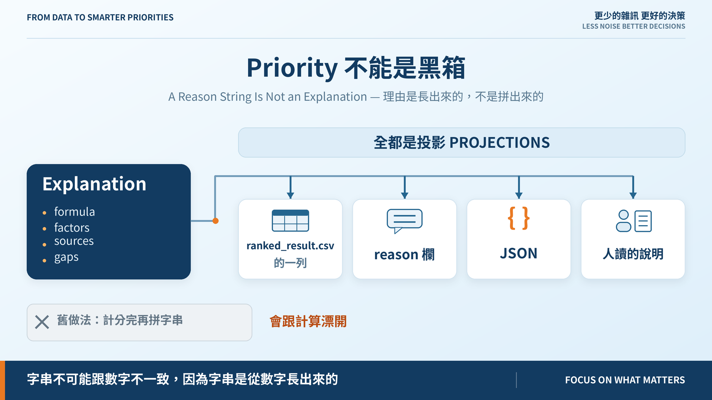
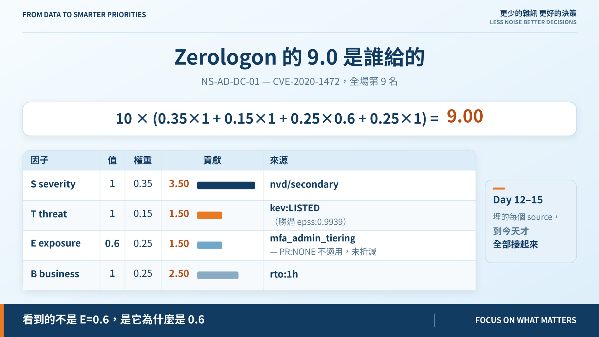
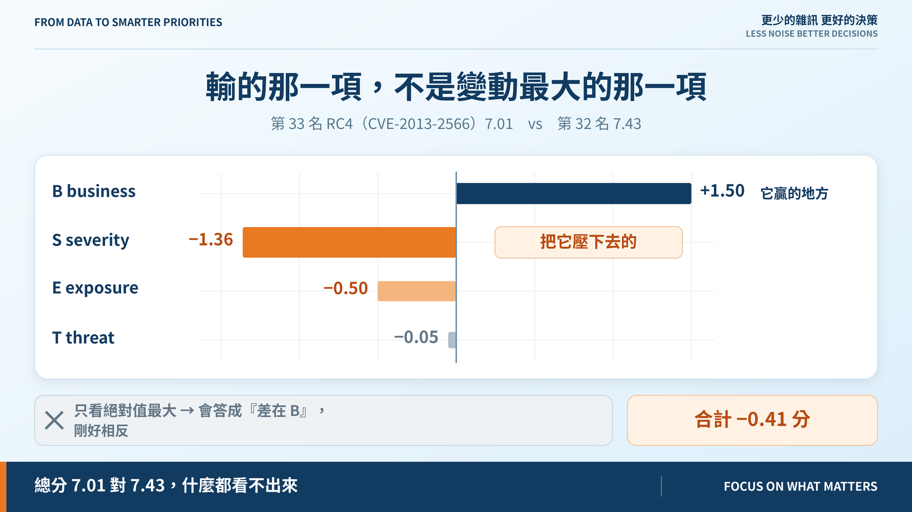

# Day 16｜Priority 不能是黑箱

**A Reason String Is Not an Explanation**



> **施工進度｜** 定邊界（Day 1–5）→ 接資料（Day 6–10）→ **做評分（Day 11–18）** → 畫攻擊路徑（19–24）→ 給修補建議（25–30）

每一列都有 `reason`，從 Day 5 就有。所以這題做完了嗎？沒有。

## 把算式印出來，不等於可解釋

那行字是**計分之後另外拼的**：

```python
row["reason"] = f"CVSS {cvss:g} ... E={exposure:g}; score={score:g}"
```

兩個毛病。

**一、它會跟計算漂開。** 改公式沒有任何東西逼你同步改字串。Day 14 加威脅項、Day 15 改控制來源，兩次都是我記得才補對的。這和規格文件凍結在 Day 6 是同一種死法。

**二、它答不了排序。** 它說得出「這筆怎麼算的」，說不出「為什麼它在第 33 名而不是第 32 名」——**那個答案在兩列之間，不在任何一列裡面。**

## 把順序倒過來

今天讓 `Explanation` 變成計分的第一級產物，CSV 的列、`reason` 欄、JSON、人讀的說明，全都是它的**投影**（見封面圖）。

這是 Day 7 對快照的同一條紀律：`raw` 是唯一事實，`extracted` 可以重新導出。**字串不可能再跟數字不一致，因為字串是從數字長出來的。**

排序也只實作一次，`rank()` 是排序後 Explanation 的列投影——兩者排不出不同順序。

守門的測試是這樣寫的：把每一列 `reason` 裡的數字全部抓出來，逐一檢查它在 Explanation 裡找不找得到。字串講了一個結構裡沒有的數，就紅。

## 跑一次：Zerologon 的 9.0 是誰給的



`10 × (0.35×1 + 0.15×1 + 0.25×0.6 + 0.25×1) = 9`——四項各貢獻 3.50、1.50、1.50、2.50。

Day 12 到 15 埋的那些 `*_source` 到今天才全部接起來：看到的不是 `E=0.6`，是「那項 MFA 分層控制攔不到不需要驗證的攻擊，所以沒折減」。

## 第 33 名：輸的那一項，不是變動最大的那一項



RC4 落後前一名 0.41 分。拆開來：

| 因子 | 差 |
|---|---:|
| B business | **+1.50** |
| S severity | **−1.36** |
| E exposure | −0.50 |
| T threat | −0.05 |

**它的業務衝擊比前一名高 1.5 分，卻還是排在後面。** 把它壓下去的是嚴重度。

這裡差點寫錯：第一版程式報「差距主要來自 B」——因為 B 的絕對值最大。但 B 是它**贏**的地方。**最大變動項不等於造成輸贏的那一項**，落後要看最大的負項。總分 7.01 對 7.43 這兩個數字，什麼都看不出來。

## 還沒做到的

`gap_to` 回答「跟它比差在哪」，不是「我改什麼能降幾分」。後者要有成本模型才有意義——不知道修補要幾小時，算出來的「降幅」只是另一個好看的數字。留給 Day 26。

順帶把 `engine.py` 搬進 `scoring/`，對齊藍圖的套件結構。Day 17、18 還要各加一個模組，現在搬只動 5 行 import。

## 明天

機器會算、會解釋了。但它算得對嗎？找五個漏洞，人先排一次，再跟模型比。

> **Day 17｜五個漏洞的人工判斷與模型比較**

Explain 模組與 ADR：[github.com/oldgi/cve2action](https://github.com/oldgi/cve2action)。Northstar 為虛構；CVE、EPSS、KEV 為公開資料。
