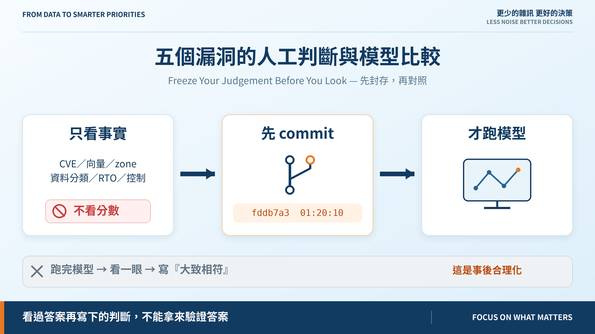
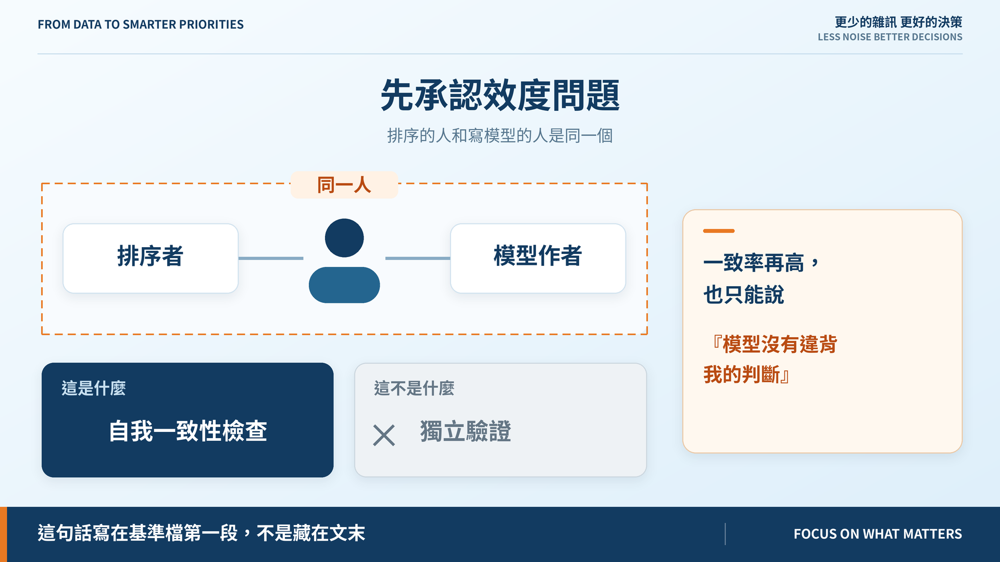
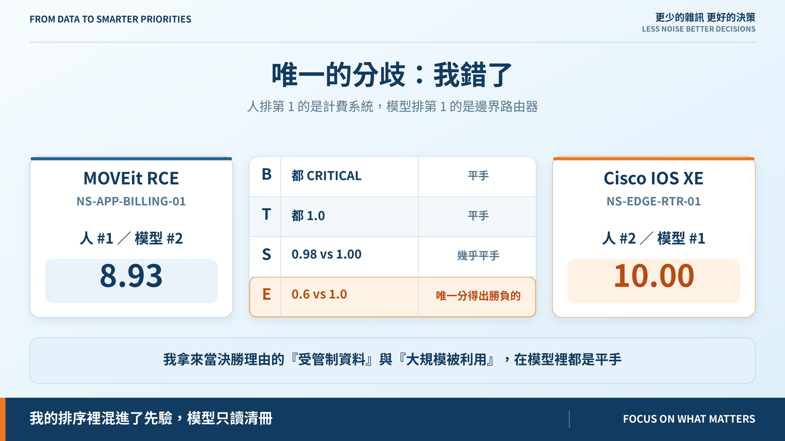

# Day 17｜五個漏洞的人工判斷與模型比較

**Freeze Your Judgement Before You Look**

> **施工進度｜** 定邊界（Day 1–5）→ 接資料（Day 6–10）→ **做評分（Day 11–18）** → 畫攻擊路徑（19–24）→ 給修補建議（25–30）

機器會算、會解釋了。但它算得對嗎？

## 最容易做錯的版本

跑完模型，看一眼，覺得排得還行，寫一句「與人工判斷大致相符」。

那不是校準，是事後合理化。**看過答案再寫下的判斷，不能拿來驗證答案。**

所以今天的順序是反的：只給自己看漏洞身分、CVSS 向量、資產事實（zone、資料分類、RTO、控制），**不看任何分數**，排完五筆、逐筆寫下理由，先 commit——`fddb7a3`，01:20:10。然後才跑模型。

程式強制不了這個順序，所以它不是規則是紀律——git 的時間戳是唯一證據。

## 先承認這次校準的效度問題

**排序的人和寫模型的人是同一個。** 這不是獨立驗證，是自我一致性檢查。一致率再高也只能說「模型沒有違背我的判斷」，不能說它對。

這句話寫在基準檔的第一段，不是藏在文末。

## 結果：10 組比較，錯 1 組

| 人工 | 模型 | 分數 | finding |
|---:|---:|---:|---|
| 1 | **2** | 8.93 | MOVEit RCE｜計費系統 |
| 2 | **1** | 10.00 | Cisco IOS XE｜邊界路由器 |
| 3 | 3 | 8.23 | sudo 提權｜客戶資料庫 |
| 4 | 4 | 6.43 | Confluence RCE｜實驗室 wiki |
| 5 | 5 | 6.32 | ControlLogix｜機房空調 |

Kendall tau-b = 0.8。

但重點不是這個數字。**係數高只代表模型複製了我的直覺，而我可能本來就錯。** 所以驗收條件不是「tau 要大於多少」，是**每一處分歧都得有書面結論**，沒寫 `cve2action calibrate` 就 exit 1。

## 那唯一的分歧：我錯了，而且錯得很具體

我把計費系統排第一，理由是「受管制資料」加「大規模被利用」。

問題是這兩項在模型裡**平手**——B 都 CRITICAL（路由器因 RTO 1 小時也進了 CRITICAL），T 都 1.0（兩個都在 KEV）。我拿來當決勝理由的東西，根本分不出勝負。

真正分得出的只有曝險：路由器在 DMZ 直接對外，計費系統在 APP 區要先穿一層。**1.0 對 0.6，差 1 分，剛好就是 10.00 對 8.93 的距離。**

我的排序裡混進了一個先驗：「MOVEit 這種系統通常是對外的」。那是對這類系統的印象，不是這家公司清冊上登記的事實。模型只讀清冊。

## 結論只能有三種

| 判定 | 後續 |
|---|---|
| **模型對** | 修正自己的直覺，不動程式 |
| **人對** | 改模型，**必須留 ADR**（測試會檢查） |
| **資料不對** | 去修資料，**不要動權重** |

第三類最常被漏掉，也最危險：把資料問題當權重問題調，公式就會去遷就一筆錯的輸入。這次如果計費系統實際對外，錯的是 zone 不是公式——那是 Day 20 的事。

## 還沒做到的

五筆樣本、一個排序者。獨立評審不在 30 天範圍內，這是這次校準最大的限制。

另外路由器拿到**滿分 10.00**——它撞到了上限。上限常被撞到，頂端就失去解析度。

## 明天

Low 永遠是 0、頂端擠在 10.0、38 筆有 24 筆是 High。這樣的分布，算可用嗎？

> **Day 18｜v0.1 評分門檻：什麼算可用？**

校準模組與基準檔：[github.com/oldgi/cve2action](https://github.com/oldgi/cve2action)。Northstar 為虛構；CVE、EPSS、KEV 為公開資料。
