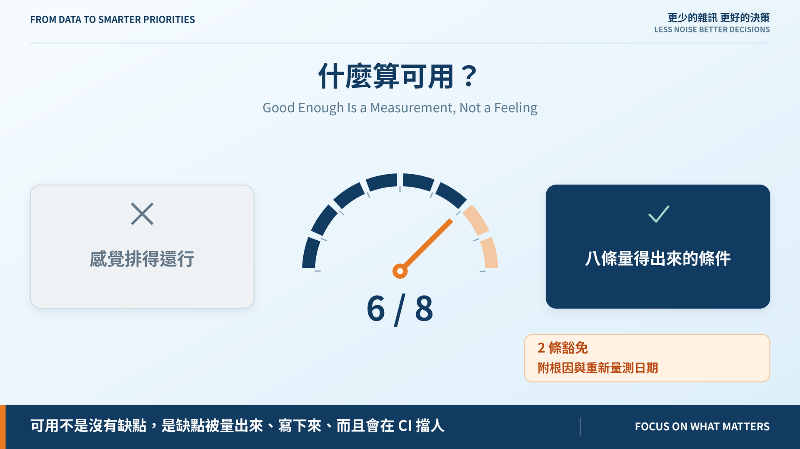
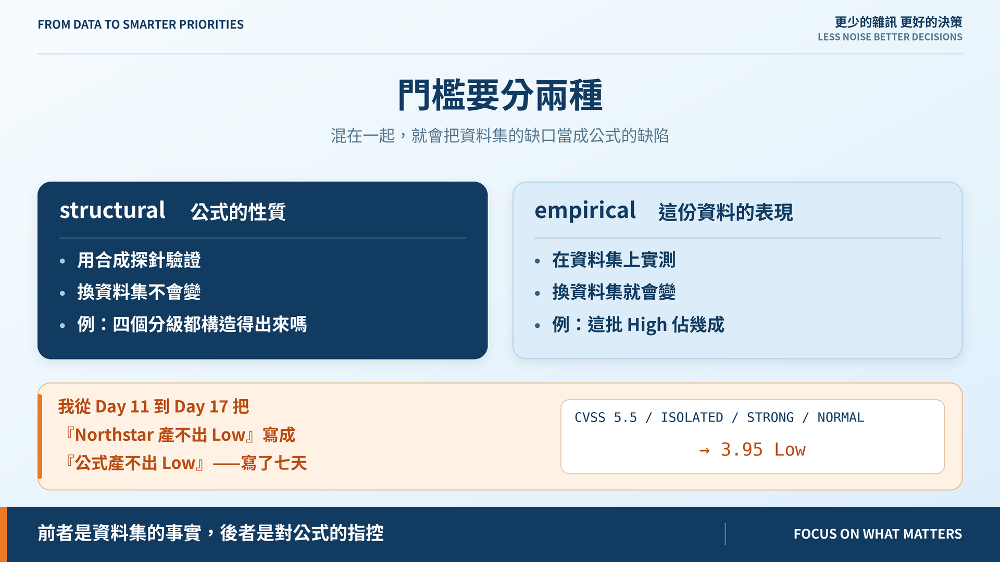
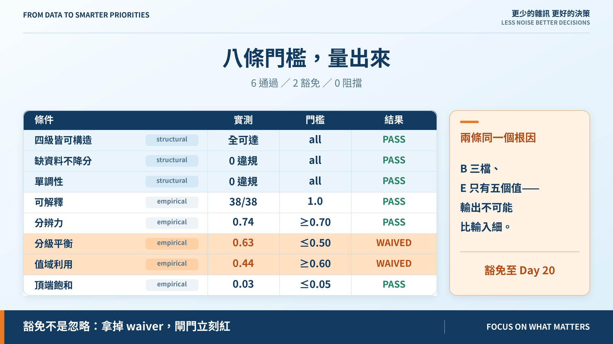

# Day 18｜v0.1 評分門檻：什麼算可用？

**Good Enough Is a Measurement, Not a Feeling**



> **施工進度｜** 定邊界（Day 1–5）→ 接資料（Day 6–10）→ **做評分（Day 11–18）** → 畫攻擊路徑（19–24）→ 給修補建議（25–30）

做評分階段的最後一天。問題只有一個：這東西可用了嗎？

## 先認一個錯：我誤會公式七天

從 Day 11 起我一直寫「v0.1 公式產不出 Low」。今天十行合成探針一驗：

```text
CVSS 5.5 / ISOLATED / STRONG / NORMAL → 3.95 Low
```

**產得出來。** 產不出 Low 的不是公式，是 Northstar 沒有「低嚴重度 × 隔離 × 不重要」這個組合——它最低的 CVSS 3.7 落在對外的入口網站上。

一個是資料集的事實，一個是對公式的指控。我把後者寫了七天。

## 門檻要分兩種



**structural** 問公式本身的性質，用合成探針驗，換資料集不變；**empirical** 問這份資料上的表現，實測，換資料集就會變。

混在一起，就會像我一樣把資料集的缺口當成公式缺陷。調權重去修資料問題，公式就會去遷就一份特定的資料——跟昨天那個 `verdict: data` 同一件事。

## 八條，量出來



structural 三條全過（四級皆可構造、缺資料不降分、單調性）；empirical 五條過三條：可解釋 38/38、分辨力 0.74、頂端飽和 0.03。

**沒過的是分級平衡 0.63（門檻 ≤0.50）與值域利用 0.44（門檻 ≥0.60）。**

## 沒過的兩條，我選擇不修

38 筆裡 24 筆是 High，分數全擠在 5.60–10.00。

根因不在權重，在**輸入的解析度**：`business_criticality` 只有三檔、`reachability` 三檔，`E` 實際只取到五個值。**輸出不可能比輸入細。**

要攤開就得改值域映射，那會讓 Day 5 到 Day 17 的每一個基準同時失效。**v0.1 要的是可比較的起點，不是好看的分布。**

兩條都豁免到 Day 20——可達性引擎會用觀測到的連線取代 zone 推導，`E` 不再只有五檔。到時候重新量；**如果那時還是這麼集中，才是公式的問題。**

豁免不是忽略。缺 `reason` 或 `revisit_on` 會被拒絕載入；把 waiver 拿掉，閘門立刻變紅，而且有一條測試專門證明這件事。

## 對外接回藍圖的 P0–P3

藍圖的終局是 CRPS（乘法、0–100、P0–P3），我們做的是它授權的 v0.1 加法 baseline。今天把對外層級接上：每個分級帶一個 P0–P3 與一句該做什麼，內部刻度一個字不動。

但**沒採用藍圖的 80/60/35 門檻**——套上去 38 筆裡會有 **21 筆 P0**，而 P0 是「緊急評估與處理」。21 件緊急等於沒有緊急。**門檻和公式是一對，只搬一半會壞掉。**

## 所以什麼算可用

> **不是「沒有缺點」，是「缺點被量出來、被寫下來、而且會在 CI 擋人」。**

今天之後，已知缺陷不再是散在文章裡的註記，而是八條會紅燈的條件。v0.1 baseline 到此凍結：權重、值域映射、八條門檻。之後要改就得重跑校準與門檻，並留下 ADR。

## 還沒做到的

**穩定性**沒進門檻——`E` 現在只有五個離散值，講擾動沒有意義，Day 20 之後才量得了。

## 明天

分數排完了，但它只會說「這台先修」。攻擊者不是一台一台打的，他們走路徑。

> **Day 19｜把基礎架構變成一張攻擊圖**

門檻設定與 ADR：[github.com/oldgi/cve2action](https://github.com/oldgi/cve2action)。Northstar 為虛構；CVE、EPSS、KEV 為公開資料。
