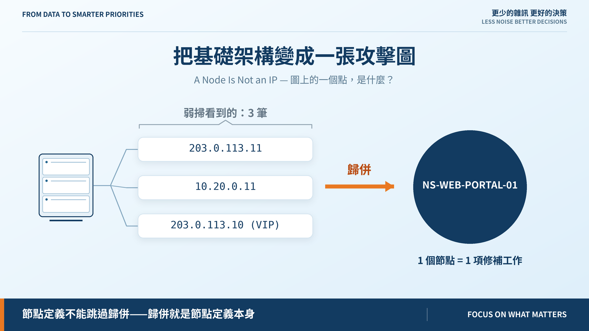
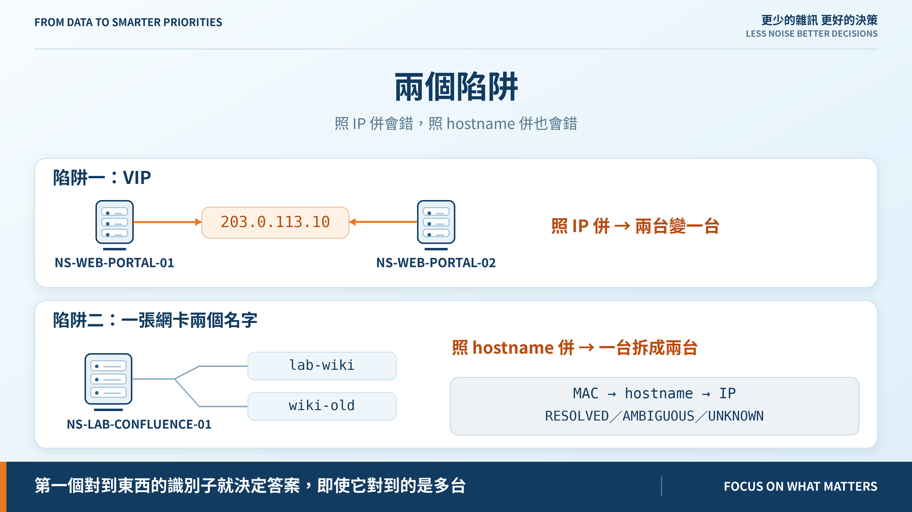
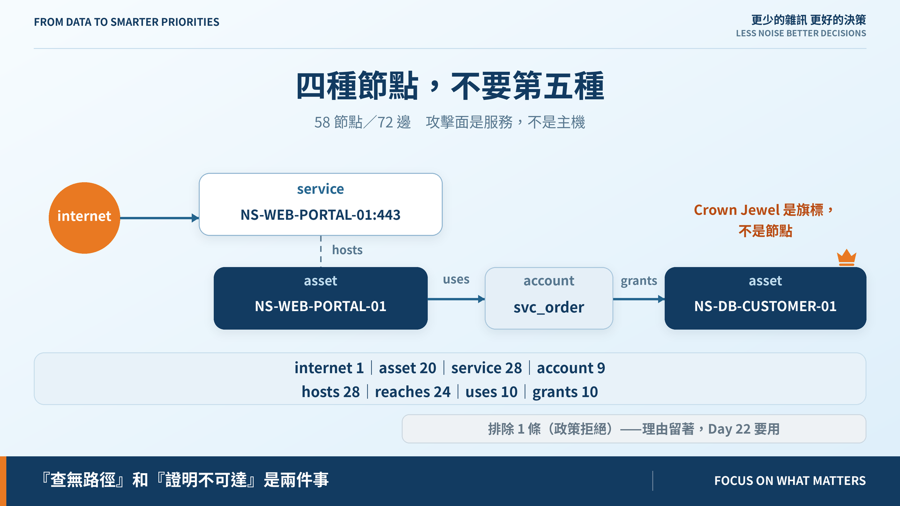

# Day 19｜把基礎架構變成一張攻擊圖

**A Node Is Not an IP**



> **施工進度｜** 定邊界（Day 1–5）→ 接資料（Day 6–10）→ 做評分（Day 11–18）→ **畫攻擊路徑（19–24）** → 給修補建議（25–30）

評分階段把每一筆 finding 當成獨立的一列。但攻擊者不是一台一台打的——他們從入口進來，踩過幾台機器，走到想要的東西那裡。

要講這件事就得畫圖。而畫圖之前有個更基本的問題。

## 圖上的一個點，是什麼？

弱掃回報的是 IP 或 hostname，**不是資產**。一台有三個介面的機器會被回報三次，同一個漏洞變成三項修補工作。

所以節點定義不能跳過歸併——**歸併就是節點定義本身**。

## 兩個陷阱，資料裡都有



**照 IP 併會錯。** VIP `203.0.113.10` 被兩台入口網站同時宣稱，用 IP 當主鍵會把兩台併成一台。

**照 hostname 併也會錯。** 同一張網卡掛兩個名字——`lab-wiki` 和 `wiki-old` 是同一台的新舊 DNS 名，用 hostname 當主鍵會把一台拆成兩台。

所以解析回三態，順序 MAC → hostname → IP——愈不容易共用的愈優先：

```text
02:1a:00:04:10:02  → NS-AD-DC-01          (mac)
wiki-old.…example  → NS-LAB-CONFLUENCE-01 (hostname)
203.0.113.10       → AMBIGUOUS [PORTAL-01, PORTAL-02]
10.99.0.5          → UNKNOWN
```

有一條規則很容易寫錯：**第一個對到東西的識別子就決定答案，即使它對到的是多台。** 看到 IP 對到兩台就改用別的識別子「試到單一答案為止」，等於讓 VIP 悄悄被歸給其中一台，不留痕跡。

AMBIGUOUS 和 UNKNOWN 都不進圖，但不能寫成同一句「找不到資產」——前者要查這個位址背後是誰，後者要查為什麼有機器不在清冊上。**理由不同，要找的人就不同。**

## 四種節點，不要第五種



藍圖把「節點類型超過六種」列為攻擊圖失控的徵兆。我們用三種加一個虛擬入口：

`internet`（外部起點，不是資產）、`asset`（歸併後的一台機器）、`service`（某台機器某個 port 上在聽的東西）、`account`（讓攻擊者從一台走到另一台的帳號）。

**攻擊面是服務，不是主機。** 而 **Crown Jewel 做成旗標，不做成節點**——做成節點就多一種邊，那條邊不帶新資訊，jewel 就是那台資產。少一種節點，就少一種之後每天要維護的東西。

帳號做成節點而非邊上的標籤，是為了 Day 24：共用帳號本身可能就是瓶頸，它得是個指得到的東西。

跑出來：**58 節點、72 邊**，30 個介面併成 20 台資產。

## 丟掉的邊要留著

建圖時丟掉三種連線：政策拒絕的、指向沒人在聽的 port 的、指向 `filtered` 服務的。每一條都連同理由記在 `excluded`。

因為 Day 22 要回答「為什麼這台沒有路徑」。靜靜丟掉就只剩「查無路徑」這種什麼都沒說的答案——**「查無路徑」和「證明不可達」是兩件事。**

`filtered` 的服務**保留節點、但沒有可達的邊**：服務還在（該修補），只是打不到。

## 還沒做到的

現在的 `reaches` 只看「政策允許」加「有服務在聽」，還沒看方向與回應路徑——能送封包不等於能完成一次互動。

## 明天

25 條連線裡，有幾條是真的走得通？

> **Day 20｜哪些網路連線真的能構成攻擊路徑？**

圖模型與 ADR：[github.com/oldgi/cve2action](https://github.com/oldgi/cve2action)。Northstar 為虛構；CVE、EPSS、KEV 為公開資料。
