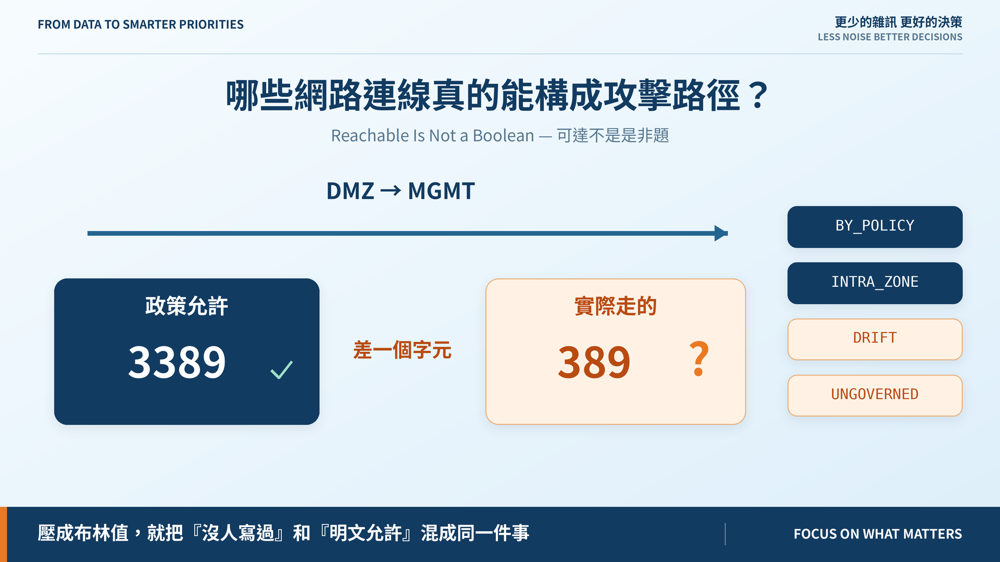
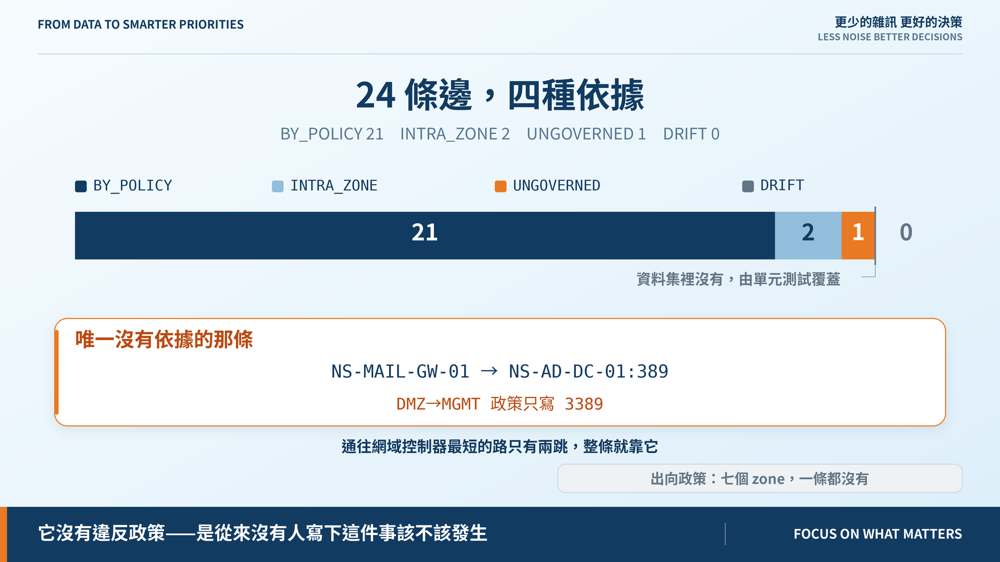
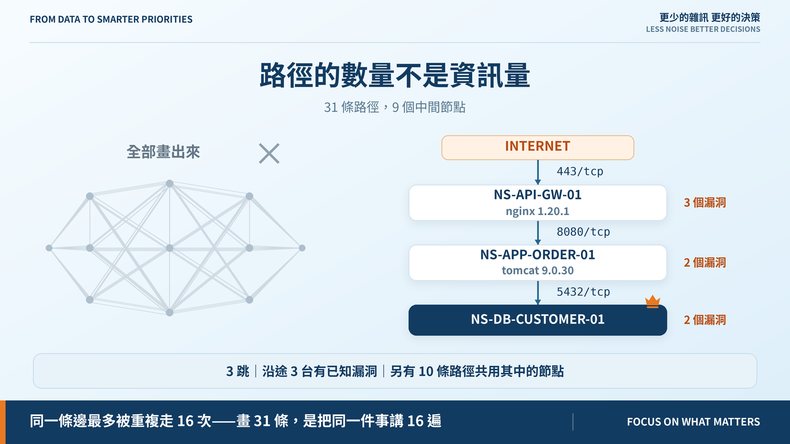

# Day 20｜哪些網路連線真的能構成攻擊路徑？

**Reachable Is Not a Boolean**



> **施工進度｜** 定邊界（Day 1–5）→ 接資料（Day 6–10）→ 做評分（Day 11–18）→ **畫攻擊路徑（19–24）** → 給修補建議（25–30）

昨天的圖有 24 條可達的邊。但「可達」是我昨天偷懶的地方——我只確認了 zone 對得上。

## 差一個字元

政策寫的是「DMZ → MGMT 允許 **3389**」。而實際有一條連線走的是 **389**。

3389 是遠端桌面，389 是 LDAP。**zone 對上不代表 port 對上**，差一個字元就是兩個完全不同的服務。

所以 port 要逐一比對。比對完，答案不是通過或不通過，是四種：

| 判定 | 意思 |
|---|---|
| `BY_POLICY` | 有政策涵蓋這個方向**與這個 port** |
| `INTRA_ZONE` | 同一個 zone，這組政策管不到 |
| `DRIFT` | 政策明文拒絕，卻連得通 |
| `UNGOVERNED` | 跨 zone，卻沒有任何政策談論過它 |

壓成一個布林值，就會把「沒人寫過這件事該不該發生」跟「明文允許」混成同一件事。

## 跑一次：21 / 2 / 1 / 0



24 條邊：**BY_POLICY 21、INTRA_ZONE 2、UNGOVERNED 1、DRIFT 0。**

那唯一沒有依據的，是郵件閘道對網域控制器的 LDAP。而通往網域控制器**最短的路只有兩跳**：

```text
internet → NS-MAIL-GW-01 → NS-AD-DC-01 👑
```

**整條路就靠那一條沒有任何政策依據的連線。** 不是它違反了政策——是從來沒有人寫下這件事該不該發生。

這種連線最難發現：看政策表沒有它，看防火牆設定它又跟別的規則長得一樣。只有把**實際觀測**和**書面政策**擺在一起比，它才會跳出來。

## 政策寫錯，不會讓封包不通

所以沒有依據的連線**不從圖上刪掉**，只標記。

把觀測刪掉只會讓報告變好看。它留在圖上帶著「沒有依據」的標記，Day 23 評分時才知道這一跳性質不同——而且它本身就是一個待辦。

## 回程通道：沒寫，不等於擋住

有些利用要靠**受害端往外連**。Log4Shell 的經典打法就是讓受害端去連攻擊者的 LDAP 伺服器。

擋不擋得住要看出向政策。我們的出向政策有幾條？

> **七個 zone，一條都沒有。**

所以任何需要回程通道的利用，我們**不能宣稱它被擋住**。這是 Day 5 以來同一條規則：不知道，不能換來比較安全的結論。

## 順帶：路徑要怎麼呈現



為了量出改動的影響，路徑渲染器提前做了，順便確立一個立場：

> **路徑的數量不是資訊量。**

31 條 Internet → Crown Jewel 的路徑，只用到 **9 個中間節點**，同一條邊最多被重複走 16 次。把 31 條都畫出來，是把同一件事講 16 遍。

所以主視覺是**一條**路徑，加上每一跳憑什麼走得過去——port、服務版本、沿途的漏洞——最後一行告訴你它不孤單。排序是決定性的，同樣的資料每次得到同一條最短路徑。

## 還沒做到的

這份資料**沒有 DRIFT 的例子**，那條規則只有單元測試覆蓋。不為了示範而改資料，是因為昨天的文章已經引用了「25 條連線、58 節點」——改了就對不上。

`INTRA_ZONE` 目前一律當成有依據。同網段也可能有主機防火牆，v0.1 沒有那層資料。

## 明天

帳號讓攻擊者橫向移動。但一個帳號能從 A 走到 B，前提是什麼？

> **Day 21｜帳號與權限如何讓攻擊者橫向移動？**

可達性引擎與 ADR：[github.com/oldgi/cve2action](https://github.com/oldgi/cve2action)。Northstar 為虛構；CVE、EPSS、KEV 為公開資料。
