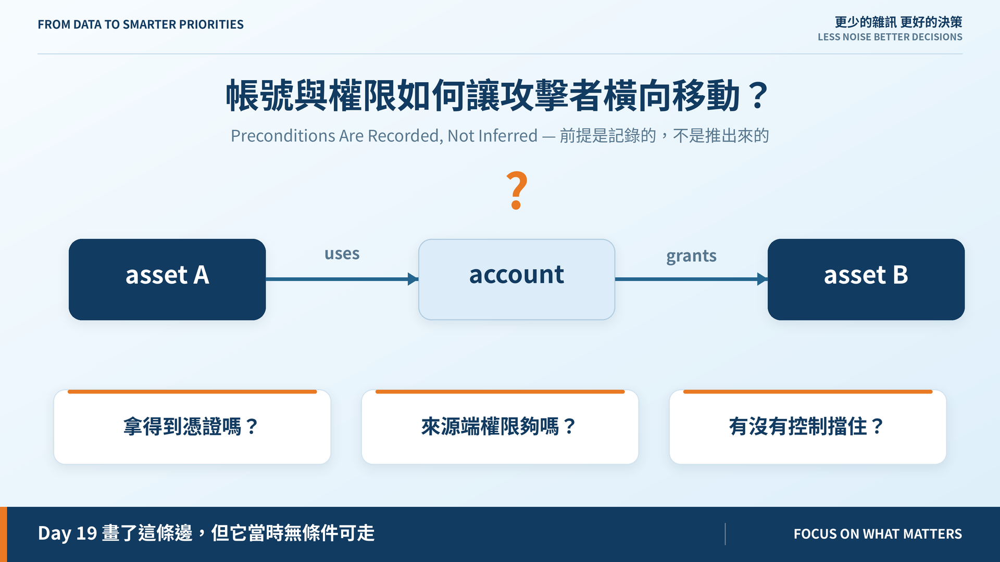
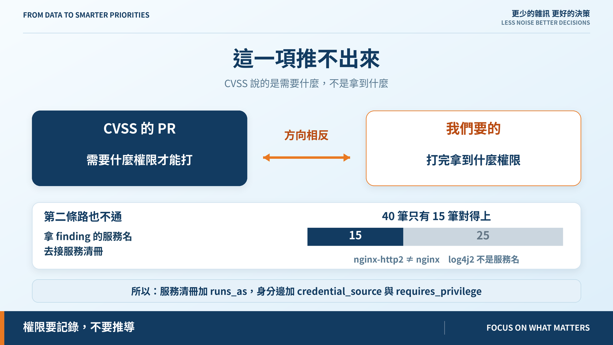
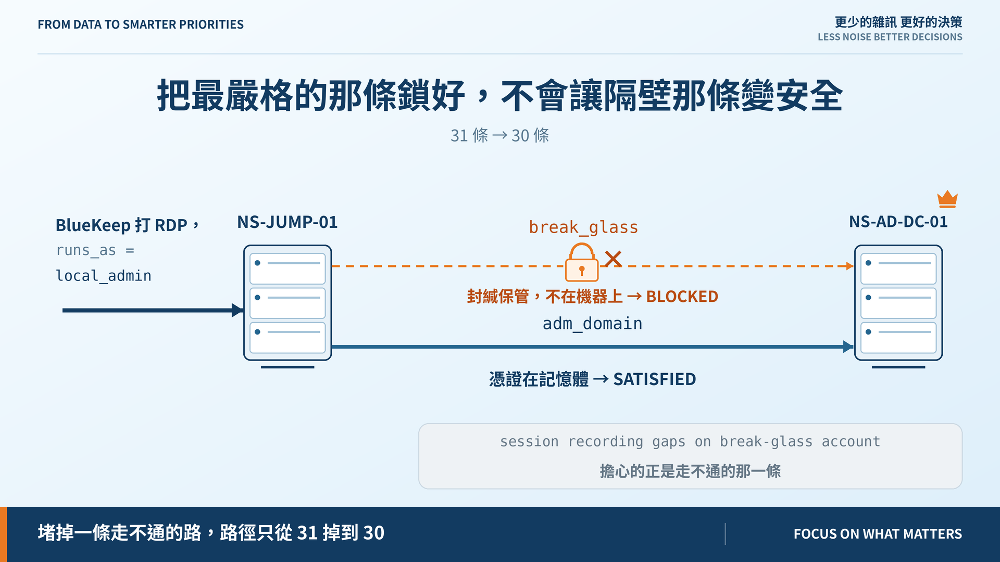

# Day 21｜帳號與權限如何讓攻擊者橫向移動？

**Preconditions Are Recorded, Not Inferred**



> **施工進度｜** 定邊界（Day 1–5）→ 接資料（Day 6–10）→ 做評分（Day 11–18）→ **畫攻擊路徑（19–24）** → 給修補建議（25–30）

昨天把網路那一半的「憑什麼」講清楚了。今天輪到身分這一半。

## Day 19 偷藏的三個假設

`asset --uses--> account --grants--> asset` 當時**無條件可走**，預設了三件事：攻擊者拿得到憑證、他在來源端的權限足以拿到它、沒有控制擋住。

要把前兩點講明白，得先知道一件事：**攻下這台之後，他拿到什麼權限？**

## 這一項推不出來



最直覺的是查 CVSS：

> **`PR` 說的是「需要什麼權限才能打」，不是「打完拿到什麼權限」。**

方向相反：`PR:N` 的漏洞可能讓你拿到 SYSTEM，也可能只讓你讀一個檔，CVSS 不區分。

第二條路是拿 finding 的服務名去接服務清冊。實測 **40 筆只有 15 筆對得上**，用名稱 join 會在 25 筆上猜錯。

所以**權限要記錄，不要推導**：服務清冊加 `runs_as`（攻下它取得什麼身分），身分邊加兩欄——憑證放在哪、要有什麼權限才拿得到。

## 判定 5 / 4 / 1：憑證不在機器上，權限再高也沒用

10 條身分邊：**SATISFIED 5、UNPROVEN 4、BLOCKED 1。**

`UNPROVEN` 是來源端對不到服務的那些。**這種邊照走**：不能證明走不通，就得當它走得通。

那條 `BLOCKED` 比較有意思：`break_glass` 的憑證**封緘保管**，不在那台跳板上。這種情況**不比較權限等級**——本機管理員權限不會讓保險箱打開。

這就是 `credential_source` 那一欄存在的理由。沒有它，權限排序會讓 `local_admin ≥ interactive_logon` 自動判定成立，而那是錯的。

## 但堵掉它，只少了一條路



路徑從 31 條掉到 **30 條**。

因為旁邊還有一條 `adm_domain` 通往同一台網域控制器，而它的憑證就放在**記憶體裡**：

```text
internet → NS-VPN-GW-01 → NS-JUMP-01 → NS-AD-DC-01 👑
                          BlueKeep 打 RDP，runs_as = local_admin
                          adm_domain 憑證在記憶體，需要 local_admin → 成立
```

**把最嚴格的那條鎖好，不會讓隔壁那條變安全。**

更諷刺的是 Day 12 的控制證據：這台跳板的 MFA 註記為「session recording gaps on **break-glass** account」——那份證據擔心的，正是我們判定走不通的那一條。

那條邊不刪——它記錄的是**真實存在的權限關係**，只是現在走不過去。拿掉它，之後這台多一個提權漏洞，就沒人想得起這條路曾經存在。

## 還沒做到的

25/40 的 finding 對不到已登錄服務，多數資產的可取得權限因此是 `UNPROVEN`——這不是模型保守，是**資料缺口**。

權限等級用粗糙的線性序；真實權限是偏序，能讀資料庫不代表能登入主機。

## 明天

30 條路徑。但「最短」不等於「最危險」，而有些機器一條路都沒有——是安全，還是我們沒查到？

> **Day 22｜從 Internet 找到最短入侵路徑**

身分模組與 ADR：[github.com/oldgi/cve2action](https://github.com/oldgi/cve2action)。Northstar 為虛構；CVE、EPSS、KEV 為公開資料。
