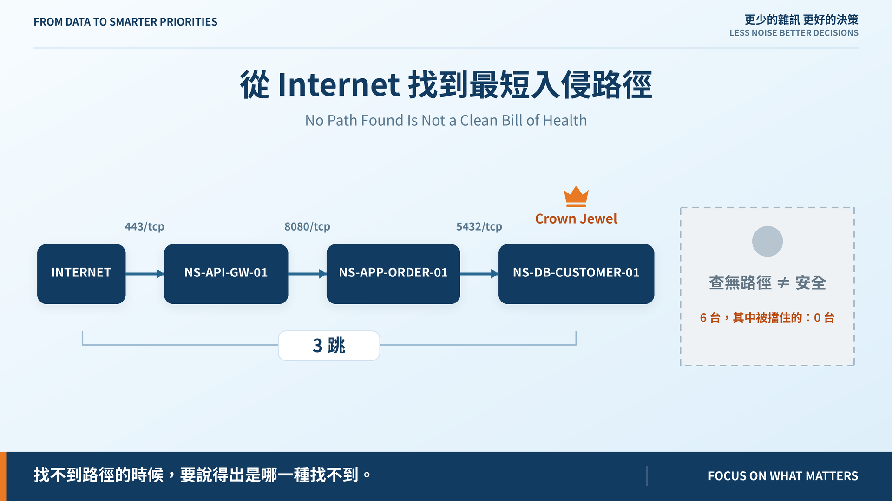
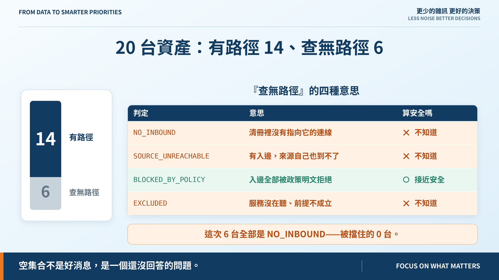
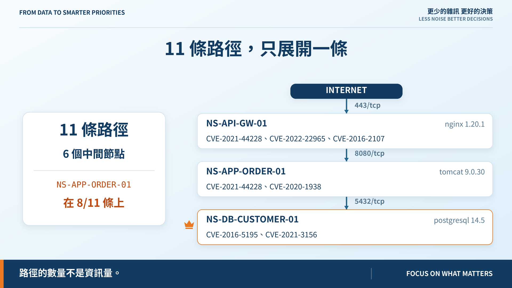

# Day 22｜從 Internet 找到最短入侵路徑

**No Path Found Is Not a Clean Bill of Health**



> **施工進度｜** 定邊界（Day 1–5）→ 接資料（Day 6–10）→ 做評分（Day 11–18）→ **畫攻擊路徑（19–24）** → 給修補建議（25–30）

圖建好了、邊有依據了、權限前提也講明白了。今天把它們接起來：找路徑。

找得到的部分不難。難的是**找不到的時候要說什麼**。

## 藍圖只寫了半句

路徑門檻那條寫著：

> 無法到達的資產不會被誤標為可達。

反過來那半句沒寫，但更容易出事：**可達的資產不應該被誤標為安全。**

搜尋回空集合看起來像好消息。但它有四種意思：

| 判定 | 意思 |
|---|---|
| `NO_INBOUND` | 清冊裡根本沒有指向它的連線 |
| `SOURCE_UNREACHABLE` | 有入邊，但來源自己也到不了 |
| `BLOCKED_BY_POLICY` | 入邊全部被政策明文拒絕 |
| `EXCLUDED` | 服務沒在聽、前提不成立等 |

**只有第三種接近「安全」。** 其餘三種都是「我們不知道」，不是「它到不了」。

## 跑一次：14 / 6，而那 6 台一台都沒被擋住



20 台資產，有路徑 14 台、查無路徑 6 台。

六台**全部是 `NO_INBOUND`**——沒有一台是因為我們擋住了它，全部是因為清冊裡根本沒有指向它的連線。

其中 `NS-APP-INTRANET-01` 身上掛著 Log4Shell 和 Confluence RCE。它「安全」的唯一理由是：**沒有人記錄過誰連得到內部網站。**

所以輸出最後一行固定寫死：

```text
其中真的算「被擋住」的：0 台——其餘是我們不知道，不是它到不了。
```

## 呈現一條，說清楚其餘



通往客戶資料庫有 11 條路徑。預設只展開**最短那一條**，前面加一段摘要：幾條、用了幾個中間節點、誰被共用最多。

這是 Day 20 那句「路徑的數量不是資訊量」的落地。`--all` 才全部展開，但那通常不是你想要的。

排序是決定性的——依跳數、再依沿途資產名。同樣的資料每次得到同一條最短路徑，文章跟截圖才對得上。

**但「最短」不等於「最危險」。** 今天只排跳數，那是明天的題目。

## 一個偽裝成測試問題的設定缺口

有條測試間歇性紅燈：重建資料集後逐位元組比對。Day 19 我以為是「測試會改寫版控檔案」，改成建到暫存目錄後**還是偶發**。

真正的原因是 `core.autocrlf=true` 而 repo 沒有 `.gitattributes`：每次 `checkout`／`merge` 會把工作區改寫成 CRLF，而建置腳本寫 LF。紅的時機取決於上一次做了什麼 git 操作，所以看起來像隨機。

**間歇性失敗先別怪測試，先問它依賴的環境是不是在變。** 這跟 Day 18 把門檻分成 structural 與 empirical 是同一個教訓。

## 還沒做到的

另外三種判定資料集裡沒有例子，用合成輸入做單元測試——跟 Day 20 的 `DRIFT` 一樣的處理。

`SOURCE_UNREACHABLE` 要先對全部資產各跑一次搜尋才判得出來。20 台還好，再大就得換做法。

## 明天

30 條路徑，最短的 2 跳。但兩跳通往一台沒有資料的路由器，跟四跳通往客戶資料庫，哪個比較危險？

> **Day 23｜不是路徑愈短就一定愈危險**

路徑模組與 ADR：[github.com/oldgi/cve2action](https://github.com/oldgi/cve2action)。Northstar 為虛構；CVE、EPSS、KEV 為公開資料。
