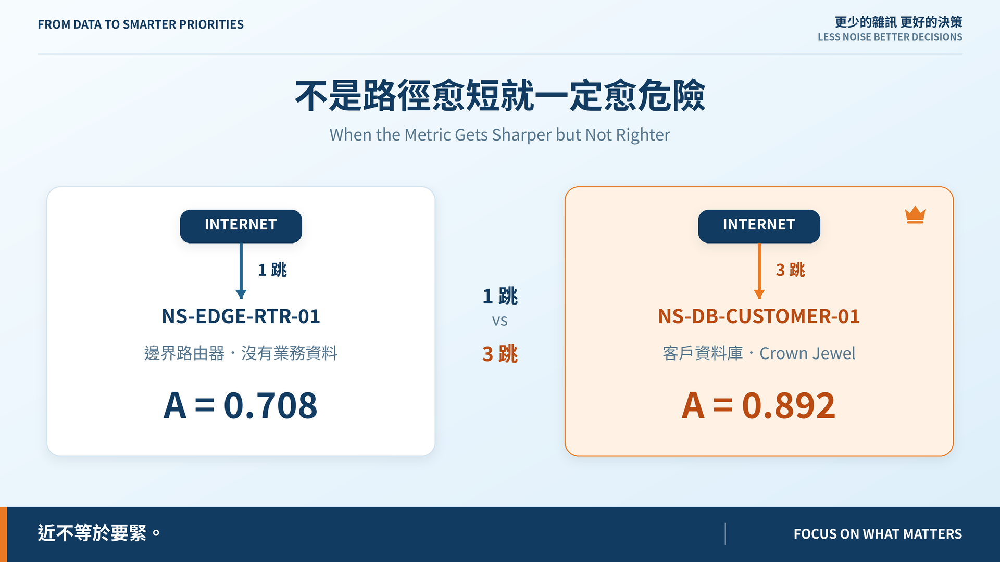
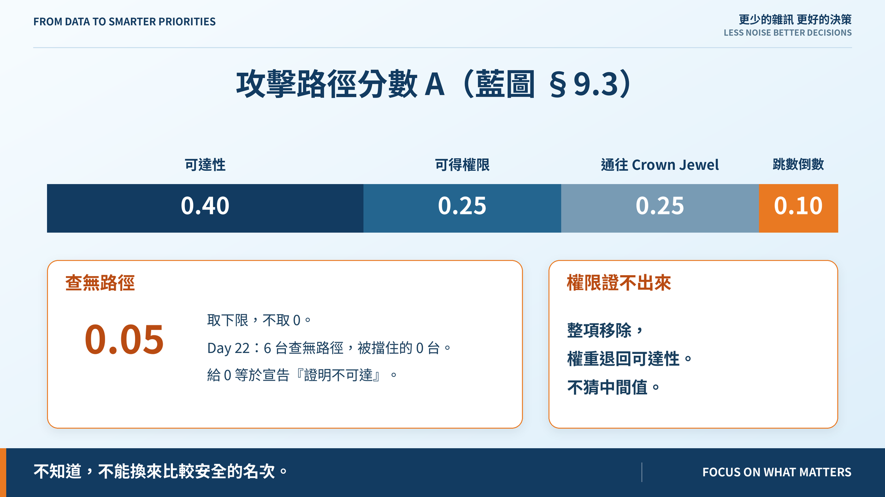
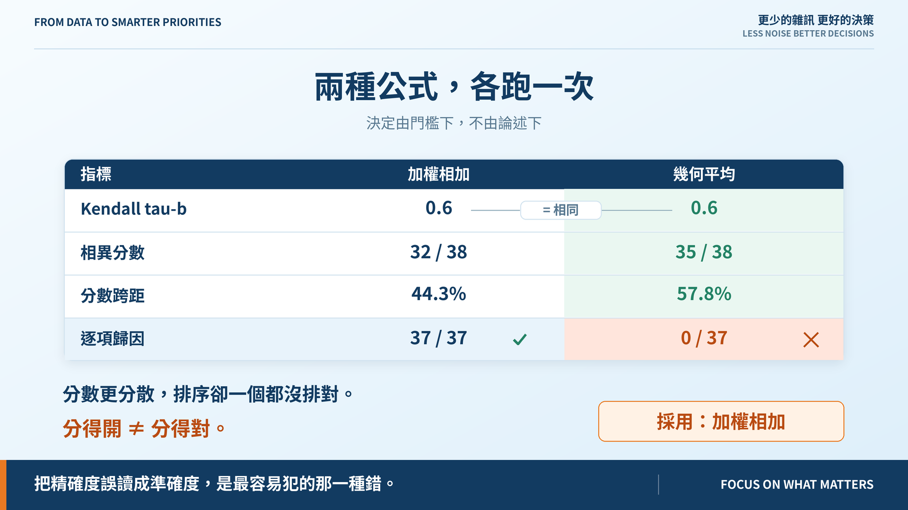

# Day 23｜不是路徑愈短就一定愈危險

**When the Metric Gets Sharper but Not Righter**

> **施工進度｜** 定邊界（Day 1–5）→ 接資料（Day 6–10）→ 做評分（11–18）→ **畫攻擊路徑（19–24）** → 給修補建議（25–30）

昨天的問題：兩跳通往一台沒有資料的路由器，跟四跳通往客戶資料庫，哪個比較危險？跳數答不了。

## 路徑分數

藍圖 §9.3 把路徑拆成四項：可達性 0.40、可得權限 0.25、通往 Crown Jewel 0.25、跳數倒數 0.10。查無路徑取下限 **0.05 不取 0**，權限未知則整項移除。

路由器 `A = 0.708`（一跳，但走不到 Crown Jewel），客戶資料庫 `A = 0.892`（三跳，但它自己就是）。**近不等於要緊。**

## 兩種公式，各跑一次

藍圖把今天訂為公式形式的決策日，並限定方法：兩種都實作、各跑一次，用 tau 與門檻決定，**不以論述決定**。兩份設定檔權重完全相同，只有 `form` 不同——比較形式時只能有一個變數。

| | 加權相加 | 幾何平均 |
|---|---:|---:|
| Kendall tau-b | 0.6 | 0.6 |
| 相異分數 | 32 / 38 | **35 / 38** |
| 分數跨距 | 44.3% | **57.8%** |

幾何平均在兩條指標上明顯勝出，而 tau 與分歧清單**一模一樣**。

**分數更分散，排序卻一個都沒排對。**

這兩條量的是刻度有沒有被用到，不量方向。更分散只代表模型更**果斷**，不是更**正確**。拿它們當採用理由，是把精確度誤讀成準確度。

## 擋下它的是一條我漏掉的門檻

我差點在這裡寫一段尺度型別的論述。但藍圖寫的是不以論述決定。

Day 16 建 `Explanation` 的理由寫在模組開頭：

> 排序是比較出來的，單看一列的算式永遠答不了「為什麼它在第三名而不是第二名」。

幾何平均下總分不是各項之和，所以「它比前一名低 0.3 分，輸在哪一項」**算不出來**。而 Day 18 的八條門檻沒有一條看守它——這個專案最核心的對外承諾，是唯一沒有門檻的一條。

補上第九條 `attributable`：每組相鄰名次都要逐項說得出誰贏在哪。加權相加 **37/37**，幾何平均 **0/37**。

沒過、沒有豁免、exit 1。**採用加權相加。**

### 這一步很容易變成作弊

為了讓結論落在自己想要的那一邊而加門檻，就是作弊。判準要先說：這條如果在 Day 18 就該存在，加它是補漏；如果是今天才為打敗對手而發明的，那就是作弊。

證據在 repo 裡：Day 16 把 `gap_to` 做成可交付成果、Day 17 的分歧判決直接引用它的輸出、Day 18 的八條完全沒碰它。這個判斷是我自己做的，所以列證據，不只給結論。

## 那條豁免根本沒有到期日

Day 18 我寫下 `revisit_on: Day 20`。看起來像承諾，但它是字串，程式只檢查非空——**那是永久豁免**，我回來重新量才發現。

重新量更難看：當時押「Day 20 的可達性引擎會讓 `E` 變寬，跨距自然拉開」，而 `range_coverage` 從 0.44 變成 **0.443**。預測落空，錯在前提——Day 20 之後我們沒把觀測連線塞回 `E`，而是另開了第五項。

改成 ISO 日期、到期即阻擋。這次不預測結果。

## 還沒做到的

tau 掉到 0.6 是因為模型把 PLC 排到 Confluence 前面，判給模型。但差距只有 **0.08 分**，而模型沒有「這兩筆分不出來」這個答案——Day 28 補。

`A` 這個名字會誤導：PLC 的 0.228 裡有 0.208 來自「打進去能拿到 local_admin」。錯在把「走得到嗎」和「走到了能拿什麼」合成一個數字。

幾何平均保留在 `risk_rules.geometric.yaml`，CI 不跑、測試跑。**否決一個選項不等於把它刪掉**；推翻今天結論的條件寫在 ADR。

## 明天

通往四個 Crown Jewel 的 30 條路徑，只用了 8 個中間節點，其中一台在 16 條上。修一台能擋掉幾條？

> **Day 24｜找出通往 Crown Jewel 的共同瓶頸**

路徑分數與 ADR-day-23：[github.com/oldgi/cve2action](https://github.com/oldgi/cve2action)。Northstar 為虛構；CVE、EPSS、KEV 為公開資料。
