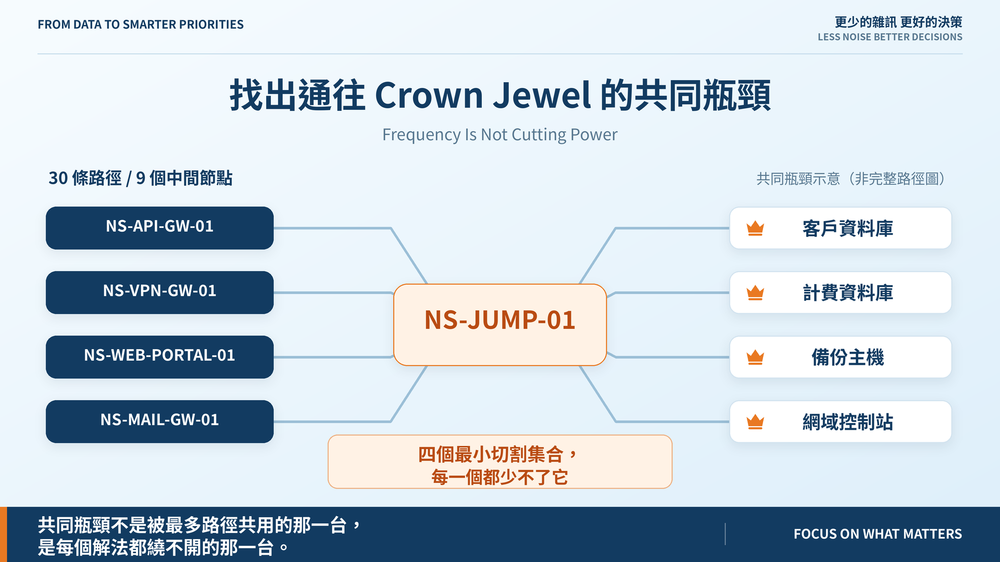
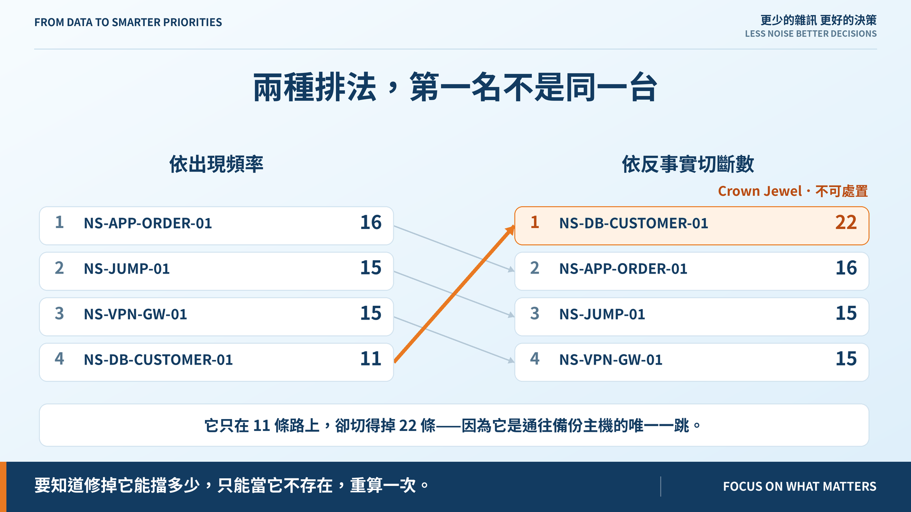
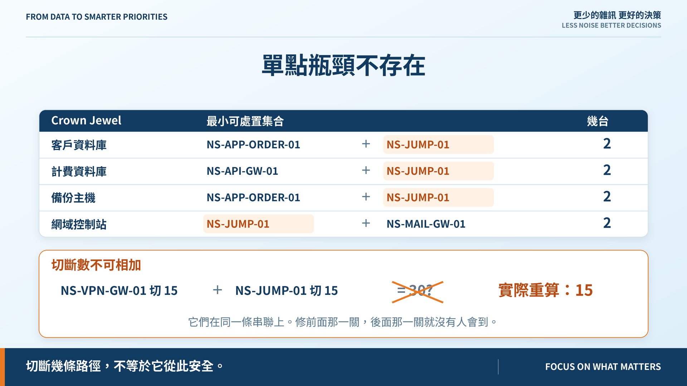

# Day 24｜找出通往 Crown Jewel 的共同瓶頸

**Frequency Is Not Cutting Power**

> **施工進度｜** 定邊界（Day 1–5）→ 接資料（Day 6–10）→ 做評分（11–18）→ **畫攻擊路徑（19–24）** → 給修補建議（25–30）

通往四個 Crown Jewel 有 30 條路徑，只用了 9 個中間節點。修一台能擋掉幾條？

Day 22 我已經寫好一個函式數這件事，而且在註解裡寫下：

> 每個中間節點出現在幾條路徑上——Day 24 的 choke point 就是這個數字。

今天的第一件事是推翻那句話。

## 兩種排法，第一名不是同一台

| 節點 | 出現在 | 移除後切斷 |
|---|---:|---:|
| `NS-DB-CUSTOMER-01` | 11 | **22** |
| `NS-APP-ORDER-01` | **16** | 16 |
| `NS-JUMP-01` | 15 | 15 |
| `NS-VPN-GW-01` | 15 | 15 |

客戶資料庫只在 11 條路上，卻切得掉 22 條——因為它是通往備份主機的唯一一跳，**被切掉的另外 11 條根本不經過它**，而是經過「只能從它過去」的下游。

頻率回答「它在多少條路上」。要知道「修掉它能擋掉多少條」，只有一個辦法：**把它當成不存在，重算一次。**

## 但那個答案沒人能執行

切得最多的那台是 Crown Jewel。「移除客戶資料庫」不是處置——它是要保護的目標。

所以反事實必須知道哪些節點可以動。不可處置的仍然列出來，但不進候選。**一個算得很漂亮卻沒人能執行的答案，不是答案。**

## 兩台各切 15，一起修還是 15

`NS-VPN-GW-01` 切 15，`NS-JUMP-01` 切 15。加起來 30，正好是全部，看起來修這兩台就清空了。

實際重算：**還是 15。**

它們在同一條串聯上——從 Internet 進 VPN、從 VPN 進跳板，是同一段路的兩個關卡。修前面那一關，後面那一關就沒有人會到。

所以報表沒有「切斷數總計」這個欄位。那個數字會騙人。

## 單點瓶頸不存在

| Crown Jewel | 最小可處置集合 |
|---|---|
| 客戶資料庫 | APP-ORDER + JUMP |
| 計費資料庫 | API-GW + JUMP |
| 備份主機 | APP-ORDER + JUMP |
| 網域控制站 | JUMP + MAIL-GW |

**四個目標各自都需要至少兩台**，全部一起斷掉要 4 台。

但看那一欄：`NS-JUMP-01` 出現在**每一個**集合裡。它只排頻率第三，可是四個解法沒有一個繞得開它——這才符合「共同」兩個字：不是被最多路徑共用，而是**每一個解法都少不了**。

跳板的狀態一變，四個 Crown Jewel 的結論要同時重新評估。

## 權限終於進了呈現

藍圖的 Day 24 門檻要求「能呈現入口、弱點、權限與 Crown Jewel 的有效路徑」。Day 22 做到三樣，**權限一直只進了分數、沒進呈現**——Day 21 算得出來，但看路徑的人看不到。

現在每一跳附上「取得權限：`local_admin`（CVE-2016-5195 為本機提權）」；證不出來的就寫「證不出來——不代表拿不到」，不猜中間值。

## 切斷不等於安全

Day 22 的那半句今天更容易犯：**切斷了幾條路徑，不等於它從此安全。** 路徑只畫得出清冊上有的連線——切斷清冊上的全部路徑，和攻擊者沒路可走，是兩件事。

所以 `--without` 把路徑歸零時固定寫「這是『這組連線斷了』，不是『它從此安全』」，並有一條測試斷言瓶頸報告裡不出現「安全」這兩個字。

## 還沒做到的

**切斷路徑不等於降低風險。** 今天只算條數，沒重算分數；「修這台能讓多少 finding 降級」是 Day 27。

**沒有成本。** 最小切割回的是「兩台」，不是「哪兩台比較便宜」——關掉跳板和重設一台閘道，代價差很遠。成本模型在 Day 26。

最小切割用窮舉，8 個節點是 255 個子集；超過 12 個就明說算不出來。

## 明天

路徑畫完了。但要開始給修補建議時會撞到一件事：清單上有些 finding 根本**不適用**於這台機器——版本不在影響範圍內。而最便宜的處置，就是證明它不必修。

> **Day 25｜修漏洞不是唯一選項**

瓶頸分析與 ADR-day-24：[github.com/oldgi/cve2action](https://github.com/oldgi/cve2action)。Northstar 為虛構；CVE、EPSS、KEV 為公開資料。
