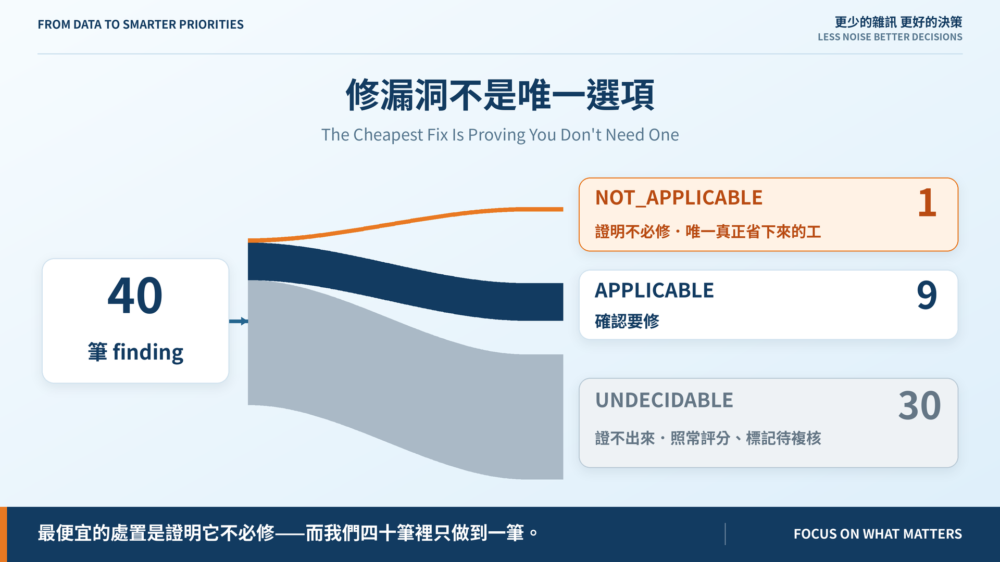
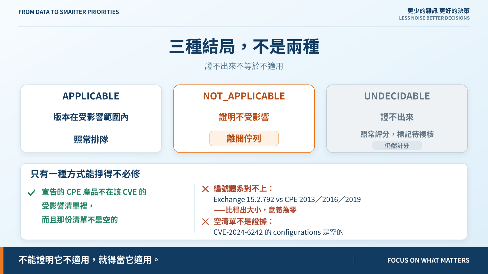

# Day 25｜修漏洞不是唯一選項

**The Cheapest Fix Is Proving You Don't Need One**

> **施工進度｜** 定邊界（Day 1–5）→ 接資料（Day 6–10）→ 做評分（11–18）→ 畫攻擊路徑（19–24）→ **給修補建議（25–30）**

最便宜的處置不是修得快，是**證明它根本不必修**。今天實作那個閘門——40 筆跑完，證明不必修的有 **1 筆**。

## 三種結局，不是兩種

| 判定 | 後果 |
|---|---|
| `APPLICABLE`（版本在受影響範圍內） | 照常排隊 |
| `NOT_APPLICABLE`（**證明**不受影響） | 離開佇列 |
| `UNDECIDABLE`（證不出來） | **照常評分**，標記待複核 |

第三種照常評分，是 Day 15、21、22 同一條紀律的第四次套用：**不能證明它不適用，就得當它適用。** 把分數拿掉才危險——那等於讓「不知道」換來比較安全的名次。

## 只有一種方式能掙得「不必修」

**宣告的 CPE 產品不在該 CVE 的受影響清單裡，而且那份清單不是空的。**

窄得刻意。版本比對在真實資料上會騙人，兩種都撞到了。

**編號體系對不上。** 郵件閘道的 Exchange 是 `15.2.792`，CPE 卻用 `2013`／`2016`／`2019`。兩邊都是數字，比得出大小，**答案毫無意義**——純數字比對會說「24 條都沒命中」。要是「沒命中」能推出「不受影響」，這台對外的 Exchange 就消失了。

**空清單不是證據。** `CVE-2024-6242` 的 `configurations` 整個是空的；「不在清單裡」只代表清單沒東西。

所以閘門**從不**用「已經修到更新版本了」放行——那需要廠商宣告的修補版本，我們沒有。

## 唯一過關的那一筆

`CVE-2019-0708`（BlueKeep）的 CPE 列了 67 個產品，Microsoft 的只到 Windows 7 與 Server 2008。跳板是 Server 2019——**不在其中**。

注意量的是**作業系統**版本：服務清冊記的是 `rdp 10.0`，協定版本答不了這個問題。所以版本證據以 `(資產, CVE)` 為鍵，不靠服務名比對。

這筆同時滿足 KEV、可達、有路徑。閘門的結論若不短路覆寫，它會被推成 P0——**把剛證明出來的東西丟掉。**

## 證不出來的 30 筆

| 理由 | 筆數 |
|---|---:|
| 根本沒有版本證據 | 26 |
| CPE 邊界帶非數字（`17.6.6a`） | 1 |
| 編號體系對不上 | 1 |
| 來源是 banner | 1 |
| NVD 沒列任何受影響版本 | 1 |

那筆 banner 值得講：檔案伺服器的 openssh 是 `7.4p1`，落在受影響的 `5.9–7.8` 裡。但那是服務自報的——**回溯修補之後 banner 不會變**，看起來中招可能早就修了。所以判不了。

## §9.6 的三條覆寫，以及 63% 的 P0

§9.6 的三條規則到昨天一條都沒實作。今天補上，**只升不降**——會降級的覆寫，實質上是沒有核准人的例外。

跑完：16 筆被推上去，**P0 從 9 筆變成 25 筆**，佔 63%，與「緊急評估與處理」矛盾——正是 Day 18 否決藍圖 80/60/35 門檻時的同一種病。

但根因不同：**40 筆裡有 32 筆的 CVE 被 KEV 收錄。** KEV 在這份資料上幾乎沒有鑑別力——Northstar 是教學資料集，刻意挑了有名的 CVE。

試過把「有效攻擊路徑」收緊成「通往 Crown Jewel」，25 只降到 22，不值得偏離原文。照原文實作，數字記在 ADR。**別拿飽和的資料集去判一條規則有沒有用。**

### 降級要有人簽名

§9.6 說「分數不取代人工決策」。反過來也成立——**一份簽過的紙，也不是數字可以自動執行的授權。** 有效的接受不降層級，只被記下並標記複核。

四筆紀錄只有兩筆算數：一筆已過期（狀態欄還掛 `APPROVED`），一筆在 KEV 收錄後撤回。**寫了期限卻沒人比對，就是永久赦免。**

## 還沒做到的

**29 筆沒有任何處置方案。** 「修漏洞不是唯一選項」的前提是選項要存在；沒登記不等於只能修，是還沒想。

MOVEit 那筆判對了但理由不成立：`15.0.1` 是另一套編號，閘門拿它跟 `< 2021.0.7` 比，比中了——方向剛好安全，推理完全錯誤。已用測試釘住：哪天有人「改進」版本比對讓它翻成不必修，測試會紅。**釘住一個靠運氣得到的答案，比假裝沒看到好。**

## 明天

四台機器、三種做法、各自的工時與停機時間。一個修補窗口塞不下全部。

> **Day 26｜Patch、隔離、關閉服務，哪一個先做？**

適用性閘門與 ADR：[github.com/oldgi/cve2action](https://github.com/oldgi/cve2action)。Northstar 為虛構；CVE、EPSS、KEV 為公開資料。
