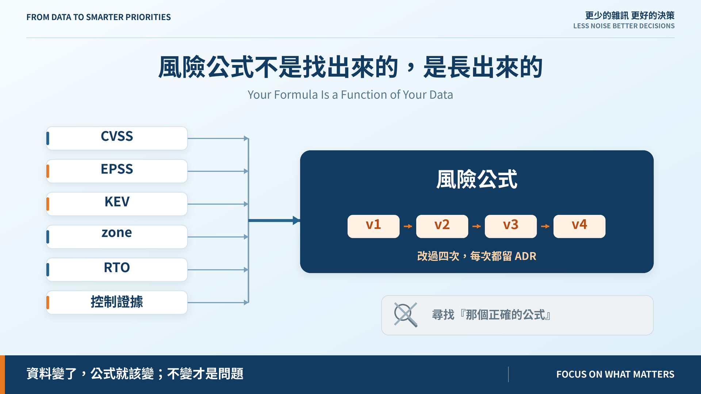
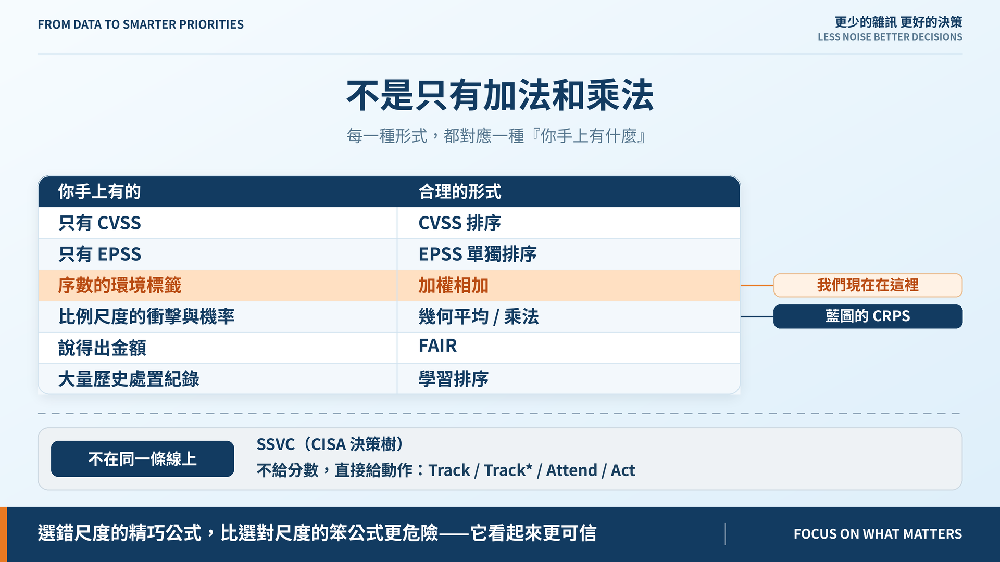

# 番外篇｜風險公式不是找出來的，是長出來的

**Your Formula Is a Function of Your Data**

> **施工進度｜** 定邊界（Day 1–5）→ 接資料（Day 6–10）→ 做評分（Day 11–18）→ 畫攻擊路徑（19–24）→ 給修補建議（25–30）　｜　本篇為番外，不佔施工日

Day 18 留了個問題沒答完：藍圖的終局公式跟我們實際在跑的，是兩條不同的式子。當天只說「Day 23 再決定」，但更值得講的是——**為什麼一個專案會長出兩條公式，而且這很正常。**

## 先把一個預設拆掉

> **沒有「正確的風險公式」等著你去找。**

公式是**你手上有什麼資料**和**你願意承擔哪種錯誤**的函數。資料變了，公式就該變；不變才是問題。

## 我們這十八天的公式演化

沒有一次是「想到更好的公式」，每次都是**輸入先變好，公式才跟上**：

| Day | 公式變成 | 為什麼 |
|---|---|---|
| 5 | `10 × (0.50S + 0.25E + 0.25B)` | 只有 CVSS 和手填的環境標籤 |
| 8 | 同上，但 S 有版本與評分者 | v3.1／v4.0 並存，不換算 |
| 12–13 | 同上，但 E、B **可推導** | 從 zone、控制證據、RTO 推，不再手標 |
| 14 | `10 × (0.35S + 0.15T + 0.25E + 0.25B)` | EPSS、KEV 接進來了，威脅不必再由 CVSS 兼差 |
| 15 | 同上，但 E 逐筆算 | 控制攔不攔得到這個漏洞，要看攻擊向量 |

**Day 14 加的不是一個項，是一份資料。** 沒有 EPSS 和 KEV 之前，加那一項只能補零，而補零比不加更糟。

這也是 Day 18 要把門檻分成 structural 和 empirical 的原因：公式的性質與資料的性質是兩回事，混在一起就會把資料問題當成公式問題去調。

## 那條還沒走的路：幾何平均

藍圖的 CRPS 是 `100 × L^0.45 × I^0.35 × A^0.20 × (1−0.6C)`。指數加起來剛好是 1——所以它不是「乘法」，是**加權幾何平均**。

| 四項因子 | 算術 | 幾何 |
|---|---:|---:|
| 0.8 / 0.8 / 0.8 / 0.8 | 8.00 | 8.00 |
| 1.0 / 1.0 / **0.1** / 1.0 | 7.75 | **5.62** |

**幾何說「每一項都得有點成立」，算術說「夠多項夠強就行」。**

哪個對？看因子是什麼尺度。幾何平均要求**比例尺度**——比值有意義、有真正的零點。我們的 `B = NORMAL = 0.4` 是「一般重要」這個**等級**，不是「衝擊的四成」；那個 0.4 是訂來當地板的，不是量出來的。**序數數字拿去開次方，意義就垮了。**

所以我們現在用加法，**不是因為幾何平均比較差，是因為我們的輸入還撐不起它。** 這句話可以被推翻：哪天 `B` 改成從受影響記錄筆數或每小時營收推導，它就重新站得住。

## 這兩種也不是全部

真正該破除的是「只有加法和乘法兩種」這個錯覺。每一種都對應一種「你手上有什麼」：

- **純 CVSS 排序**——只有 CVSS 時的誠實作法。Day 2 否定的是**假裝它考慮了環境**，不是它本身。
- **EPSS 單獨排序**——只問會不會被打，不問打中了會怎樣。沒有資產資料時堪用。
- **加權相加**——環境標籤是序數時的合理形式。**我們現在在這裡。**
- **幾何平均 / 乘法**——衝擊與機率是比例尺度時才站得住。藍圖的 CRPS 是這一類。
- **SSVC**（CISA 的決策樹）——**根本不給分數**，直接給動作：Track / Track\* / Attend / Act。它主張把分數換成一棵走得完的樹，因為分數會被當成精度。
- **FAIR**——換算成金額。需要損失資料，多數組織拿不出來。
- **學習排序**——有足夠歷史處置紀錄就能訓練，代價是可解釋性。

這些**不在同一條光譜上**，它們回答的問題根本不同。SSVC 不是「比較粗的 CRPS」，它是**拒絕給分數**這個選擇本身。

## 所以怎麼選

不是挑最新的那個，是挑**跟你的資料同一個尺度**的那個。選錯尺度的精巧公式，比選對尺度的笨公式更危險——它看起來更可信。

然後**用量的，不要用辯的**。Day 17 做的校準工具就是為這件事：兩條公式都跑一次，對同一份人工排序比 tau 與分歧清單。Day 23 就會這樣做一次。

## 這篇真正想講的

> **一條三個月沒改過的風險公式，通常不代表它很穩，代表沒有人在往裡面加資料。**

我們的公式從 Day 5 到今天改了四次，每次都留了 ADR。那不是搖擺，那是它還活著。

你家的公式該長什麼樣，不取決於哪篇論文最新，取決於你手上有什麼、以及你願意為哪種錯誤負責。

公式與 ADR：[github.com/oldgi/cve2action](https://github.com/oldgi/cve2action)。Northstar 為虛構；CVE、EPSS、KEV 為公開資料。
