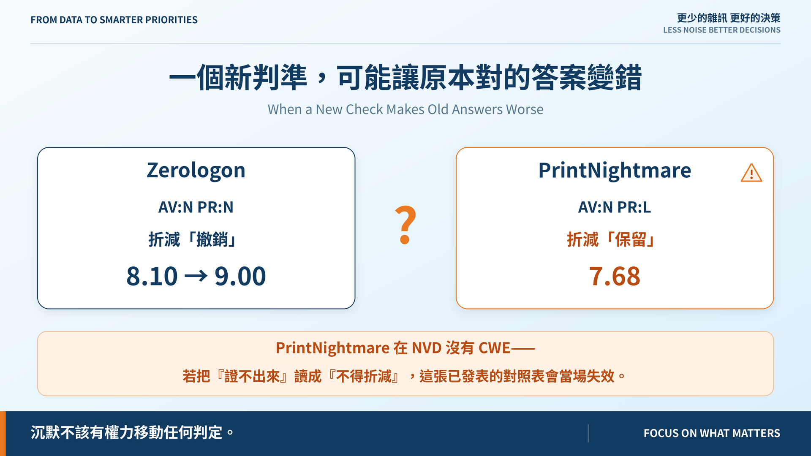
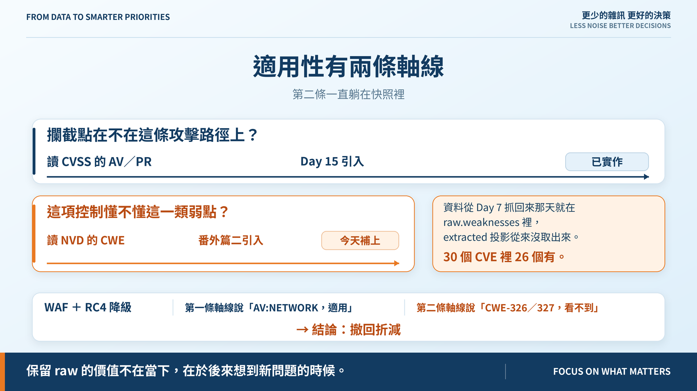
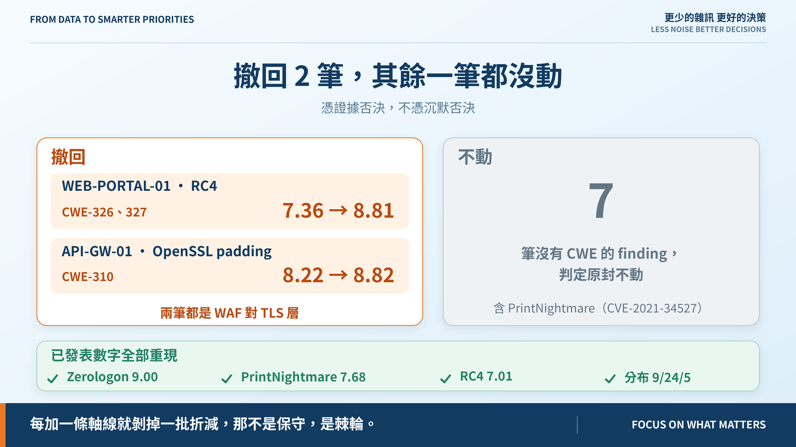

# 番外篇｜一個新判準，可能讓原本對的答案變錯

**When a New Check Makes Old Answers Worse**

> **施工進度｜** 定邊界（Day 1–5）→ 接資料（Day 6–10）→ 做評分（11–18）→ 畫攻擊路徑（19–24）→ **給修補建議（25–30）**

Day 15 那篇文章我寫了這句話：

> WAF 對 TLS 層的 RC4 降級仍被判為適用，那個折減其實站不住。控制與弱點類別的對應留給 Day 25。

**Day 25 沒做那件事。** 那天做的是版本適用性——「裝的版本在不在受影響範圍內」，跟「這項控制擋不擋得住這類弱點」是兩個問題。Day 24 的盤點才查出來。

這篇補上，順便講一件差點做錯的事。

## 缺的那條軸線一直在資料裡

Day 15 的適用性問的是：**攔截點在不在這條攻擊路徑上？** 用 CVSS 的 `AV` 和 `PR` 回答。沒問的是第二條：**這項控制懂不懂這一類弱點？**

答案在 NVD 的 `CWE`——而它**從 Day 7 抓回來那天就在快照裡了**，躺在 `raw.weaknesses`，`extracted` 投影從來沒取出來。30 個 CVE 裡 26 個有。

這跟 Day 25 發現 CPE 一模一樣。兩次都說明同一件事：**保留 `raw` 的價值不在當下，在於後來想到新問題的時候。**

RC4 那筆是 `CWE-326`（加密強度不足）與 `CWE-327`（已破解的演算法）。WAF 檢查 HTTP，TLS 交握在它下面，看不到就擋不住。

## 差點做錯的那一步

直覺是照 Day 15 的三態紀律辦：**證不出來就不得折減。** 我差點就這樣寫。

然後查到 `CVE-2021-34527`（PrintNightmare）**在 NVD 沒有 CWE**。照那個直覺，它的 MFA 折減會被撤回，7.68 → 8.58。而 Day 15 已發表的核心對照表是：

| | AV/PR | 折減 | 分數 |
|---|---|---|---|
| Zerologon | AV:N **PR:N** | 撤銷 | 8.10 → **9.00** |
| PrintNightmare | AV:N **PR:L** | **保留** | 7.68 |

下一句是「差別就在那一格」。**那張表會當場失效**——不是因為發現它錯了，而是因為我加了一個它答不出來的新問題。

## 規則：新軸線只能憑證據否決，不能憑沉默否決

有資料且說不適用 → 撤回。**沒有資料 → 不動**，維持前一條軸線憑證據得到的結論。

這不違反「UNKNOWN 不得降低風險」——那條講的是缺資料不得換來比較**安全**的結論，而沉默在這裡換到的是**不變**。

真正的問題不是方向，是**沉默該不該有權力移動任何東西**。不該。這就是 Day 25「空清單不是證據」的同一條。

### 不這樣做會變成棘輪

如果每條新軸線都把「沒資料」讀成「不得折減」，每加一條就剝掉一批，最後沒有任何補償控制拿得到分。

**那不是保守，是棘輪。** 模型會因為問題變多而變嚴格，而嚴格的來源是無知，不是證據。

## 跑出來

撤回 **2 筆**，兩筆都是 WAF 對 TLS 層：`WEB-PORTAL-01` 的 RC4（CWE-326／327）7.36 → 8.81，`API-GW-01` 的 OpenSSL padding（CWE-310）8.22 → 8.82。

**其餘一筆都沒動**，包括 7 筆沒有 CWE 的 finding。已發表的數字也原封不動——Zerologon 9.00、PrintNightmare 7.68、RC4 7.01、分布 9/24/5。

機制是 Day 23 留下來的：`risk_rules.v0.1.yaml` 不宣告這一節，舊基準就自動不受影響。

## 動手前先補一條測試

Day 16 的核心範例是 RC4「落後前一名 0.41 分，7.01 對 7.43」——而那組數字**沒有任何回歸測試守著**。Day 5 的 Case A/B 有、Day 18 的門檻有，就這條沒有，而我今天動的正是 RC4。

先補測試，再改程式：**先鎖住不能變的，再動可以變的。**

## 還沒做到的

**只宣告了 WAF 一種控制。** EDR 對 SSRF、網段隔離對應用層弱點都還沒盤。每多一條就可能撤回更多折減，而每一條都要有理由，不能靠直覺填。

**CWE 的粒度不均。** Log4Shell 同時掛 CWE-20、400、502、917，從最廣的「輸入驗證不足」到最準的「表達式注入」都有。目前用交集判斷，命中一個就否決——還沒撞到，但是個破綻。

## 明天

這條軸線是 Day 26 的前置：候選引擎要把「補償控制」當成一個選項提供出去，就得先答得出這項控制到底有沒有用。

> **Day 26｜Patch、隔離、關閉服務，哪一個先做？**

第二條軸線與 ADR：[github.com/oldgi/cve2action](https://github.com/oldgi/cve2action)。Northstar 為虛構；CVE 與 CWE 為公開資料。
